# Fabric Admin Agent — Backend Setup & Onboarding Guide

*Complete technical reference for infrastructure setup, data pipeline configuration, notebook scheduling, and capacity onboarding*

<table border="1" cellpadding="6" cellspacing="0" style="border-collapse:collapse;">
  <thead>
    <tr><th>Field</th><th>Details</th></tr>
  </thead>
  <tbody>
    <tr><td><strong>Version</strong></td><td>v2.0</td></tr>
    <tr><td><strong>Owner</strong></td><td>Fabric Admin Agent Team — MAQ Software</td></tr>
    <tr><td><strong>Last Updated</strong></td><td>February 2026</td></tr>
    <tr><td><strong>Classification</strong></td><td>Internal — Confidential</td></tr>
    <tr><td><strong>Audience</strong></td><td>Backend engineers, DevOps, Fabric admins</td></tr>
  </tbody>
</table>

---

## Table of Contents

1. [Overview & Goal](#1-overview--goal)
2. [Prerequisites & Role Requirements](#2-prerequisites--role-requirements)
3. [One-Time Infrastructure Setup](#3-one-time-infrastructure-setup)
4. [Onboarding a New Capacity](#4-onboarding-a-new-capacity)
5. [Disclaimer](#5-disclaimer)

---

## 1. Overview & Goal

The Fabric Admin Agent is a proactive capacity management solution built on **Microsoft Fabric Workload Extensibility Toolkit**. It continuously monitors Fabric capacity telemetry in near real-time, detects anomalies (sustained overloads, sudden spikes, upward trends), predicts future CU consumption, and surfaces actionable recommendations — moving tenant admins from reactive troubleshooting to proactive stewardship.

>  **Goal:** Deploy the complete Fabric Admin Agent backend so that, after onboarding a new capacity, the system automatically ingests live capacity events, runs detection notebooks on a schedule, surfaces findings to the UI, and sends notifications — all without manual intervention.

### 1.1 Core Architecture

The backend is composed of four layers that work together in a continuous pipeline:

<table border="1" cellpadding="6" cellspacing="0" style="border-collapse:collapse; width:100%;">
  <thead>
    <tr><th>Layer</th><th>Technology</th><th>Purpose</th></tr>
  </thead>
  <tbody>
    <tr><td>Real-time Ingestion</td><td>Eventstream → Eventhouse (KQL DB)</td><td>Streams live Capacity Overview Events every 30 sec; one Eventstream is created per capacity onboarded to the Fabric Admin Agent workload</td></tr>
    <tr><td>Historical Staging</td><td>Pipeline → Lakehouse (Delta tables)</td><td>Pulls item-level metrics from Capacity Metrics App</td></tr>
    <tr><td>Detection &amp; Analytics</td><td>KQL (Kusto Query Language)</td><td>Runs all detection logic in real-time as Capacity Overview Events are streamed; surfaces findings instantly via KQL queries</td></tr>
    <tr><td>Operational Metadata</td><td>KQL Database (FabricAdminAgentLogs)</td><td>Stores findings, settings, capacities, and audit logs in the KQL Eventhouse DB</td></tr>
  </tbody>
</table>

### 1.2 Key Fabric & Azure Artifacts

All artifacts are deployed in the Fabric workspace used by the Admin Agent:

<table border="1" cellpadding="6" cellspacing="0" style="border-collapse:collapse; width:100%;">
  <thead>
    <tr><th>Artifact Name</th><th>Type</th><th>Role</th></tr>
  </thead>
  <tbody>
    <tr><td>FabricAdminAgent</td><td>Lakehouse</td><td>Delta tables: usage metrics</td></tr>
    <tr><td>FabricAdminAgent_AggregatedMetrics</td><td>Notebook</td><td>Creates day/week/month/quarter/year level CU metrics at workspace and item level</td></tr>
    <tr><td>FabricAdminAgent_Capacities</td><td>Notebook</td><td>Gathers capacities in the tenant; executed in FetchCapacitiesPipeline</td></tr>
    <tr><td>FabricAdminAgent_CapacityMonitoringAgentDataset</td><td>Semantic Model</td><td>Semantic Model for CapacityMonitoringAgentReport</td></tr>
    <tr><td>FabricAdminAgent_CapacityMonitoringAgentReport</td><td>Report</td><td>Embedded visual: capacity monitoring metrics</td></tr>
    <tr><td>FabricAdminAgent_ConfigNotebook</td><td>Notebook</td><td>Returns KQL URI; called by all other notebooks at startup</td></tr>
    <tr><td>FabricAdminAgent_Dates</td><td>Notebook</td><td>Creates Date table</td></tr>
    <tr><td>FabricAdminAgent_FetchCapacitiesPipeline</td><td>Pipeline</td><td>Gathers data of capacities present in the tenant</td></tr>
    <tr><td>FabricAdminAgent_FetchWorkspacesPipeline</td><td>Pipeline</td><td>Gathers workspace data within capacities in the tenant</td></tr>
    <tr><td>FabricAdminAgent_InitializeTables</td><td>Notebook</td><td>One-time: creates all KQL tables in the KLQ Database</td></tr>
    <tr><td>FabricAdminAgent_ItemOperationMetrics</td><td>Notebook</td><td>Gathers item operation level data from Capacity Metrics App</td></tr>
    <tr><td>FabricAdminAgent_Items</td><td>Notebook</td><td>Gathers items data in capacities</td></tr>
    <tr><td>FabricAdminAgent_LoadCapacityMetricsData</td><td>Pipeline</td><td>Pulls item-level data from Capacity Metrics App</td></tr>
    <tr><td>FabricAdminAgent_LoggingUtility</td><td>Notebook</td><td>Shared utility functions (logging, token helpers, etc.)</td></tr>
    <tr><td>FabricAdminAgent_Workspaces</td><td>Notebook</td><td>Gathers workspaces in capacities; executed in FetchWorkspacesPipeline</td></tr>
    <tr><td>FabricAdminAgentLogs</td><td>Eventhouse</td><td>Eventhouse for storing live capacity events</td></tr>
    <tr><td>FabricAdminAgentLogs</td><td>KQL Database</td><td>Stores FabricCapacityEvents, CapacityUtilization, ConfigTable, MVs</td></tr>
  </tbody>
</table>

---

## 2. Prerequisites & Role Requirements

>  **Important:** All prerequisites below must be met before starting the setup steps. Missing any item will cause failures during Eventstream creation or notebook execution.

### 2.1 Fabric Roles

<table border="1" cellpadding="6" cellspacing="0" style="border-collapse:collapse; width:100%;">
  <thead>
    <tr><th>Role / Permission</th><th>Where</th><th>Why It Is Needed</th></tr>
  </thead>
  <tbody>
    <tr>
      <td>Contributor (minimum)</td>
      <td>Fabric Workspace (Admin Agent WS)</td>
      <td>Required to create the Fabric Admin Agent workload item and deploy all Fabric artifacts</td>
    </tr>
    <tr>
      <td>Capacity Administrator</td>
      <td>Microsoft Fabric (per capacity)</td>
      <td>Required to read Capacity Overview Events via Eventstream and to add capacities in the workload Configuration tab; must be assigned for every capacity being monitored</td>
    </tr>
    <tr>
      <td>Global Administrator, Privileged Role Administrator, Application Administrator, or Cloud Application Administrator</td>
      <td>Microsoft Entra ID (tenant level)</td>
      <td>Required to grant admin consent for the Backend Service Principal during initial workload setup (Step 4)</td>
    </tr>
    <tr>
      <td>Fabric Administrator or Global Administrator (with Tenant.Read.All or Tenant.ReadWrite.All)</td>
      <td>Microsoft Fabric / Power BI</td>
      <td>Required to authorize the PBI Service connection in Manage Connections and Gateways (Step 15)</td>
    </tr>
  </tbody>
</table>

### 2.2 Azure Resources

<table border="1" cellpadding="6" cellspacing="0" style="border-collapse:collapse; width:100%;">
  <thead>
    <tr><th>Resource</th><th>Configuration / Required Permission</th><th>Purpose</th></tr>
  </thead>
  <tbody>
    <tr>
      <td>Azure Function App</td>
      <td>Created during custom deployment</td>
      <td>Hosts APIs for capacity operations, notification services, and automation workflows.</td>
    </tr>
    <tr>
      <td>App Service Plan</td>
      <td>Created during custom deployment</td>
      <td>Provides compute resources for the Azure Function App.</td>
    </tr>
    <tr>
      <td>Azure Storage Account</td>
      <td>Created during custom deployment</td>
      <td>Provides storage required by the Azure Function App runtime and application operations.</td>
    </tr>
    <tr>
      <td>Log Analytics Workspace</td>
      <td>Created during custom deployment</td>
      <td>Stores operational logs, diagnostics, and monitoring telemetry for the function app.</td>
    </tr>
    <tr>
      <td>Application Insights</td>
      <td>Created during custom deployment</td>
      <td>Provides application monitoring, tracing, performance metrics, and diagnostics for the function app.</td>
    </tr>
    <tr>
      <td>Azure Key Vault</td>
      <td>User must have <strong>Key Vault Administrator</strong> role during setup</td>
      <td>Stores HVE (High Volume Email) account credentials</td>
    </tr>
    <tr>
      <td>Application Insights Smart Detection</td>
      <td>Automatically created by Azure Monitor</td>
      <td>Detects application failures, performance anomalies, and operational issues.</td>
    </tr>
    <tr>
      <td>Action Group</td>
      <td>Automatically created by Azure Monitor</td>
      <td>Used by Smart Detection alert rules to generate and route alert notifications.</td>
    </tr>
  </tbody>
</table>

#### Azure Deployment Outputs

**Automated Deployment**

- Azure Key Vault

**Custom ARM Template Deployment**

- Azure Storage Account
- Log Analytics Workspace
- Application Insights
- App Service Plan
- Azure Function App

**Automatically Created by Azure Monitor**

- Application Insights Smart Detection
- Smart Detector Alert Rule (Failure Anomalies)
- Action Group

#### Minimum Azure Permissions Required

The user or deployment Service Principal performing the setup must have:

* **Contributor** (or higher) on the target Azure Resource Group.
* **Key Vault Administrator** (or equivalent permissions to create and manage secrets) on the Azure Key Vault.

> **Note:** No Azure RBAC permissions on the Microsoft Fabric Capacity Azure resource are required solely for Capacity Overview Event ingestion. Fabric capacity permissions are documented separately in Section 2.3.

### 2.3 Fabric Capacity Events — Required Permissions

The workload uses **Capacity Overview Events** as the source for its Eventstream. These events provide live Capacity Unit (CU) telemetry that is ingested into the KQL Database and processed by the monitoring notebooks.

To configure and operate this functionality, the onboarding user or Service Principal must have the following permissions:

| Scope                                                          | Required Permission                                 |
| -------------------------------------------------------------- | --------------------------------------------------- |
| Microsoft Fabric Capacity                                      | **Contributor or higher** on the monitored capacity |
| Workspace hosting the Eventstream, KQL Database, and notebooks | **Contributor or higher**                           |

Without these permissions:

* The **Capacity Overview Events** source may not be available for configuration in the Eventstream.
* No live CU telemetry will be streamed into the KQL Database.
* Monitoring and detection notebooks will have no capacity telemetry data to process.

> **Note:** Microsoft documentation specifies that users must have **Contributor or higher permissions on the selected capacity** to stream Capacity Overview Events.

#### How to Assign Capacity Permissions

1. Open **Microsoft Fabric Admin Portal**.
2. Navigate to **Capacities**.
3. Select the target capacity.
4. Grant the onboarding user or Service Principal **Contributor** (or higher) permissions on the capacity.

#### How to Assign Workspace Permissions

1. Open the target Fabric workspace.
2. Select **Manage Access**.
3. Add the onboarding user or Service Principal.
4. Grant **Contributor** (or higher) permissions.

---

## 3. One-Time Infrastructure Setup

Perform all steps below once per environment deployment. Each step is a dependency for the next.

> **Prerequisite — Microsoft Fabric Capacity Metrics App:** Before starting, ensure the Capacity Metrics App is installed and its semantic model is refreshing. Note down the **Workspace Name** and **Semantic Model Name** — these are required in Step 19.

---

### Step 0: Enable Required Fabric Tenant Settings

Before deploying or using the Fabric Admin Agent workload, a Fabric Administrator must enable the required tenant settings for additional workloads in the Microsoft Fabric Admin Portal.

**Navigate to:**

**Microsoft Fabric Admin Portal → Tenant Settings → Additional Workloads**

---

#### 0.1 Enable "Users can see and work with additional workloads not validated by Microsoft"

This setting allows users to discover and use unverified workloads such as Fabric Admin Agent.

1. Locate **Users can see and work with additional workloads not validated by Microsoft**.
2. Enable the setting.
3. Apply it to the required users or security groups.

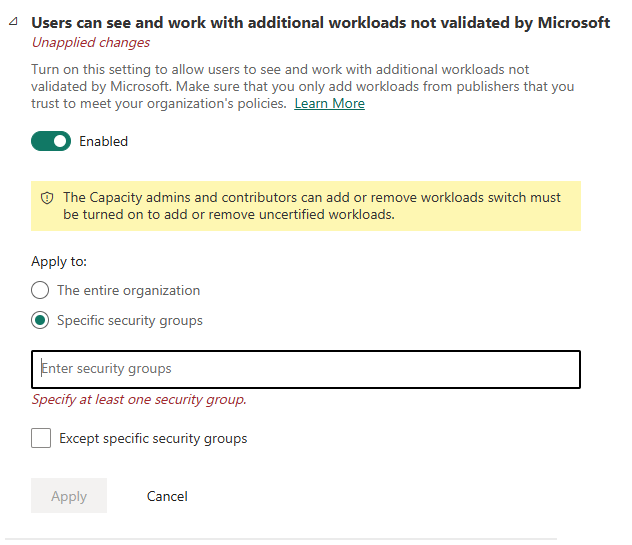

---

#### 0.2 Enable "Workspace admins can add and remove additional workloads"

This setting allows workspace administrators to install and manage workloads within their Fabric workspaces.

1. Locate **Workspace admins can add and remove additional workloads (Preview)**.
2. Enable the setting.
3. Apply it to the required users or security groups.

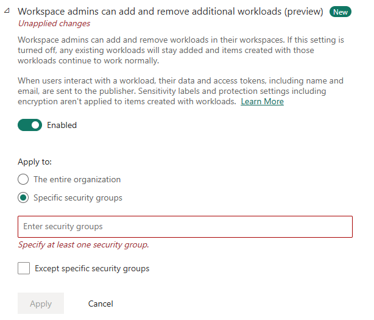

---

#### 0.3 Enable "Capacity admins and contributors can add and remove additional workloads"

This setting allows capacity administrators and contributors to manage workloads on Fabric capacities.

1. Locate **Capacity admins and contributors can add and remove additional workloads**.
2. Enable the setting.
3. Apply it to the required users or security groups.
4. If desired, enable **Only capacity admins can add and remove workloads** to further restrict access.

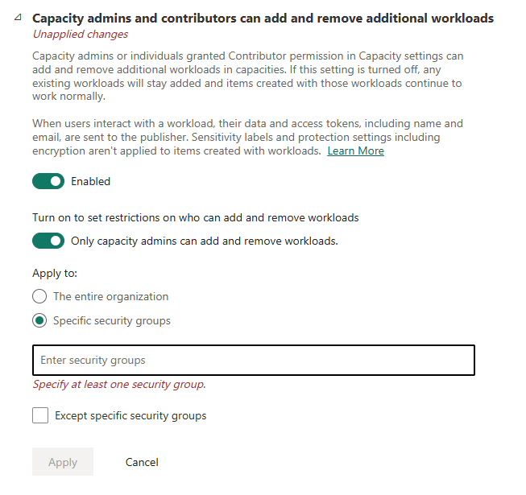

---

> **Important:** All three settings must be enabled before the Fabric Admin Agent workload can be installed, deployed, or used within the tenant.

#### Required Role

The user enabling these settings must be a **Fabric Administrator** or **Global Administrator**.

#### Verification

After enabling the settings:

1. Click **Apply** for each setting.
2. Wait several minutes for the changes to propagate across the tenant.
3. Verify that the **Fabric Admin Agent** workload is available from the **New Item** experience in the target workspace.

Once these settings are enabled, proceed with **Step 1: Verify Workspace Access**.

### Step 1: Verify Workspace Access

Ensure the user performing the setup has at least **Contributor** role on the Fabric workspace where the Fabric Admin Agent will be deployed.

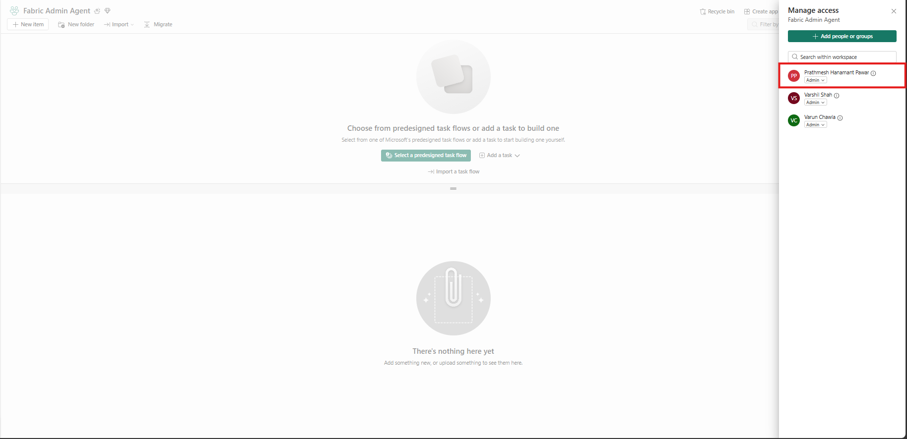

---

### Step 2: Create the Fabric Admin Agent Workload Item

**1.** In the Fabric workspace, click the **New Item** button.

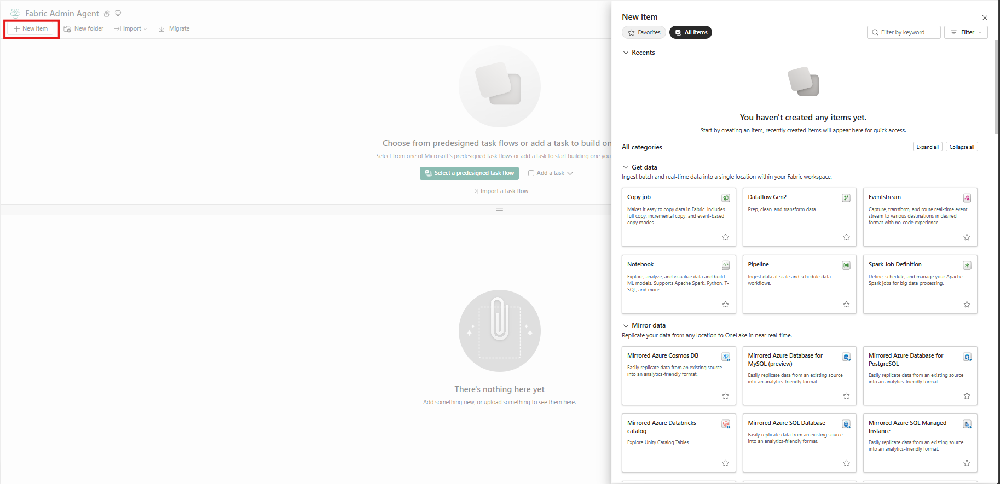

**2.** Search for **Fabric Admin Agent** and click on it.

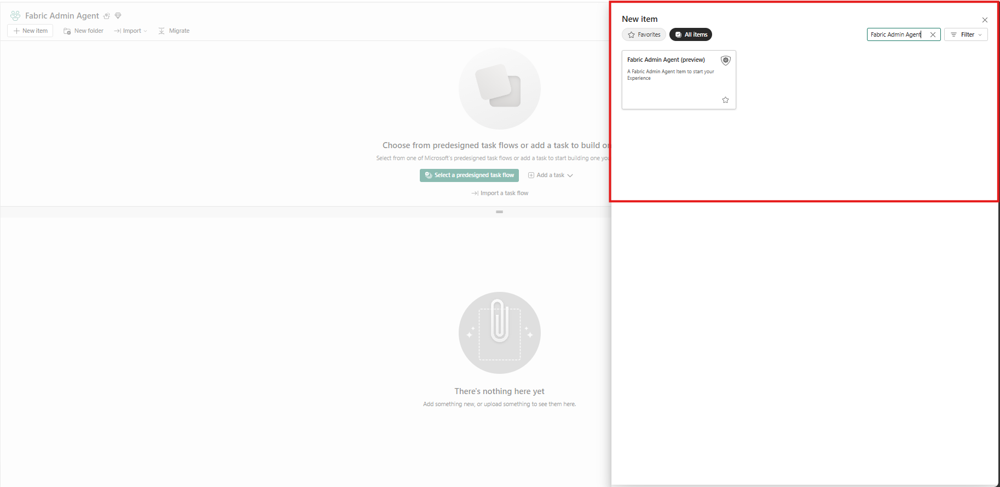

**3.** Enter a name for the artifact and confirm creation.

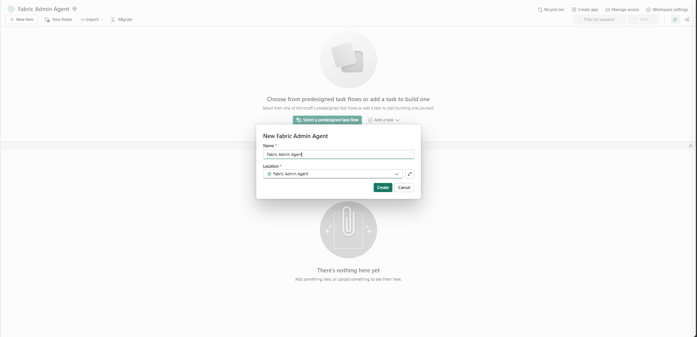

The item is created in its initial state.

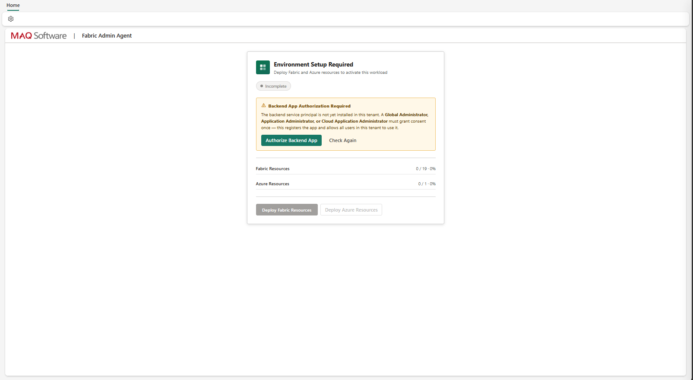

---

### Step 3: Approve Frontend Service Principal Permissions

Upon creation, a popup appears requesting permissions for the **Frontend Service Principal (SPN)**. This is required for the workload UI to access Fabric APIs on behalf of the user.

**1.** Review the requested permissions in the popup.

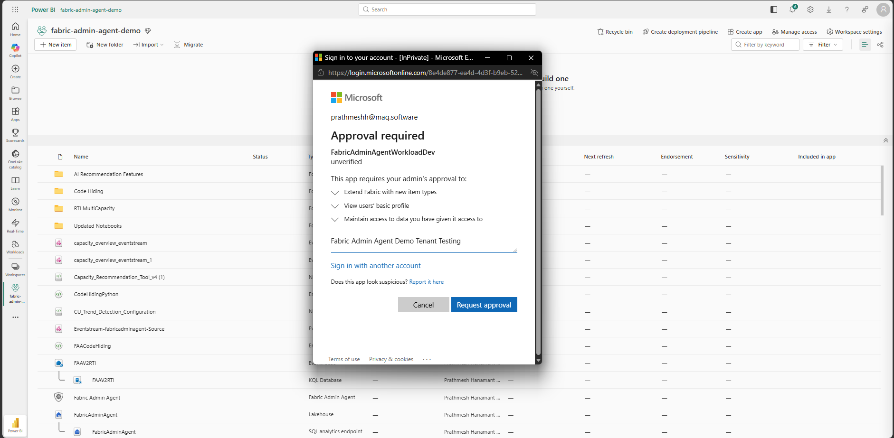

**2.** Click **Request Approval** to submit the consent request.

> **Note:** Approval must be granted by a user with one of the admin roles listed in Section 2.1 (Global Administrator, Privileged Role Administrator, Application Administrator, or Cloud Application Administrator).

---

### Step 4: Authorize the Backend Application

The Backend app registration requires admin consent and **must be performed by** a **Global Administrator**, **Privileged Role Administrator**, **Application Administrator**, or **Cloud Application Administrator**.

**1.** The admin navigates to the Backend app authorization screen within the workload setup.

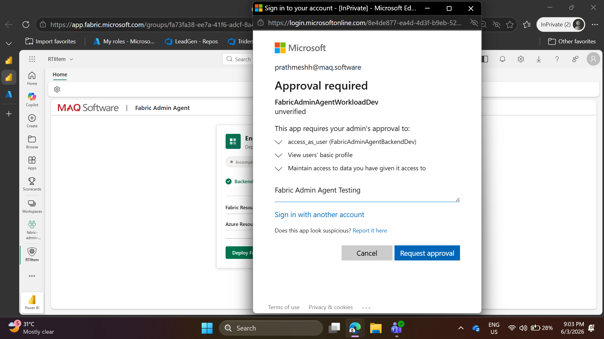

**2.** The admin reviews and grants the requested API permissions.

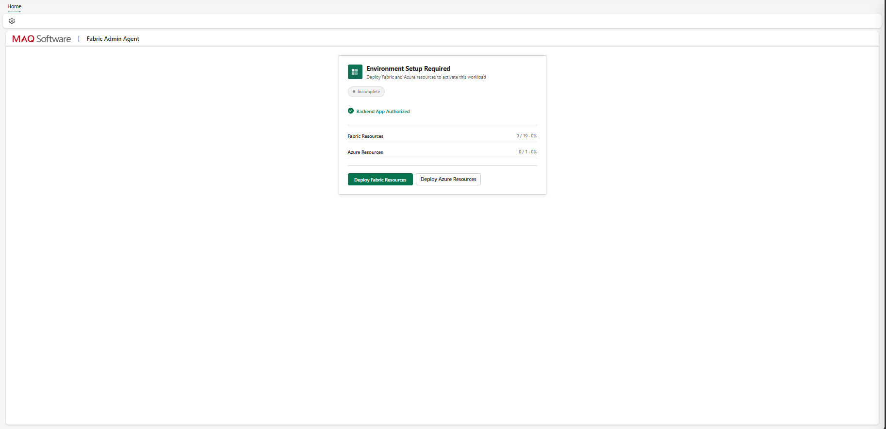

> **Important:** Both the Frontend SPN approval (Step 3) and Backend app authorization (Step 4) must be completed before proceeding to Step 5.

---

### Step 5: Deploy Fabric Resources

Once both SPN approvals are complete:

**1.** Click the **Deploy Fabric Resources** button in the workload item.

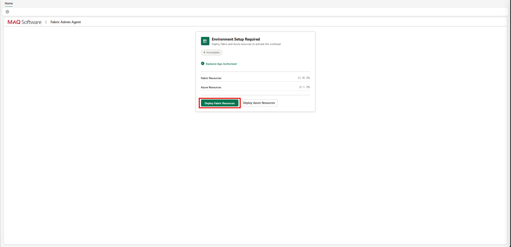

**2.** Wait for the deployment to complete. This process takes approximately **20–25 minutes**.

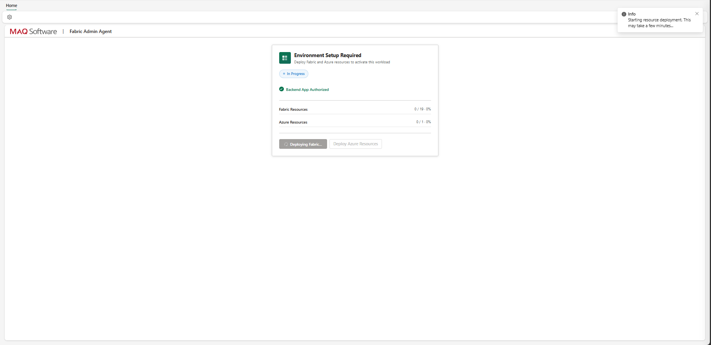

**3.** Confirm all Fabric artifacts have been successfully deployed.

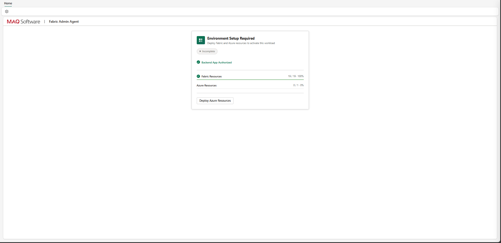

---

### Step 6: Deploy Azure Resources

**1.** Click the **Deploy Azure Resources** button.

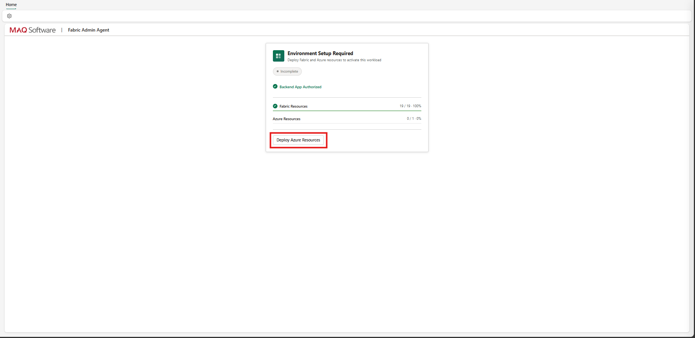

**2.** Provide the following inputs when prompted:

<table border="1" cellpadding="6" cellspacing="0" style="border-collapse:collapse; width:100%;">
  <thead>
    <tr><th>Parameter</th><th>Description</th></tr>
  </thead>
  <tbody>
    <tr><td>Azure Subscription ID</td><td>The subscription where Azure resources will be deployed</td></tr>
    <tr><td>Resource Group Name</td><td>The resource group where Azure resources will be deployed</td></tr>
  </tbody>
</table>

> **Note:** The user must have **Contributor** role on the target Azure Resource Group.

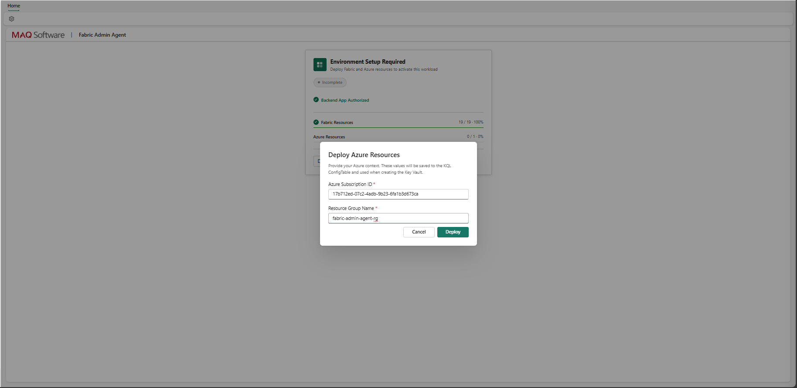

**3.** Confirm the deployment. This step only deploys a Key Vault.

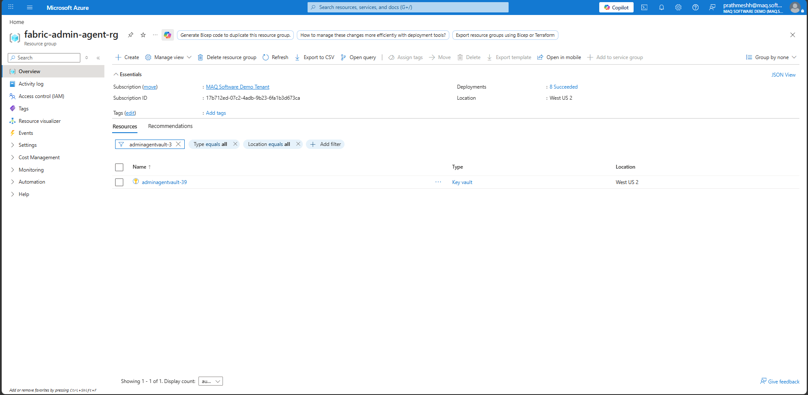

---

### Step 7: Note the Deployed Resources

**1.** In the Fabric Admin Agent workload item, navigate to the **Configuration** tab.

**2.** Expand the **Deployed Artifacts** section in the left pane.

**3.** Note down the names and GUIDs of the following deployed artifacts:

- **Eventhouse** — KQL Eventhouse for real-time capacity events
- **Semantic Model** — for capacity monitoring reports
- **PBI Connection** — Power BI service connection
- **PowerBIDataset Connection** — dataset refresh connection

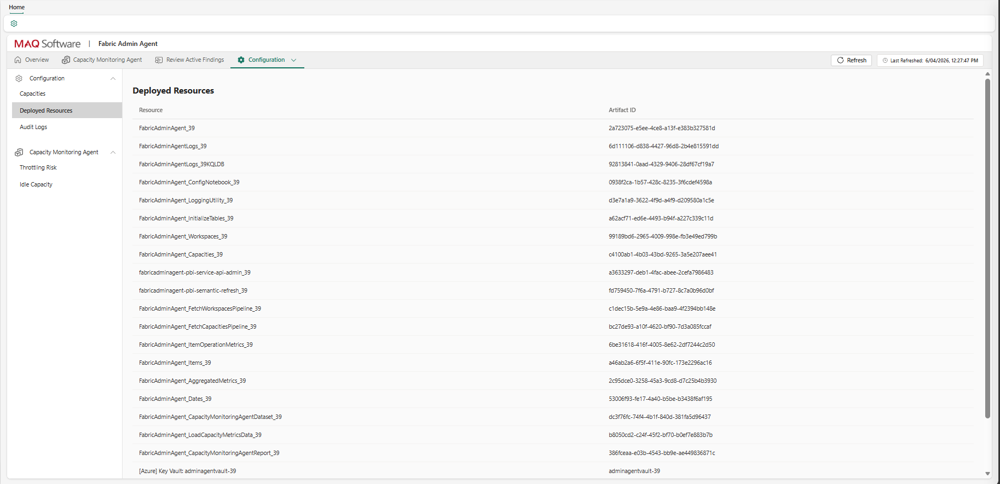

---

### Step 8: Deploy the Function App via ARM Template

A custom ARM template deployment provisions the Azure Function App used for capacity operations. This must be done manually in the Azure Portal using the ARM template provided by the Fabric Admin Agent team.

**1.** In the Azure Portal, navigate to **Deploy a custom template** (search for "Deploy a custom template" in the search bar, or go to [portal.azure.com/#create/Microsoft.Template](https://portal.azure.com/#create/Microsoft.Template)).

**2.** Click **Build your own template in the editor**, paste in the ARM template JSON from the [ARM-FunctionApp-FAA.json](https://github.com/MAQ-Software-Solutions/Fabric-Admin-Agent/blob/main/ARM-FunctionApp-FAA.json) file, and click **Save**.

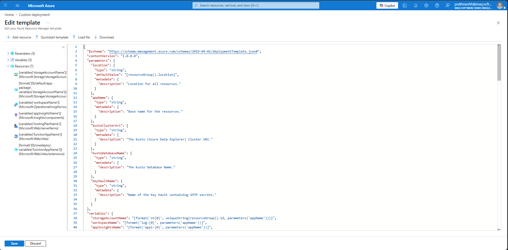

**3.** Provide the following required input parameters:

<table border="1" cellpadding="6" cellspacing="0" style="border-collapse:collapse; width:100%;">
  <thead>
    <tr><th>Parameter</th><th>Description</th></tr>
  </thead>
  <tbody>
    <tr><td>Function App Name</td><td>Name for the new Azure Function App</td></tr>
    <tr><td>Key Vault Name</td><td>Name of the Key Vault deployed in Step 6</td></tr>
    <tr><td>KQL DB URI</td><td>Query URI of the KQL Database (from Step 7)</td></tr>
    <tr><td>KQL DB Name</td><td>Name of the KQL Database (from Step 7)</td></tr>
  </tbody>
</table>

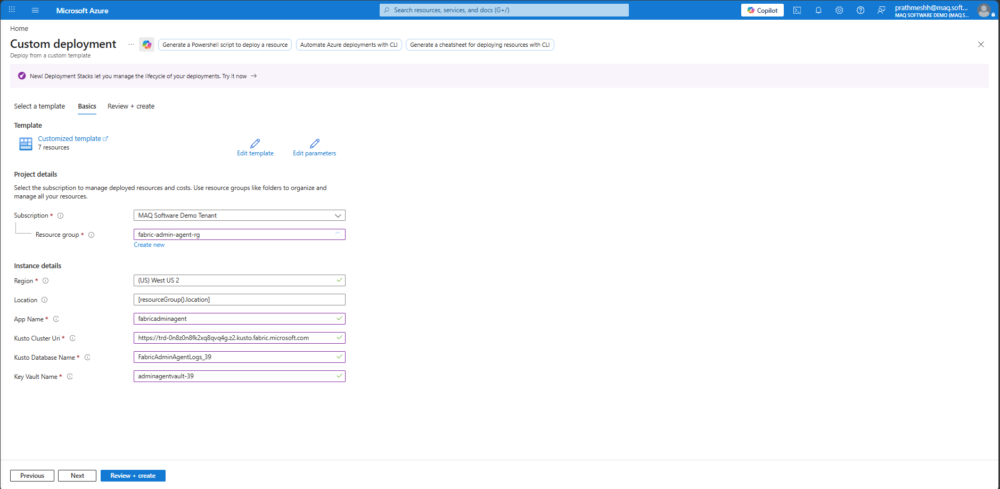

**4.** Submit the deployment. This takes approximately **2–3 minutes**.

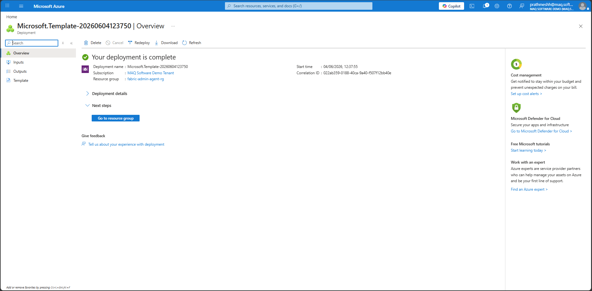

**5.** Verify that all Azure resources have been successfully deployed.

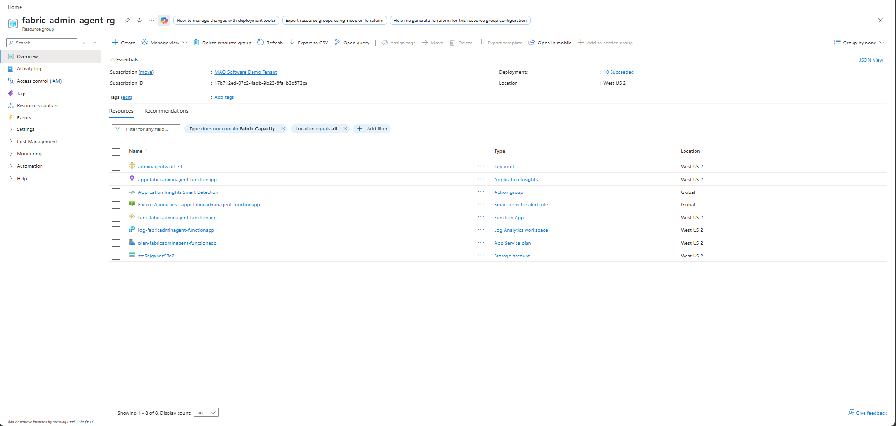

The following resources should be visible in the Azure Resource Group:

- Azure Key Vault
- Azure Function App
- App Service Plan
- Azure Storage Account
- Log Analytics Workspace
- Application Insights

---

### Step 9: Copy the Function App Managed Identity

**1.** In the Azure Portal, navigate to the deployed **Function App**.

**2.** Go to **Settings → Identity**.

**3.** Under the **System assigned** tab, copy the **Object (principal) ID**.

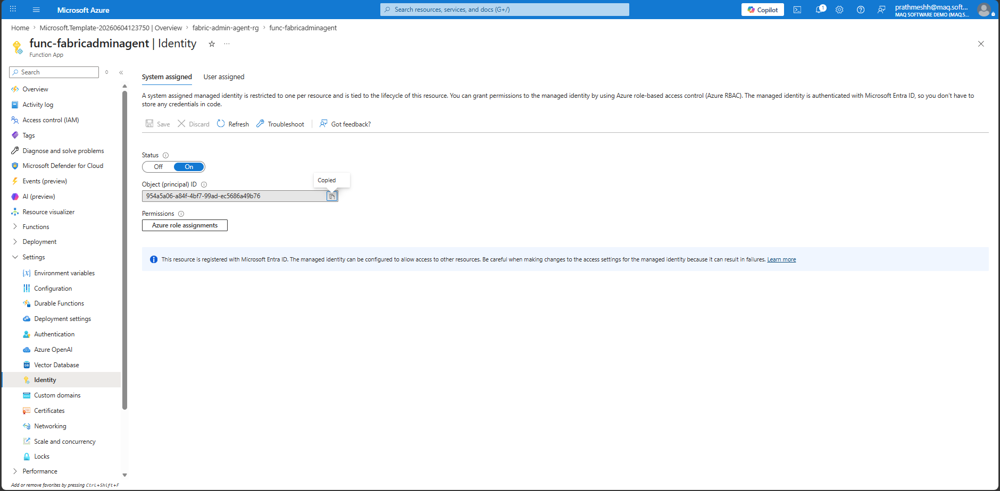

---

### Step 10: Grant Workspace Contributor Role to the Function App

**1.** Navigate to the Fabric workspace in the Fabric Portal.

**2.** Go to **Workspace settings → Manage access**.

**3.** Add the Function App's managed identity (using the Object ID from Step 9) with the **Contributor** role.

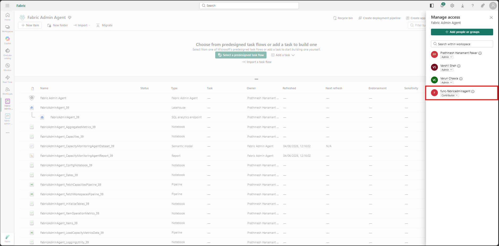

---

### Step 11: Grant Capacity Roles to the Function App Identity

For each capacity to be onboarded, grant the following Fabric permissions to the Function App's managed identity:

- **Microsoft.Fabric/capacities/read**
- **Microsoft.Fabric/capacities/write**

**1.** Go to **Microsoft Fabric Admin Portal → Capacities**.

**2.** Select the target capacity.

**3.** Add the Function App's managed identity with the required roles.

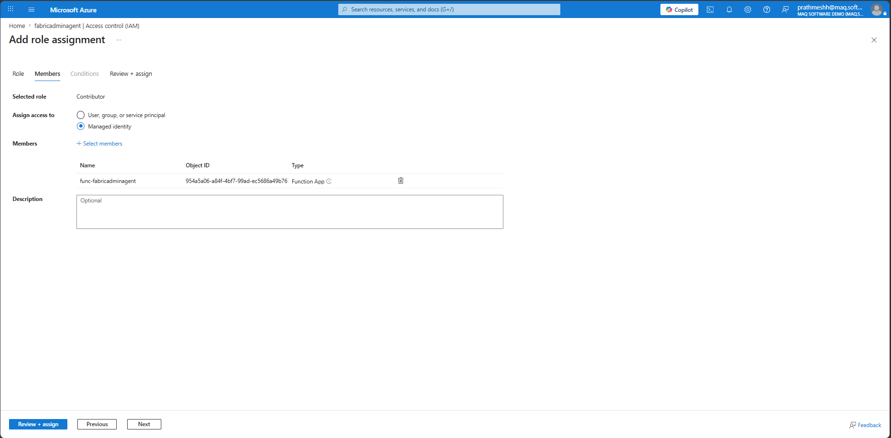

---

### Step 12: Grant Key Vault Secrets User Role to the Function App

**1.** In the Azure Portal, navigate to the deployed **Key Vault**.

**2.** Go to **Access control (IAM) → Add role assignment**.

**3.** Assign the **Key Vault Secrets User** role to the Function App's managed identity.

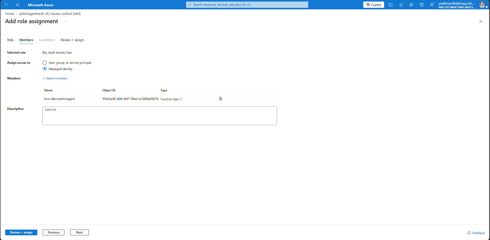

---

### Step 13: Create a High-Volume Email (HVE) Account and Store Secrets in the Key Vault

The Fabric Admin Agent sends alert notification emails using a dedicated email account. Microsoft recommends using a **High Volume Email (HVE)** account for reliable delivery at scale.

**Create the HVE account:**

**1.** Sign in to the [Microsoft 365 admin center](https://admin.microsoft.com).

**2.** Go to **Users → Active users** and create a new user (e.g., `fabricadminagent-alerts@yourdomain.com`).

**3.** Assign the user a license that includes Exchange Online (e.g., Exchange Online Plan 1 or Microsoft 365 Business Basic).

**4.** Navigate to the [Exchange admin center](https://admin.exchange.microsoft.com) → **Settings → Mail flow** → **High volume email**.

**5.** Enable HVE for the mailbox and note down the SMTP credentials.

> **[Screenshot: Exchange admin center — High volume email settings with the new mailbox enabled]**

<!-- > **Note:** Alternatively, you can use an existing shared mailbox or a standard Microsoft 365 account with an app password. HVE is recommended for production use to avoid throttling. -->

**Store the secrets in the Key Vault:**

In the deployed Key Vault, create the following secrets:

<table border="1" cellpadding="6" cellspacing="0" style="border-collapse:collapse; width:100%;">
  <thead>
    <tr><th>Secret Name</th><th>Value</th></tr>
  </thead>
  <tbody>
    <tr><td><code>FabricAdminAgentEmail</code></td><td>Email address used for sending alert notifications</td></tr>
    <tr><td><code>FabricAdminAgentEmailPassword</code></td><td>Password / App password for the notification email account</td></tr>
  </tbody>
</table>

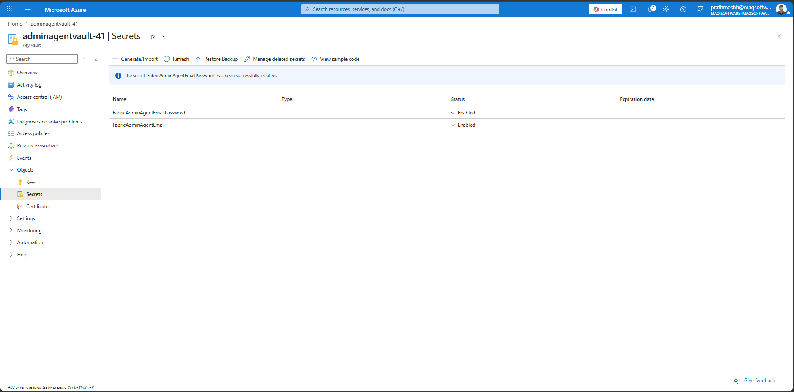

---

### Step 14: Verify Function App Configuration

**1.** In the Azure Portal, navigate to the deployed **Function App**.

**2.** Go to **Settings → Environment variables** (or **Configuration**).

**3.** Verify that all Key Vault reference settings display a **resolved** status (green checkmark).

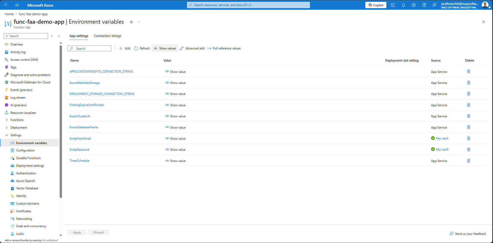

---

### Step 15: Authorize Connections in Manage Connections and Gateways

The Fabric Admin Agent supports multiple authentication methods for its Fabric connections. Configure the authentication method that best aligns with your organization's security and governance requirements.

**1.** In the Fabric Portal, navigate to:

**Settings (top right) → Manage connections and gateways**

---

**15.1 Configure the PBI Service Connection**

The PBI Service Connection is used by the Fabric Admin Agent to retrieve tenant metadata, including Fabric capacities and workspaces.

**2.** Locate the **PBI Service connection** (`fabricadminagent-pbi-service-admin_<identifier>`).

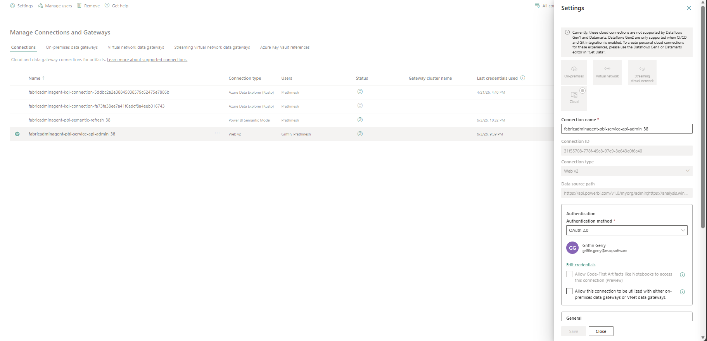

**3.** Edit the connection credentials and select one of the supported authentication methods.

| Authentication Method | Minimum Requirements                                                               |
| --------------------- | ---------------------------------------------------------------------------------- |
| OAuth2                | Fabric Administrator (recommended) or Global Administrator                         |
| Service Principal     | Service Principal configured for Power BI/Fabric REST APIs and Power BI Admin APIs |
| Workspace Identity    | Workspace Identity enabled and granted required Fabric permissions                 |

**4.** Save the connection configuration.

---

**15.2 Configure the PBI Semantic Refresh Connection**

The PBI Semantic Refresh Connection is used to access and refresh semantic models used by the workload.

**5.** Locate the **PBI Semantic Refresh connection**.

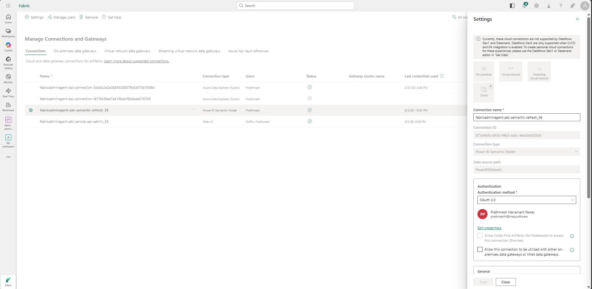

**6.** Edit the connection credentials and configure the same authentication method used for the PBI Service Connection.

**7.** Save the connection configuration.

---

### OAuth2 Requirements

If using OAuth2:

#### PBI Service Connection

* Sign in using a **Fabric Administrator** account (recommended).
* The account must have permission to access the Power BI Admin APIs used by the workload.

#### PBI Semantic Refresh Connection

* Access to the Fabric workspace.
* Access to the semantic model.
* Contributor (or higher) permissions on the workspace are recommended.

---

### Service Principal Requirements

If using a Service Principal:

#### Microsoft Entra Configuration

1. Create a Microsoft Entra App Registration.
2. Create a Microsoft Entra Security Group.
3. Add the Service Principal to the Security Group.

#### Fabric Tenant Settings

Enable the following tenant settings and scope them to the Security Group containing the Service Principal:

* Service principals can call Fabric public APIs

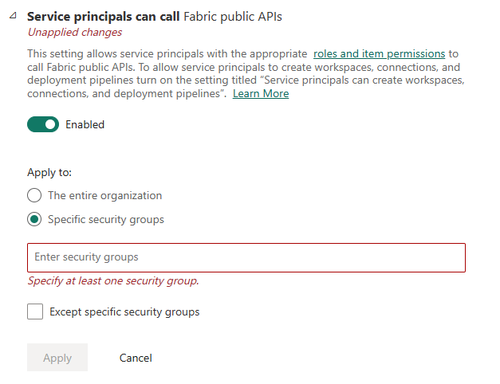

* Service principals can access read-only admin APIs

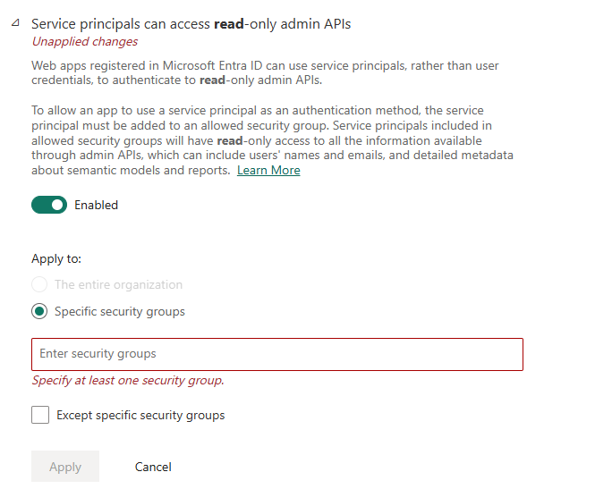

#### Fabric Permissions

Grant the Service Principal:

* Access to the required Fabric workspaces.
* Access to the semantic models used by the workload.
* Contributor (or higher) permissions on monitored Fabric capacities.

> **Note:** The Fabric Admin Agent only performs read operations against Power BI Admin APIs to retrieve capacities and workspaces. The **Service principals can access admin APIs used for updates** tenant setting is not required.

---

### Workspace Identity Requirements

If using Workspace Identity:

* Workspace Identity must be enabled for the Fabric workspace.
* Workspace Identity must have access to the required Fabric workspaces.
* Workspace Identity must have access to the semantic models used by the workload.
* Workspace Identity must be granted Contributor (or higher) permissions on monitored Fabric capacities.

---

### Step 16: Configure Semantic Model OAuth Settings

**1.** In the Fabric workspace, open the **FabricAdminAgent_CapacityMonitoringAgentDataset** semantic model.

**2.** Go to **Settings → Data source credentials**.

**3.** Edit the KQL DB source credentials and set them to **OAuth2**.

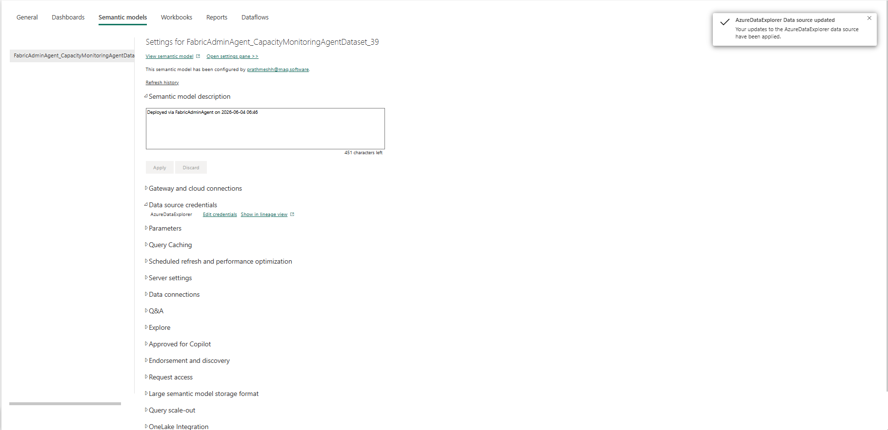

---

### Step 17: Add a Capacity in the Workload

**1.** Open the **Fabric Admin Agent** workload item.

**2.** Navigate to the **Configuration** tab.

**3.** Click **Add Capacity** and select the capacity to onboard.

> **Note:** The user must be a **Fabric Capacity Administrator** for the respective capacity.

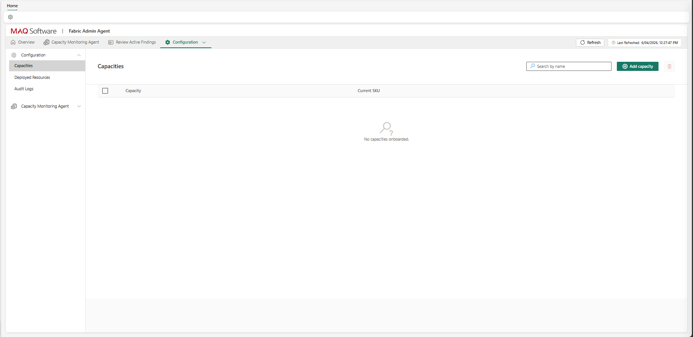

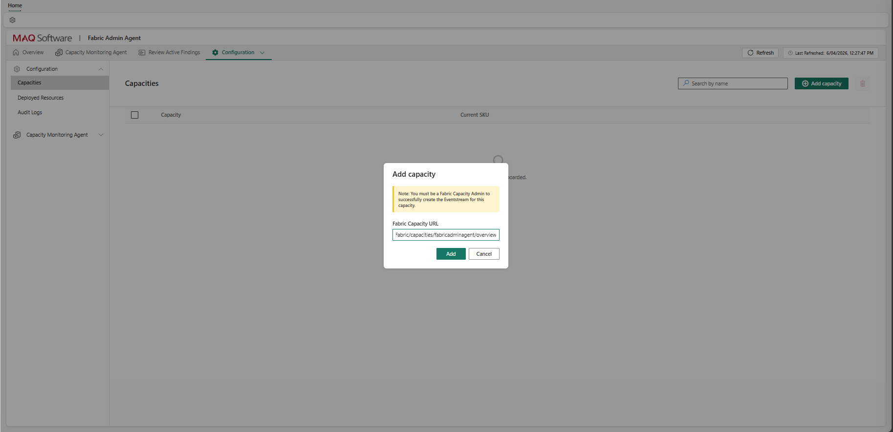

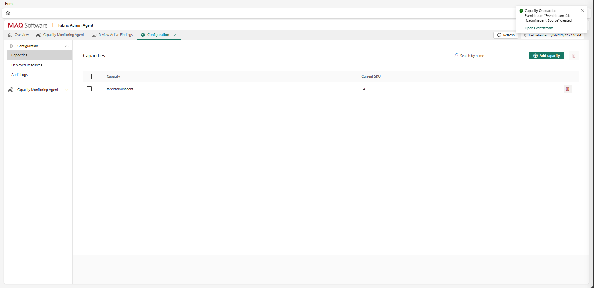

---

### Step 18: Configure Finding Settings

For each onboarded capacity, configure the detection thresholds and notification settings:

**1.** In the **Configuration** tab, select the onboarded capacity.

**2.** Fill in the finding configuration fields:

<table border="1" cellpadding="6" cellspacing="0" style="border-collapse:collapse; width:100%;">
  <thead>
    <tr><th>Setting</th><th>Description</th></tr>
  </thead>
  <tbody>
    <tr><td>Sensitivity</td><td>Detection sensitivity level for anomaly findings</td></tr>
    <tr><td>Email Recipients</td><td>Comma-separated list of email addresses to receive alert notifications</td></tr>
    <tr><td>Thresholds</td><td>CU percentage thresholds for each finding type (Sustained Load, Spike, Trend)</td></tr>
    <tr><td>Min F-SKU</td><td>Minimum allowed SKU for auto-scaling actions</td></tr>
    <tr><td>Max F-SKU</td><td>Maximum allowed SKU for auto-scaling actions</td></tr>
  </tbody>
</table>

**3.** Click **Save**.

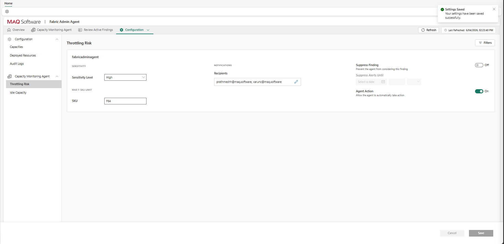

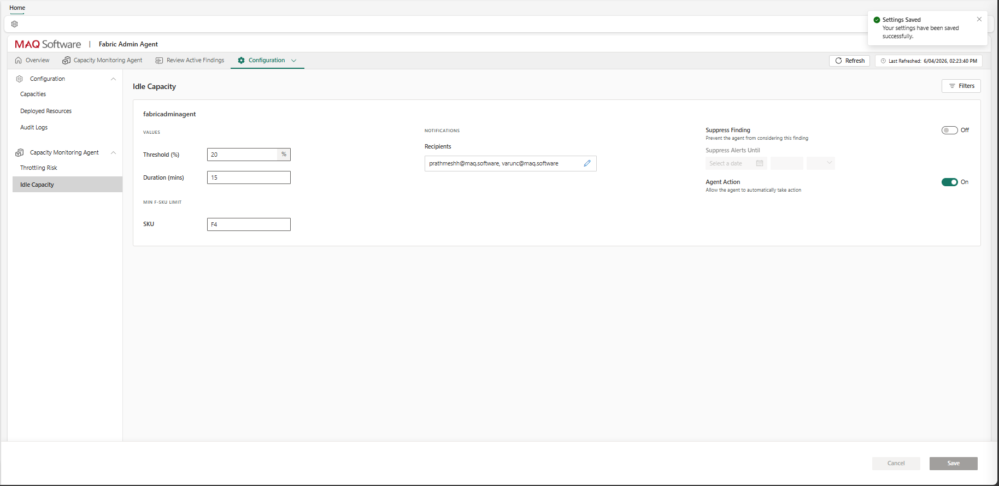

---

### Step 19: Configure and Schedule the Data Pipeline

**1.** In the Fabric workspace, open the **FabricAdminAgent_LoadCapacityMetricsData** pipeline.

**2.** Provide the required pipeline parameters:

<table border="1" cellpadding="6" cellspacing="0" style="border-collapse:collapse; width:100%;">
  <thead>
    <tr><th>Parameter</th><th>Value</th></tr>
  </thead>
  <tbody>
    <tr><td>Capacity Metrics App Workspace Name</td><td>Name of the workspace where the Capacity Metrics App is installed</td></tr>
    <tr><td>Capacity Metrics App Model Name</td><td>Name of the Capacity Metrics App semantic model</td></tr>
  </tbody>
</table>

**3.** Set a **Daily** schedule (or as required by your refresh cadence).

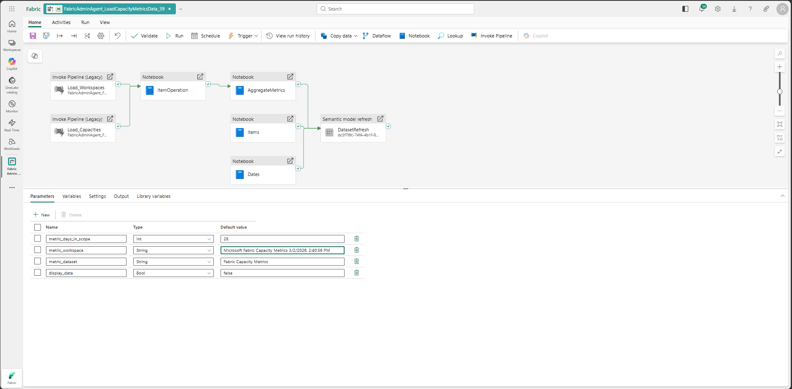

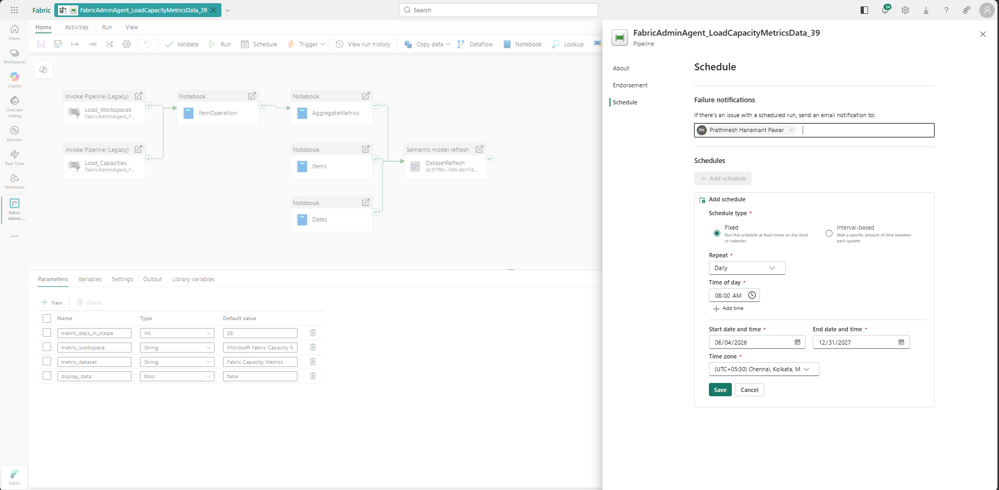

---

### Step 20: Verify Setup

After completing all steps, confirm the system is operating correctly:

- **Review Active Findings** tab in the Fabric Admin Agent workload should start populating with alerts once capacity events are detected and the detection logic runs.
- **Monitoring Agent** tab will be populated after the pipeline refresh completes successfully.

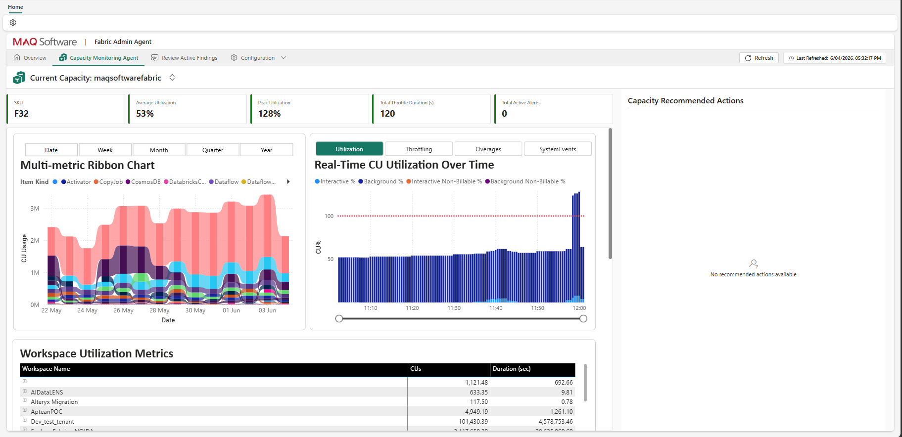

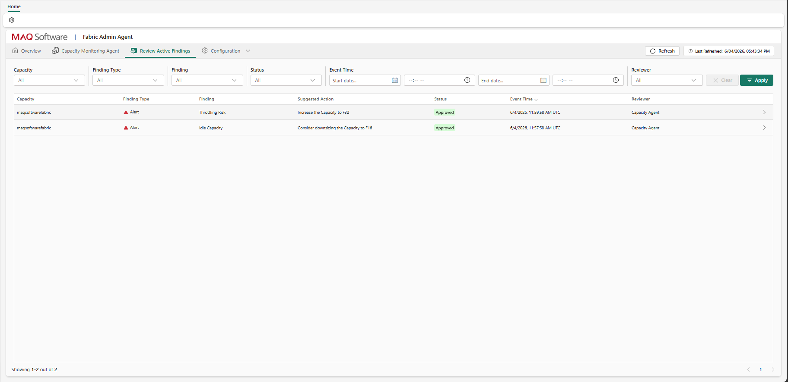

---

## 4. Onboarding a New Capacity

When a new Fabric capacity needs to be monitored, perform the following steps. These are **per-capacity one-time setup steps** in addition to the one-time infrastructure setup in Section 3.

### Step 1: Assign Capacity Admin Role

1. Go to **Microsoft Fabric Admin Portal → Capacities**.
2. Select the new capacity.
3. Go to the **'Capacity admins'** tab.
4. Add the user account or Service Principal that will configure the Eventstream.

> This role is **required** to see 'Capacity Overview Events' as a source in Eventstream.

### Step 2: Add Capacity from the Workload

1. Go to **Configuration** in the Fabric Admin Agent.
2. Navigate to the **Capacities** tab.
3. Click **Add Capacities** — this will automatically insert the row in KQL DB.

> **Note:** CapacityId is the Fabric Capacity GUID (find it in the Admin Portal or via the Fabric REST API).

### Step 3: Eventstream Creation

When a capacity is onboarded in Step 2, an Eventstream named **`Eventstream-<capacity-name>-Source`** is automatically created in the workspace. No manual Eventstream setup is required.

> Verify the Eventstream is active and streaming events after onboarding.

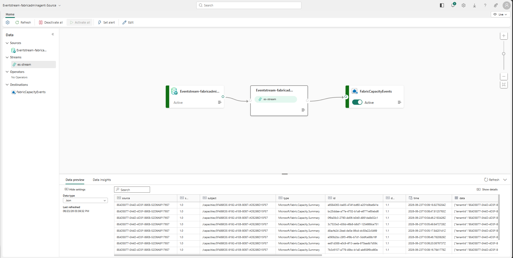

### Step 4: Verify Data Flow

After onboarding, confirm the following:

- Eventstream is active and streaming events.
- FabricCapacityEvents table in KQL DB is receiving rows.
- Detection notebooks are picking up data for the new capacity on the next scheduled run.

---

## 5. Disclaimer

- **Capacity Off Behavior:**
  - When a capacity is turned off, the Eventstream also turns off automatically.
  - The Eventstream must be turned on manually after the capacity is re-enabled.

- **Function App Managed Identity Permissions:** The Function App uses a System Assigned Managed Identity. The following permissions must be granted to this identity:
  - **Key Vault Secrets User** role on the deployed Azure Key Vault (to read email credentials at runtime)
  - **Contributor** role on the Fabric workspace (to interact with Fabric APIs)
  - **Microsoft.Fabric/capacities/read** and **Microsoft.Fabric/capacities/write** roles on each monitored Fabric capacity (to scale up, scale down, pause, and resume)

- **Key Vault Secret Naming Convention:** The following Azure Key Vault secrets must be created using the specified naming convention:
  - FabricAdminAgentEmail
  - FabricAdminAgentEmailPassword

---

*End of Document*

*For questions or updates, contact the Fabric Admin Agent Team — MAQ Software*
