# Fabric Admin Agent — Backend Setup & Onboarding Guide

*Complete technical reference for infrastructure setup, data pipeline configuration, notebook scheduling, and capacity onboarding*

<table border="1" cellpadding="6" cellspacing="0" style="border-collapse:collapse;">
  <thead>
    <tr><th>Field</th><th>Details</th></tr>
  </thead>
  <tbody>
    <tr><td><strong>Version</strong></td><td>v2.0</td></tr>
    <tr><td><strong>Owner</strong></td><td>Fabric Admin Agent Team — MAQ Software</td></tr>
    <tr><td><strong>Last Updated</strong></td><td>February 2026</td></tr>
    <tr><td><strong>Classification</strong></td><td>Internal — Confidential</td></tr>
    <tr><td><strong>Audience</strong></td><td>Backend engineers, DevOps, Fabric admins</td></tr>
  </tbody>
</table>

---

## Table of Contents

1. [Overview & Goal](#1-overview--goal)
2. [Prerequisites & Role Requirements](#2-prerequisites--role-requirements)
3. [One-Time Infrastructure Setup](#3-one-time-infrastructure-setup)
4. [Notebook Scheduling](#4-notebook-scheduling)
5. [Pipeline Scheduling](#5-pipeline-scheduling)
6. [KQL ConfigTable — Full Reference](#6-kql-configtable--full-reference)
7. [Onboarding a New Capacity](#7-onboarding-a-new-capacity)
8. [Disclaimer](#8-disclaimer)
9. [Common Issues & Troubleshooting](#9-common-issues--troubleshooting)

---

## 1. Overview & Goal

The Fabric Admin Agent is a proactive capacity management solution built on **Microsoft Fabric Workload Extensibility Toolkit**. It continuously monitors Fabric capacity telemetry in near real-time, detects anomalies (sustained overloads, sudden spikes, upward trends), predicts future CU consumption, and surfaces actionable recommendations — moving tenant admins from reactive troubleshooting to proactive stewardship.

>  **Goal:** Deploy the complete Fabric Admin Agent backend so that, after onboarding a new capacity, the system automatically ingests live capacity events, runs detection notebooks on a schedule, surfaces findings to the UI, and sends notifications — all without manual intervention.

### 1.1 Core Architecture

The backend is composed of four layers that work together in a continuous pipeline:

<table border="1" cellpadding="6" cellspacing="0" style="border-collapse:collapse; width:100%;">
  <thead>
    <tr><th>Layer</th><th>Technology</th><th>Purpose</th></tr>
  </thead>
  <tbody>
    <tr><td>Real-time Ingestion</td><td>Eventstream → Eventhouse (KQL DB)</td><td>Streams live Capacity Overview Events every 30 sec</td></tr>
    <tr><td>Historical Staging</td><td>Pipeline → Lakehouse (Delta tables)</td><td>Pulls item-level metrics from Capacity Metrics App</td></tr>
    <tr><td>Detection &amp; Analytics</td><td>PySpark Notebooks (scheduled)</td><td>Runs all detection logic, predictions, aggregates findings</td></tr>
    <tr><td>Operational Metadata</td><td>SQL Database (FabricAdminAgentDB)</td><td>Stores findings, settings, capacities, audit logs</td></tr>
  </tbody>
</table>

### 1.2 Key Fabric & Azure Artifacts

All artifacts are deployed in the Fabric workspace used by the Admin Agent:

<table border="1" cellpadding="6" cellspacing="0" style="border-collapse:collapse; width:100%;">
  <thead>
    <tr><th>Artifact Name</th><th>Type</th><th>Role</th></tr>
  </thead>
  <tbody>
    <tr><td>capacity_utilization_eventstream</td><td>Eventstream</td><td>Source: Capacity Overview Events → KQL DB</td></tr>
    <tr><td>FabricAdminAgentLogs</td><td>KQL Eventhouse DB</td><td>Stores FabricCapacityEvents, CapacityUtilization, ConfigTable, MVs</td></tr>
    <tr><td>FabricAdminAgent</td><td>Lakehouse</td><td>Delta tables: alert staging, model artifacts, predictions</td></tr>
    <tr><td>LoadDataCapacityMetrics</td><td>Data Pipeline</td><td>Pulls item-level data from Capacity Metrics App</td></tr>
    <tr><td>FabricAdminAgentDB</td><td>SQL Database</td><td>dbo.FabricFindings, Capacities, CapacitySettings, SettingTypes</td></tr>
    <tr><td>FabricAdminAgent_CapacityEventsInsights</td><td>Power BI Report</td><td>Embedded visual: CU utilization line chart based on capacity events</td></tr>
    <tr><td>FabricAdminAgent_CapacityMetricsInsights</td><td>Power BI Report</td><td>Embedded visual: workspace/item/operation metrics</td></tr>
    <tr><td>FabricAdminAgent_InitializeTables</td><td>Notebook</td><td>One-time: creates all KQL tables, MVs, and SQL schema</td></tr>
    <tr><td>FabricAdminAgent_ConfigVariables</td><td>Notebook</td><td>Returns KQL URI; called by all other notebooks at startup</td></tr>
    <tr><td>FabricAdminAgent_Utils</td><td>Notebook</td><td>Shared utility functions (logging, token helpers, etc.)</td></tr>
    <tr><td>FabricAdminAgent_AgentAction</td><td>Notebook</td><td>Allows Agent to automatically take recommended action and send email notifications</td></tr>
    <tr><td>FabricAdminAgent_SustainedLoadDetection</td><td>Notebook</td><td>Detects Sustained Load findings on onboarded capacities</td></tr>
    <tr><td>FabricAdminAgent_SpikeDetection</td><td>Notebook</td><td>Detects Spike Detection findings on onboarded capacities</td></tr>
    <tr><td>FabricAdminAgent_DetectCUTrend</td><td>Notebook</td><td>Detects CU Trending Upwards on onboarded capacities</td></tr>
    <tr><td>FabricAdminAgent_ModelTrainingForShortTermCUPredictions</td><td>Notebook</td><td>Trains models on user data based on capacity events</td></tr>
    <tr><td>FabricAdminAgent_InferenceShortTermCUPredictions</td><td>Notebook</td><td>Predicts CU utilization percentage based on capacity events</td></tr>
    <tr><td>FabricAdminAgent_FabricFindings</td><td>Notebook</td><td>Stores all findings generated after the last pipeline run</td></tr>
    <tr><td>FabricAdminAgent_AverageUtilization</td><td>Notebook</td><td>Calculates Avg CU utilization for last 14 days per capacity</td></tr>
    <tr><td>FabricAdminAgent_Dates</td><td>Notebook</td><td>Creates Date table</td></tr>
    <tr><td>FabricAdminAgent_AggregatedMetrics</td><td>Notebook</td><td>Creates day/week/month/quarter/year level CU metrics at workspace and item level</td></tr>
    <tr><td>FabricAdminAgent_ItemOperationMetrics</td><td>Notebook</td><td>Gathers item operation level data from Capacity Metrics App</td></tr>
    <tr><td>FabricAdminAgent_FetchCapacitiesPipeline</td><td>Pipeline</td><td>Gathers data of capacities present in the tenant</td></tr>
    <tr><td>FabricAdminAgent_FetchWorkspacesPipeline</td><td>Pipeline</td><td>Gathers workspace data within capacities in the tenant</td></tr>
    <tr><td>FabricAdminAgent_Capacities</td><td>Notebook</td><td>Gathers capacities in the tenant; executed in FetchCapacitiesPipeline</td></tr>
    <tr><td>FabricAdminAgent_Workspaces</td><td>Notebook</td><td>Gathers workspaces in capacities; executed in FetchWorkspacesPipeline</td></tr>
    <tr><td>FabricAdminAgent_CapacityMetricsModel</td><td>Semantic Model</td><td>Semantic Model for CapacityMetricsInsights report</td></tr>
    <tr><td>FabricAdminAgent_CapacityEventsModel</td><td>Semantic Model</td><td>Semantic Model for CapacityEventsInsights report</td></tr>
    <tr><td>FabricAdminAgentKeyVault</td><td>Azure Key Vault</td><td>Stores secrets (ClientId, ClientSecret, TenantId, EmailId, EmailPassword)</td></tr>
    <tr><td>FabricAdminAgentAutomation</td><td>Azure Automation</td><td>Used for creating schedules for capacity turn on/off</td></tr>
    <tr><td>FabricAdminAgentRunbook</td><td>Azure Runbook</td><td>Used for creating schedules for capacity turn on/off</td></tr>
  </tbody>
</table>

---

## 2. Prerequisites & Role Requirements

>  **Important:** All prerequisites below must be met before starting the setup steps. Missing any item will cause failures during Eventstream creation or notebook execution.

### 2.1 Fabric Roles

<table border="1" cellpadding="6" cellspacing="0" style="border-collapse:collapse; width:100%;">
  <thead>
    <tr><th>Role / Permission</th><th>Where</th><th>Why It Is Needed</th></tr>
  </thead>
  <tbody>
    <tr>
      <td>Capacity Administrator</td>
      <td>Microsoft Fabric (tenant level)</td>
      <td>Required to read Capacity Overview Events via Eventstream; must be assigned for every capacity being monitored</td>
    </tr>
    <tr>
      <td>Workspace Member or Admin</td>
      <td>Fabric Workspace (Admin Agent WS)</td>
      <td>Needed to create and configure all Fabric artifacts (Eventstream, Eventhouse, Lakehouse, Notebooks, Pipelines, Reports); required for the pipeline to read historical capacity metrics from lakehouse tables</td>
    </tr>
  </tbody>
</table>

### 2.2 Azure Resources

<table border="1" cellpadding="6" cellspacing="0" style="border-collapse:collapse; width:100%;">
  <thead>
    <tr><th>Resource</th><th>Configuration</th><th>Purpose</th></tr>
  </thead>
  <tbody>
    <tr><td>Azure Key Vault</td><td>User must have Key Vault Administrator role</td><td>Stores ClientId, ClientSecret, TenantId, EmailId, EmailPassword</td></tr>
    <tr><td>Service Principal (App)</td><td>Client Credentials grant; assigned SQL db_owner or db_datawriter</td><td>Used by all notebooks for SQL auth and Key Vault access via mssparkutils</td></tr>
    <tr><td>SMTP Email Account</td><td>Credentials stored in Key Vault</td><td>Sends notifications on finding detection and action taken</td></tr>
  </tbody>
</table>

### 2.3 Fabric Capacity Events — Capacity Admin Requirement

The Eventstream uses **Capacity Overview Events** as its source. This data source is only visible and selectable in the Eventstream editor if the logged-in user (or the Service Principal configuring the stream) is a **Capacity Administrator** on the target capacity in the Microsoft Fabric Admin Portal.

Without this role:

- The 'Capacity Overview Events' source option will **not** appear in the Eventstream source picker.
- No live CU telemetry will flow into the KQL DB.
- All detection notebooks will have no data to process and will exit early.

>  **How to Assign:** Go to Microsoft Fabric Admin Portal → Capacities → select the capacity → Capacity admins tab → Add the user or Service Principal.

---

## 3. One-Time Infrastructure Setup

Perform all steps below once per environment deployment. Each step is a dependency for the next.

### Step 1: Setup the Microsoft Fabric Capacity Metrics App

> Skip this step if you have already set up the Capacity Metrics App.

**1.** Navigate to the **Apps Section** on Power BI.

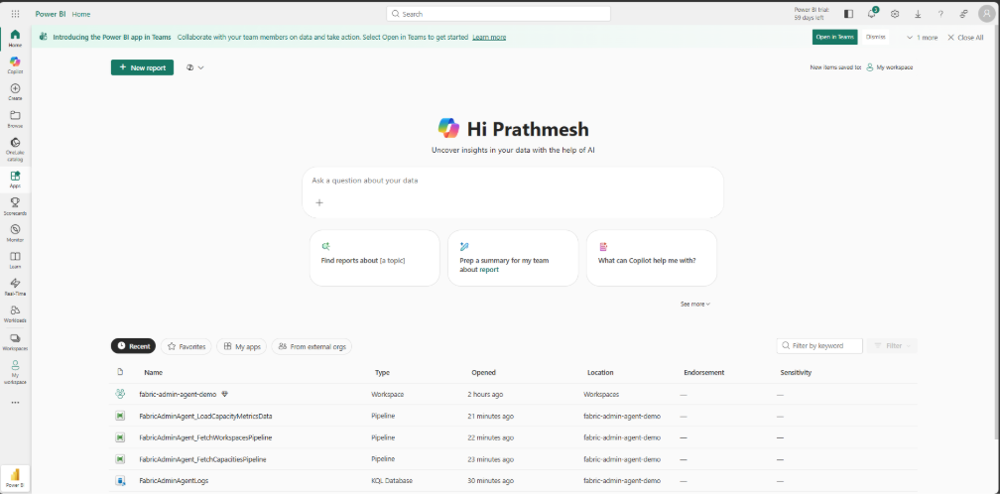

**2.** Click on the **Get Apps** button.

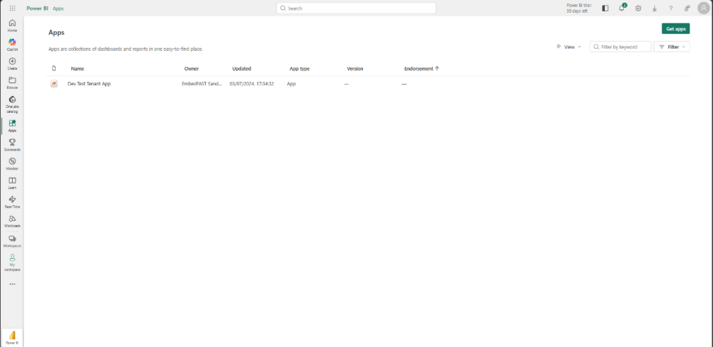

**3.** Search for **Microsoft Fabric Capacity Metrics** in the search menu.

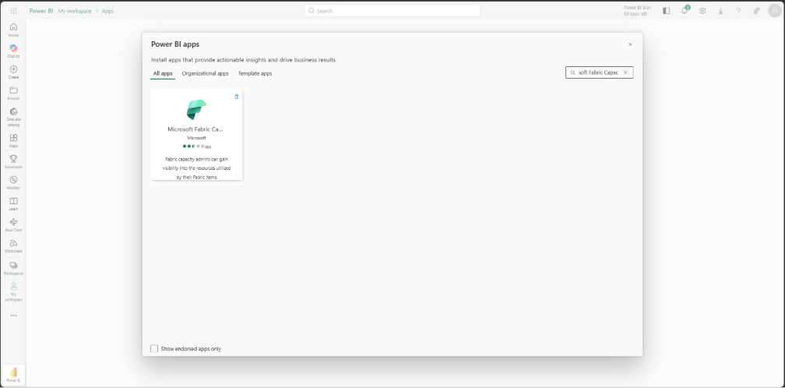

**4.** Click **Get it Now**.

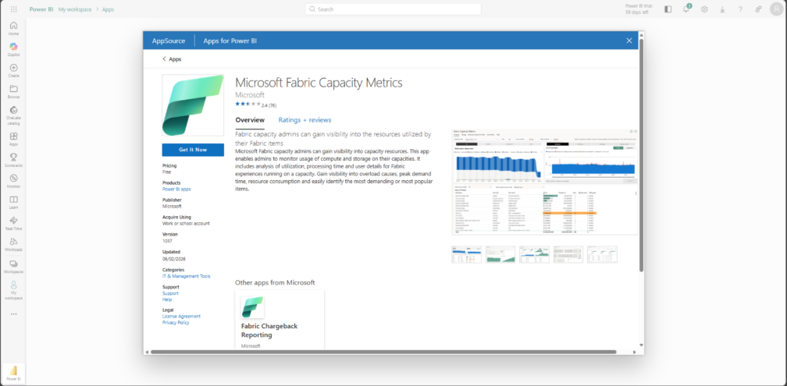

**5.** Click **Install**.

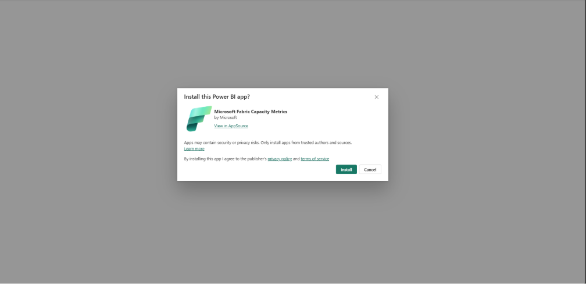

**6.** A new app is added named "Microsoft Fabric Capacity Metrics <<current_timestamp>>".

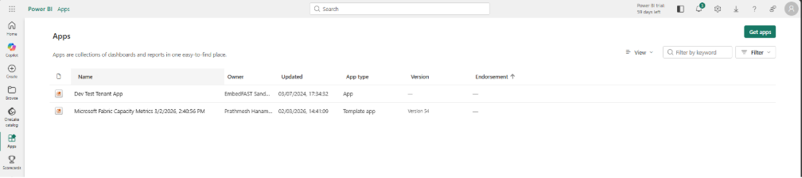

**7.** Click on the row to navigate to the new Report, then click **Connect**.

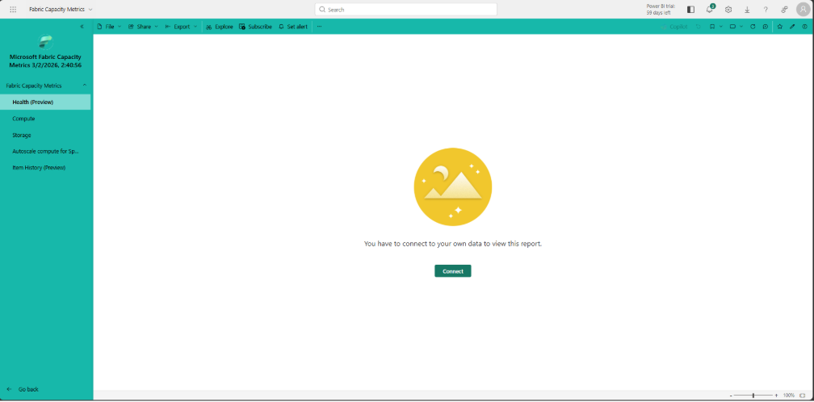

**8.** Set the **Offset** for the time according to the region Timestamp (e.g., for Indian Standard Time: +5.5).

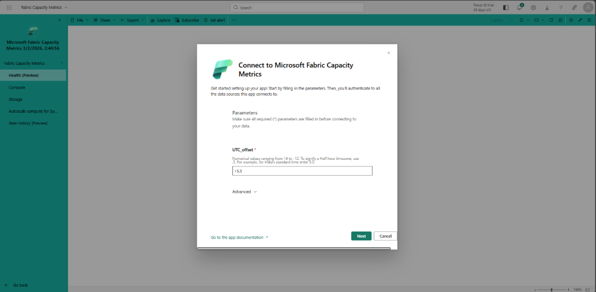

**9.** Sign in and Connect.

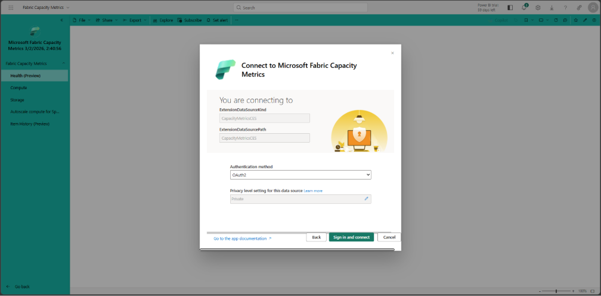

**10.** Report is now set up successfully.

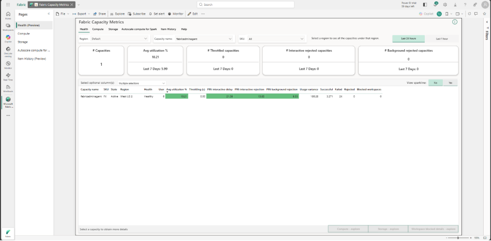

**11.** Note down the following details for the Microsoft Fabric Capacity Metrics App:

- Workspace Name
- Semantic Model Name

---

### Step 2: Create a Fabric Admin Agent Artifact

**1.** Click on the **New Item** button on the Fabric Portal.

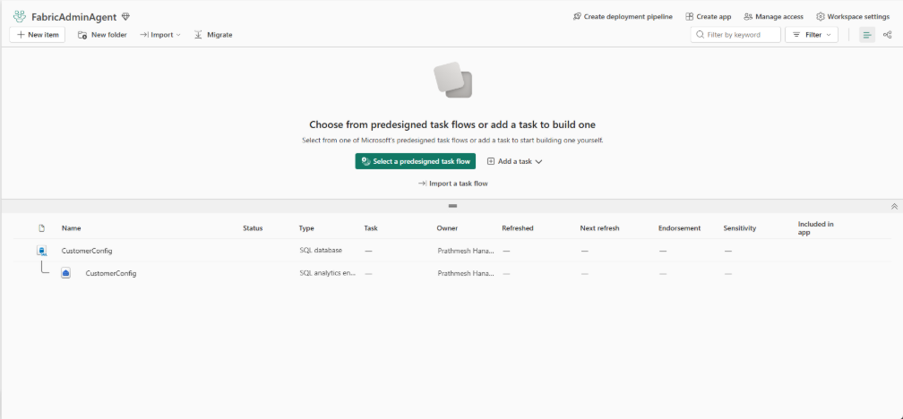

**2.** Search for **Fabric Admin Agent** and click on the tab.

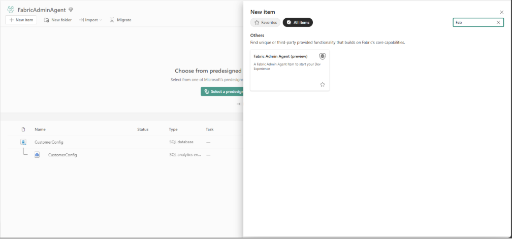

**3.** Enter the name of the artifact.

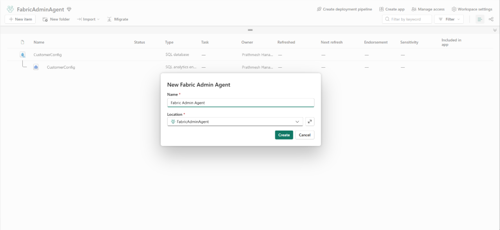

The artifact is created in its initial state.

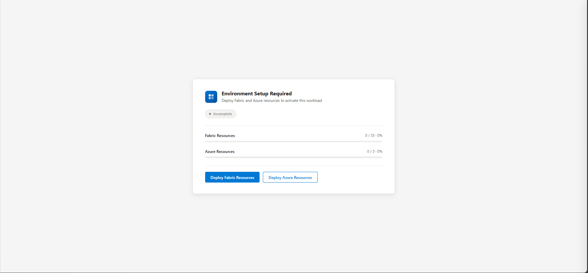

---

### Step 3: Deploy the Required Fabric and Azure Artifacts

**1.** Click the **Deploy Fabric Resources** button.


**2.** Deployment starts *(this step might take a few minutes)* Wait untill the Fabric resources are deployed.

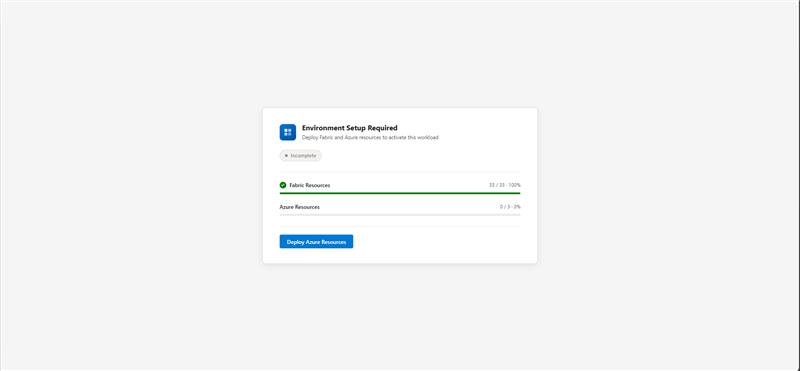

> This step deploys the required Fabric and also creates connection objects to refresh semantic models with the KQL DB.

**3.** Search for the Fabric SQL DB named **FabricAdminAgentDB** deployed in the current workspace.

**4.** Create a new Script, and execute the below script in the SQL DB

```
IF OBJECT_ID('dbo.FabricAdminAgentConfig', 'U') IS NULL
BEGIN
    CREATE TABLE dbo.FabricAdminAgentConfig
    (
        ConfigType  NVARCHAR(100) NOT NULL,
        ConfigName  NVARCHAR(100) NOT NULL,
        ConfigValue NVARCHAR(MAX) NOT NULL,
        CONSTRAINT PK_FabricAdminAgentConfig PRIMARY KEY (ConfigType, ConfigName)
    );
END;
GO

MERGE dbo.FabricAdminAgentConfig AS target
USING (VALUES
    -- Automation
    ('automation', 'SubscriptionId',    <<automation_subscriptionID>>),
    ('automation', 'ResourceGroupName', <<automation_resourceGroupName>>),
    ('automation', 'AccountName',       <<automation_acount_name>>),
    ('automation', 'RunbookName',       <<automation_runbook_name>>),

    -- KeyVault
    ('KeyVault', 'KeyVaultName', 'FabricAdminAgentKeyVault'),

    -- Capacity Monitoring Agent
    ('capacityMonitoringAgentConfig', 'WorkspaceName', <<workspace_name>>),
    ('capacityMonitoringAgentConfig', 'ReportName',    'FabricAdminAgent_CapacityMetricsInsights'),
    ('capacityMonitoringAgentConfig', 'PageName',      'CapacityMetricsInsights'),
    ('capacityMonitoringAgentConfig', 'TableName',     'capacities'),
    ('capacityMonitoringAgentConfig', 'ColumnName',    'displayName'),

    -- Capacity SKU Monitoring
    ('capacitySkuMonitoringConfig', 'WorkspaceName', <<workspace_name>>),
    ('capacitySkuMonitoringConfig', 'ReportName',    'FabricAdminAgent_CapacityEventsInsights'),
    ('capacitySkuMonitoringConfig', 'PageName',      'CU Percentage Trend'),
    ('capacitySkuMonitoringConfig', 'TableName',     'CapacityUtilization'),
    ('capacitySkuMonitoringConfig', 'ColumnName',    'CapacityName')

) AS source (ConfigType, ConfigName, ConfigValue)
ON  target.ConfigType = source.ConfigType
AND target.ConfigName = source.ConfigName

WHEN MATCHED THEN
    UPDATE SET ConfigValue = source.ConfigValue

WHEN NOT MATCHED THEN
    INSERT (ConfigType, ConfigName, ConfigValue)
    VALUES (source.ConfigType, source.ConfigName, source.ConfigValue);
GO
```

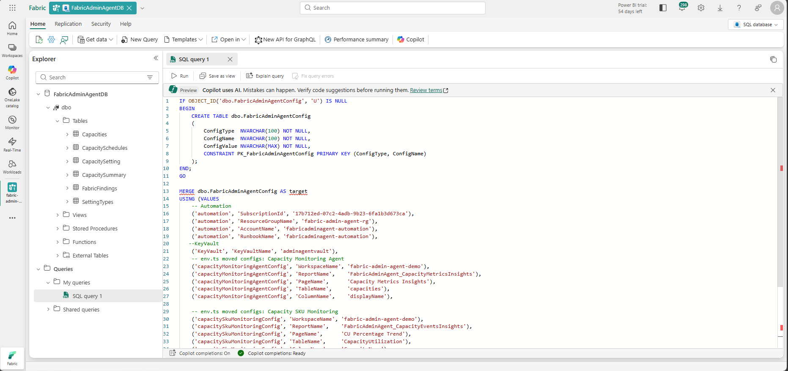

**Placeholder values:**

<table border="1" cellpadding="6" cellspacing="0" style="border-collapse:collapse; width:100%;">
  <thead>
    <tr><th>Placeholder</th><th>Description</th></tr>
  </thead>
  <tbody>
    <tr><td><code>&lt;&lt;automation_subscriptionID&gt;&gt;</code></td><td>The Azure subscription ID where the automation account will be deployed</td></tr>
    <tr><td><code>&lt;&lt;automation_resourceGroupName&gt;&gt;</code></td><td>The Azure resource group name where the automation account will be deployed</td></tr>
    <tr><td><code>&lt;&lt;automation_acount_name&gt;&gt;</code></td><td>Name of the automation account</td></tr>
    <tr><td><code>&lt;&lt;automation_runbook_name&gt;&gt;</code></td><td>Name of the runbook created under the automation account</td></tr>
    <tr><td><code>&lt;&lt;workspace_name&gt;&gt;</code></td><td>Name of the Fabric workspace</td></tr>
  </tbody>
</table>

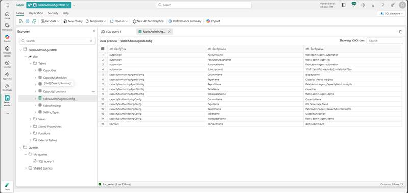


**5.** Deploy Azure resources: Click on Deploy Azure Resources button
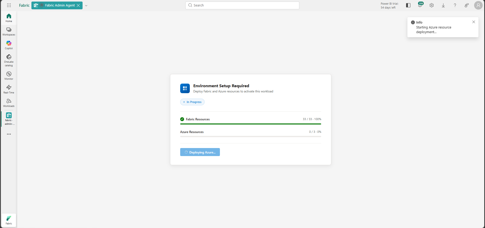

> This will deploy a azure automation account, a runbook and a Keyvault with the names added in the above SQL query executed in the SQL DB.

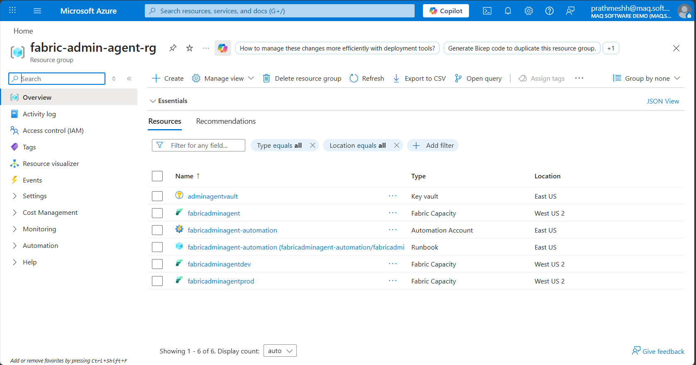

**6.** The Workload opens up, you can so to the settings tab --> extend App Settings section in the left pane --> and click on Deployed Aztifacts
> You will see the complete list of artifacts and their GUIDs deployed in Azure as well as Fabric

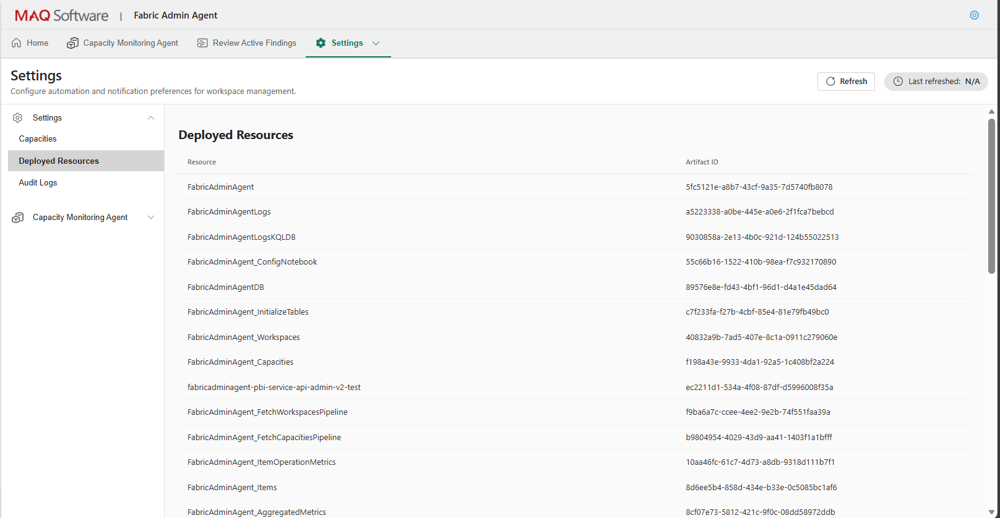
---

### Step 4: Setup the Deployed connection objects

**1.** Navigate to Settings in the top right --> Manage connections and gateways

**2.** Find the below three connections created - 
  * fabricadminagent-pbi-service-admin
  * fabricadminagent-kql-connection-<<current_workspace_GUID>>
  * A connection with the query URI of the KQL DB deployed

**3.** Setup the Authorization for all the 3 connections to be OAuth2 and Edit the credentials --> A Microsoft login popup comes in --> sign in with your account --> Click Save
> Added screenshots for one connection, follow similar steps for the other 2 connections

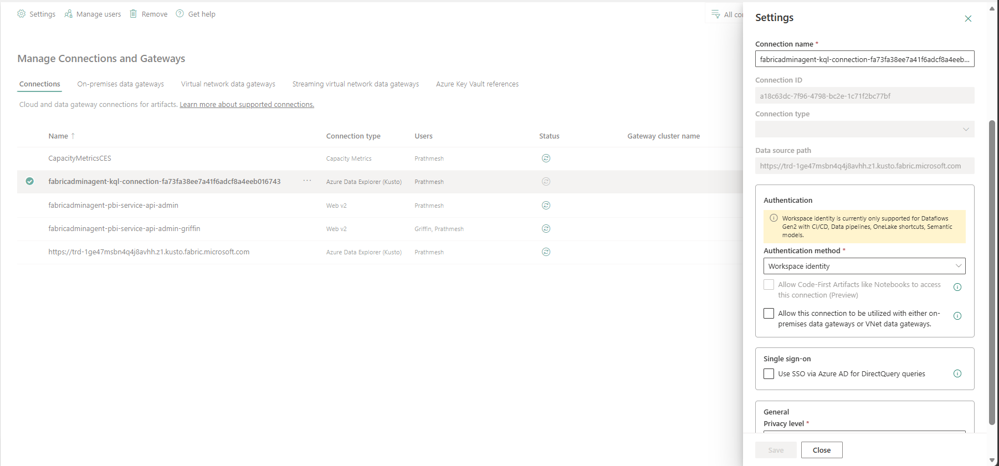

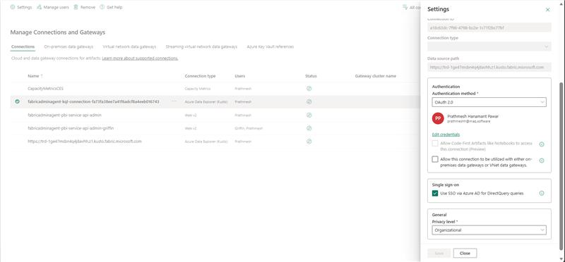

**4.** Navigate to the workspace, and find a pipline named **FabricAdminAgent_FindingsPipeline**
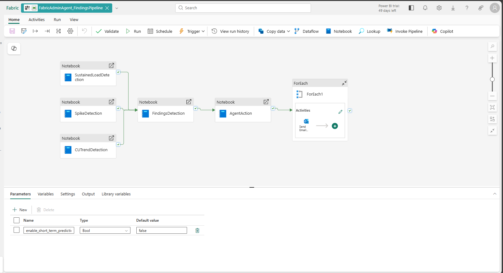

**5.** Click on the Outlook activity inside the For Each loop activity on the Pipline --> Click on the Source Settings

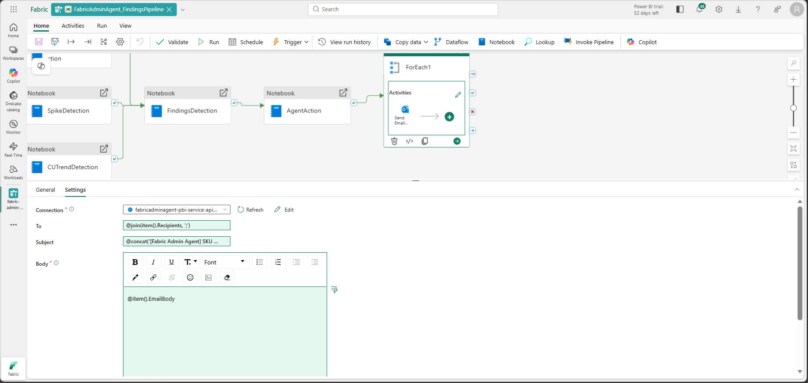

**6.** Click on the Edit Icon --> Browse all sources --> Microsoft 365 Outlook --> Name the connection as per your convention --> Sign In --> Click Connect --> Save the Pipeline

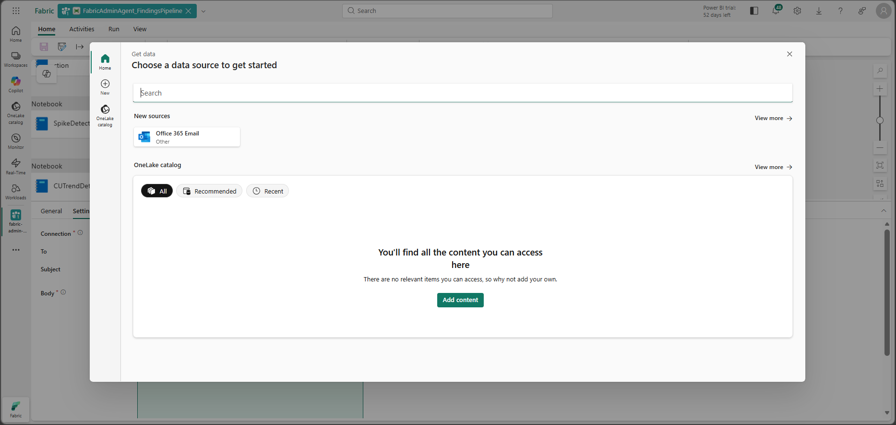
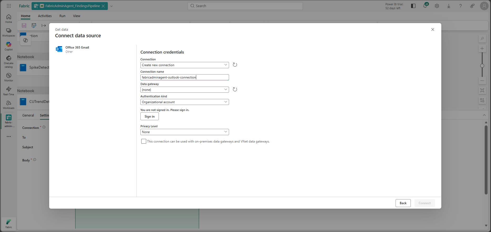
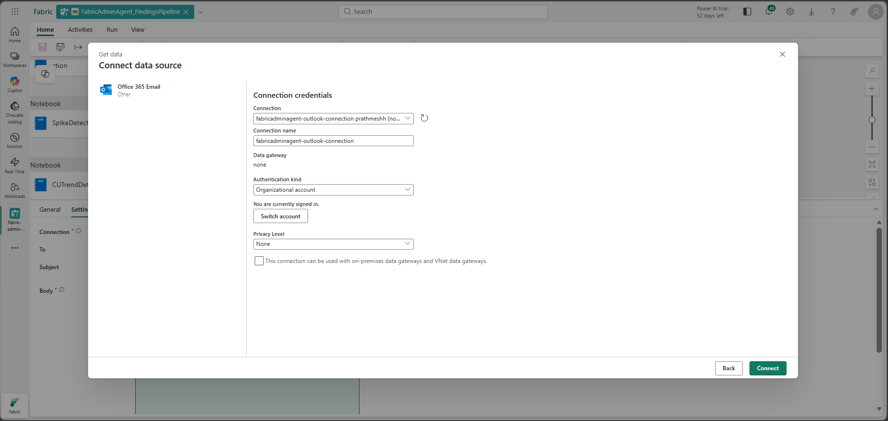
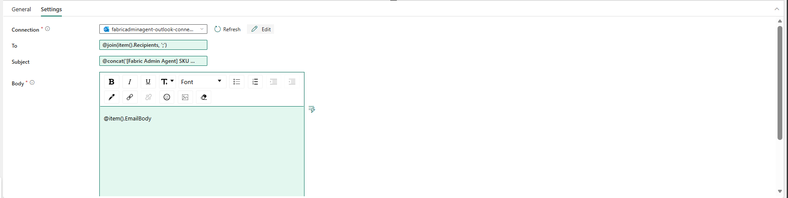

---

### Step 5: Setup Capacity Eventstream and KQL DB

>  This is a crucial step for the Fabric Admin Agent to be working. Fabric Capacity Overview Events must be enabled for the Tenant.

For each capacity to be onboarded to the Fabric Admin Agent:

**1.** Create an event stream for the capacity.

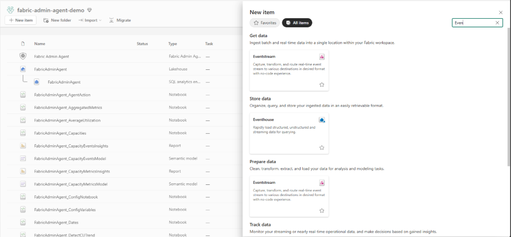

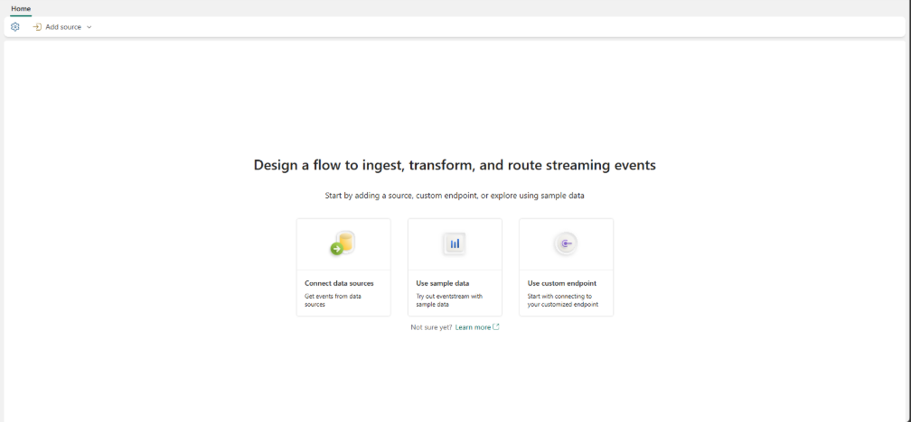

**2.** Set the source as **Fabric Capacity Overview Events**.

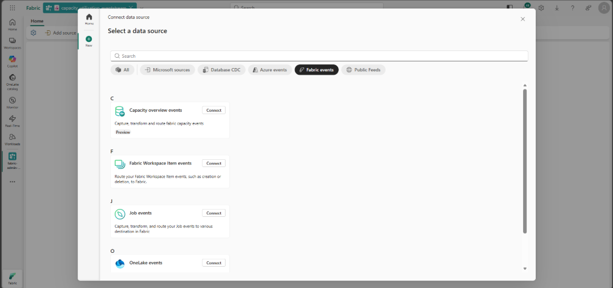

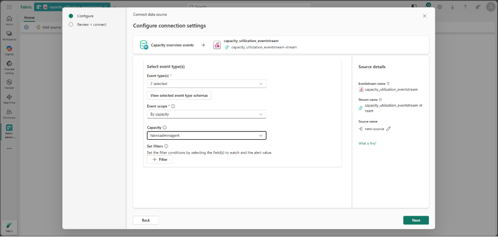

**3.** Set the destination as the **EventHouse** deployed in Step 3. The table name must be FabricCapacityEvents.

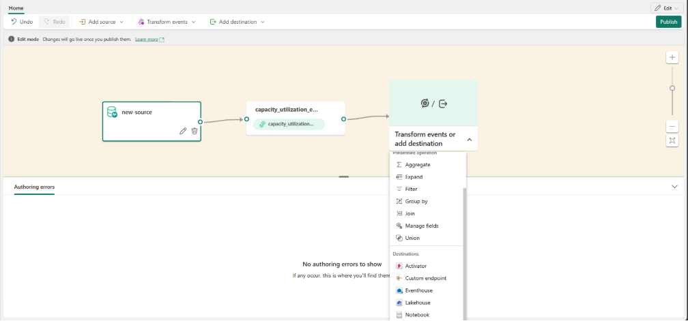

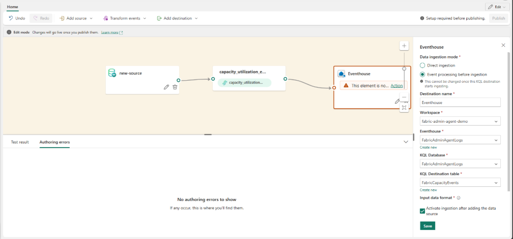

**4.** Save and publish the event stream topology.

---

### Step 8: Configure Azure Key Vault

In Azure Key Vault, create the following secrets:

<table border="1" cellpadding="6" cellspacing="0" style="border-collapse:collapse; width:100%;">
  <thead>
    <tr><th>Secret Name</th><th>Value</th></tr>
  </thead>
  <tbody>
    <tr><td><code>FabricAdminAgentClientId</code></td><td>Service Principal Application (Client) ID</td></tr>
    <tr><td><code>FabricAdminAgentClientSecret</code></td><td>Service Principal Client Secret</td></tr>
    <tr><td><code>TenantID</code></td><td>Azure Active Directory Tenant ID</td></tr>
    <tr><td><code>FabricAdminAgentEmailId</code></td><td>SMTP sender email address</td></tr>
    <tr><td><code>FabricAdminAgentEmailPassword</code></td><td>SMTP sender password</td></tr>
  </tbody>
</table>

Grant the Fabric Workspace Managed Identity (or the executing principal) **GET** permission on secrets.

Note down the **Key Vault URL** — this will be stored in the KQL ConfigTable.

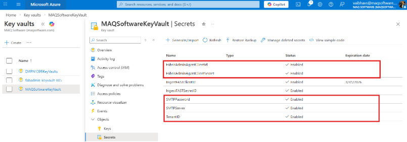

---

### Step 9: Set Up the Historical Data Pipeline

Open the LoadDataCapacityMetrics pipeline. This pipeline pulls item-level capacity metrics from the Capacity Metrics App.

Configure the pipeline parameters and set a **Daily** schedule (recommended — data from Capacity Metrics App is aggregated by day).

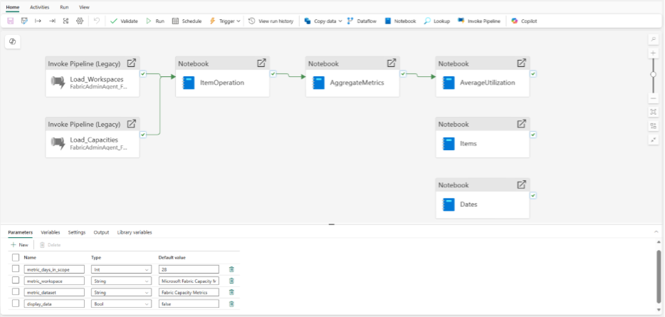

---

## 4. Notebook Scheduling

All detection notebooks follow a strict execution order. The three detection notebooks (Sustained Load, Spike Detection, CU Trend) run first, writing alerts to their respective Lakehouse staging tables. **FabricFindings** runs last, reading from all three staging tables and writing the unified, deduplicated results to the SQL FabricFindings table that powers the UI.

>  **Execution Order:** Detection Notebooks (run in parallel or sequence) → FabricFindings Notebook → AgentAction Notebook

### 4.1 Detection Notebooks — Schedule: Every 30 Minutes (or Customizable)

Each notebook reads incrementally from the KQL ConfigTable using its own LastProcessedDate key, processes only new data, writes alerts to Lakehouse, and updates its processed timestamp.

<table border="1" cellpadding="6" cellspacing="0" style="border-collapse:collapse; width:100%;">
  <thead>
    <tr><th>Notebook</th><th>Lakehouse Output Table</th><th>Config Key Updated</th><th>Finding Type</th></tr>
  </thead>
  <tbody>
    <tr><td>SustainedLoadDetection</td><td>dbo.incrementalsustainedloadalerts</td><td>SustainedLoadProcessedDate</td><td>Sustained Load</td></tr>
    <tr><td>SpikeDetectionEventhouseUtilization</td><td>dbo.spikealerts</td><td>SpikeDetectionProcessedDate</td><td>Spike Detection</td></tr>
    <tr><td>DetectCUTrend</td><td>dbo.cutrendalerts</td><td>CUTrendProcessedDate</td><td>CU Trending Upwards</td></tr>
    <tr><td>ShortTermCUPredictions (Inference)</td><td>dbo.CapacityPredictions</td><td>ShortTermPredictionProcessedDate</td><td>Short Term Prediction</td></tr>
  </tbody>
</table>

### 4.2 FabricFindings Notebook — Schedule: Every 30 Minutes (after detections)

This is the central aggregator. It runs after all detection notebooks complete and performs:

- Reads all four Lakehouse staging tables (incrementalsustainedloadalerts, spikealerts, cutrendalerts, CapacityPredictions)
- Selects the most relevant alert per capacity per finding type using the **second-largest processed timestamp** as an anchor to pick the closest EventTime record
- Normalizes all four sources into a unified schema (FindingId, Finding, CapacityName, CurrentSKU, FinalSKU, EventTime, Status, SuggestedAction, etc.)
- **Lifecycle management:** existing Active findings are moved to **Expired** when a newer finding for the same capacity+type arrives
- **Suppression management:** findings with SuppressFinding=true are moved to **Suppressed** status in SQL
- **Deduplication:** skips any finding that already exists in SQL with the same FindingKey + EventTime composite key
- **FinalSKU & SuggestedAction:** computed centrally — e.g., if CUPercentage > 90%, recommends next F-SKU tier (F16 → F32)
- Writes new, deduplicated findings to dbo.FabricFindings in Azure SQL in append mode

### 4.3 AgentAction Notebook — Schedule: Every 30 Minutes (after FabricFindings)

Runs only when AllowAgentAction = true is configured for a capacity. Automatically accepts recommended SKU upgrades without manual intervention:

- Reads CapacitySettings to find capacities with AllowAgentAction = true
- Filters FabricFindings for Status = Active and non-null FinalSKU for authorised (Capacity, FindingType) pairs
- Backend handles: SKU upgrade, status update to Approved, SMTP email notification to configured recipients
- Latency depends on notebook scheduling frequency

### 4.4 Model Training Notebook — Schedule: Weekly / On Demand

Trains the global time-series forecasting model for Short Term Predictions:

- Uses last 30 days of CapacityUtilization data from KQL (records with CUPercentage > 500 excluded)
- Trains 5 model types (Random Forest, Gradient Boosting, XGBoost, LightGBM, Ridge) for each of 3 forecast horizons (5 min, 15 min, 30 min) using Optuna hyperparameter search
- Best model selected by minimum CV RMSE using TimeSeriesSplit (3 folds)
- Saves model artifacts to Lakehouse/Files/models/model_{horizon}_{timestamp}.pkl and companion .json metadata
- Saves categorical encodings to Files/models/encodings/{column}_map.json — these **must** be present before Inference notebook runs

> Detection notebooks (×4) run every 30 min → FabricFindings runs 5 min after → AgentAction runs 5 min after that. Recommended: use Fabric Schedule or a Pipeline to chain execution order.

---

## 5. Pipeline Scheduling

### 5.1 LoadDataCapacityMetrics Pipeline

**What it does:**

- Reads item-level historical capacity data from the Capacity Metrics App (via tables: capacity_metrics_by_item_by_operation_by_day, etc.)
- Aggregates and stages the data into the FabricAdminAgent Lakehouse in a format ready for Power BI reports and trend analysis notebooks
- Powers the embedded Power BI reports (FabricAdminAgent_CapacityMetricsInsights) — workspace, item, and operation-level metrics

**Schedule configuration:**

<table border="1" cellpadding="6" cellspacing="0" style="border-collapse:collapse; width:100%;">
  <thead>
    <tr><th>Setting</th><th>Value</th></tr>
  </thead>
  <tbody>
    <tr><td>Schedule Frequency</td><td>Daily (recommended: 2:00 AM UTC)</td></tr>
    <tr><td>Trigger Type</td><td>Scheduled (Fabric Pipeline Scheduled Trigger)</td></tr>
    <tr><td>Dependency</td><td>Requires FUAM_Lakehouse tables to be available and populated</td></tr>
    <tr><td>On Failure</td><td>Alert the workspace admin via email; do not block detection notebooks execution</td></tr>
  </tbody>
</table>

---

## 6. KQL ConfigTable — Full Reference

The **ConfigTable** in the KQL database is the single source of truth for all runtime configurations. All notebooks read from and write to this table.

### 6.1 Table Schema

<table border="1" cellpadding="6" cellspacing="0" style="border-collapse:collapse; width:100%;">
  <thead>
    <tr><th>Column</th><th>Type</th><th>Description</th></tr>
  </thead>
  <tbody>
    <tr><td>Category</td><td>string</td><td>Logical grouping: SQLDBConfig, KeyVault, CapacityEvent</td></tr>
    <tr><td>ConfigKey</td><td>string</td><td>Unique key within category</td></tr>
    <tr><td>ConfigValue</td><td>string</td><td>The configuration value (connection string, secret name, timestamp, etc.)</td></tr>
    <tr><td>LastModifiedDate</td><td>datetime</td><td>Auto-updated timestamp; used to select most recent value per key</td></tr>
    <tr><td>IsActive</td><td>bool</td><td>Only active (<code>true</code>) records are read by notebooks</td></tr>
  </tbody>
</table>

### 6.2 Category: SQLDBConfig

SQL connection metadata. Notebooks use these values to construct the JDBC connection URL.

<table border="1" cellpadding="6" cellspacing="0" style="border-collapse:collapse; width:100%;">
  <thead>
    <tr><th>ConfigKey</th><th>Example Value</th><th>Description</th></tr>
  </thead>
  <tbody>
    <tr><td>SQLServerName</td><td><code>&lt;server&gt;.database.windows.net</code></td><td>Azure SQL Server hostname</td></tr>
    <tr><td>SQLDatabaseName</td><td><code>FabricAdminAgentDB</code></td><td>Target SQL Database name</td></tr>
  </tbody>
</table>

### 6.3 Category: KeyVault

Names of Azure Key Vault secrets (not the secret values themselves — notebooks fetch actual values at runtime via mssparkutils).

<table border="1" cellpadding="6" cellspacing="0" style="border-collapse:collapse; width:100%;">
  <thead>
    <tr><th>ConfigKey</th><th>Example Value (Secret Name in KV)</th><th>Purpose</th></tr>
  </thead>
  <tbody>
    <tr><td>KeyVaultName</td><td><code>&lt;&lt;name your keyvault&gt;&gt;</code></td><td>Key Vault where your secrets are stored</td></tr>
    <tr><td>ClientId</td><td><code>FabricAdminAgentClientId</code></td><td>Name of secret holding the Service Principal App ID</td></tr>
    <tr><td>ClientSecret</td><td><code>FabricAdminAgentClientSecret</code></td><td>Name of secret holding the Service Principal password</td></tr>
    <tr><td>TenantId</td><td><code>TenantId</code></td><td>Name of secret holding the AAD Tenant ID</td></tr>
    <tr><td>EmailId</td><td><code>FabricAdminAgentEmailId</code></td><td>Name of secret holding the SMTP sender email</td></tr>
    <tr><td>EmailPassword</td><td><code>FabricAdminAgentEmailPassword</code></td><td>Name of secret holding the SMTP password</td></tr>
  </tbody>
</table>

### 6.4 Category: CapacityEvent — Processed Timestamps

Each detection notebook reads its own **last-processed timestamp** from ConfigTable and updates it after each run. This enables incremental processing — only new data since the last execution is processed. On the very first run, if no timestamp exists, the full dataset is processed (cold start).

<table border="1" cellpadding="6" cellspacing="0" style="border-collapse:collapse; width:100%;">
  <thead>
    <tr><th>ConfigKey</th><th>Updated By</th><th>Used By</th></tr>
  </thead>
  <tbody>
    <tr><td>SustainedLoadProcessedDate</td><td>SustainedLoadDetection notebook</td><td>Filters SustainedLoadFindings WHERE WindowStart &gt;= this timestamp</td></tr>
    <tr><td>SpikeDetectionProcessedDate</td><td>SpikeDetectionEventhouseUtilization notebook</td><td>Filters CapacityUtilization WHERE WindowStartTime &gt;= this timestamp</td></tr>
    <tr><td>CUTrendProcessedDate</td><td>DetectCUTrend notebook</td><td>Filters SustainedLoadFindings WHERE WindowStart &gt;= this timestamp</td></tr>
    <tr><td>ShortTermPredictionProcessedDate</td><td>Inference: ShortTermCUPredictions notebook</td><td>Used by FabricFindings as anchor for selecting latest prediction record</td></tr>
  </tbody>
</table>

---

## 7. Onboarding a New Capacity

When a new Fabric capacity needs to be monitored, perform the following steps. These are **per-capacity one-time setup steps** in addition to the one-time infrastructure setup in Section 3.

### Step 1: Assign Capacity Admin Role

1. Go to **Microsoft Fabric Admin Portal → Capacities**.
2. Select the new capacity.
3. Go to the **'Capacity admins'** tab.
4. Add the user account or Service Principal that will configure the Eventstream.

> This role is **required** to see 'Capacity Overview Events' as a source in Eventstream.

### Step 2: Add Capacity from the Workload

1. Go to **Settings** in the Fabric Admin Agent.
2. Navigate to the **Capacities** tab.
3. Click **Add Capacities** — this will automatically insert the row in SQL DB.

> **Note:** CapacityId is the Fabric Capacity GUID (find it in the Admin Portal or via the Fabric REST API).

### Step 3: Create Eventstream for the Capacity

Follow Steps 6–7 from Section 3 for the new capacity:

- Create a new Eventstream using **Capacity Overview Events** as the source.
- Set the destination to FabricCapacityEvents table in the KQL Eventhouse.
- Authenticate any new connections.

### Step 4: Verify Data Flow

After onboarding, confirm the following:

- Eventstream is active and streaming events.
- FabricCapacityEvents table in KQL DB is receiving rows.
- Detection notebooks are picking up data for the new capacity on the next scheduled run.

---

## 8. Disclaimer

- **Tenant Configuration:** Each Tenant ID can have only one Fabric Admin Agent artifact setup.

- **Capacity Off Behavior:**
  - When a capacity is turned off, the Eventstream also turns off automatically.
  - The Eventstream must be turned on manually after the capacity is re-enabled.

- **Configurable Notebooks:** The following notebooks are configurable: Sustained Load, Spike Detection, CU Trend.
  Any changes in table names or variable names require corresponding updates in:
  - Config notebook
  - Fabric Finding notebook
  - Any other dependent notebooks or scripts

- **Pipeline Scheduling:** The pipeline schedule must match the refresh schedule of the Capacity Metrics App semantic model.

- **Short-Term Prediction Requirements:** For model training, at least one month of data must be collected from the Capacity Utilization table within Capacity Events.

- **Azure Automation Account Permissions:** The Azure Automation Account used for capacity operations must have the following permissions:
  - Microsoft.Fabric/capacities/suspend/action
  - Microsoft.Fabric/capacities/resume/action

- **Key Vault Secret Naming Convention:** The following Azure Key Vault secrets must be created using the specified naming convention:
  - FabricAdminAgentClientId
  - FabricAdminAgentClientSecret
  - TenantId
  - FabricAdminAgentEmailId
  - FabricAdminAgentEmailPassword

- **Service Principal Role:** The Service Principal should have **Contributor** role on the workspace where the Fabric Admin Agent workload is deployed.

---

## 9. Common Issues & Troubleshooting

<table border="1" cellpadding="6" cellspacing="0" style="border-collapse:collapse; width:100%;">
  <thead>
    <tr><th>Symptom</th><th>Likely Cause</th><th>Resolution</th></tr>
  </thead>
  <tbody>
    <tr>
      <td>No data in FabricCapacityEvents</td>
      <td>Eventstream not running or Capacity Admin role missing</td>
      <td>Check Eventstream status; verify user has Capacity Admin role on the capacity</td>
    </tr>
    <tr>
      <td>Detection notebook exits early with 'No new data'</td>
      <td>Last processed timestamp is ahead of available data (or first run with empty table)</td>
      <td>Check ConfigTable CapacityEvent timestamps; delete the entry to force a cold-start full scan</td>
    </tr>
    <tr>
      <td>FabricFindings notebook fails with JDBC error</td>
      <td>SQL connection details wrong in ConfigTable or Service Principal not authorized</td>
      <td>Verify SQLServerName and SQLDatabaseName in ConfigTable; confirm SP has SQL db_datawriter role</td>
    </tr>
    <tr>
      <td>Key Vault secret retrieval fails</td>
      <td>Role not assigned to that Key Vault</td>
      <td>Add yourself to Key Vault Access Policy (or RBAC: Key Vault Secrets User)</td>
    </tr>
    <tr>
      <td>AgentAction takes no action (no SKU upgrade)</td>
      <td>AllowAgentAction = false in CapacitySettings, or no Active findings with non-null FinalSKU</td>
      <td>Check SQL CapacitySettings.ConfigurationJSON for target capacity; verify findings in FabricFindings</td>
    </tr>
    <tr>
      <td>ML predictions not appearing</td>
      <td>Model .pkl files missing from Lakehouse (training not run yet)</td>
      <td>Run TimeForcasting_TimeForecastingModels notebook manually; verify Files/models/ has .pkl and .json artifacts</td>
    </tr>
    <tr>
      <td>Power BI report shows blank / no data</td>
      <td>Pipeline (LoadDataCapacityMetrics) hasn't run or lakehouse is unavailable</td>
      <td>Trigger pipeline manually; check FUAM workspace access permissions</td>
    </tr>
    <tr>
      <td>Workload not working</td>
      <td>Capacity in which the workload is running is either off or has reached its limit</td>
      <td>Go to the Azure portal and try to resume the capacity</td>
    </tr>
  </tbody>
</table>

---

*End of Document*

*For questions or updates, contact the Fabric Admin Agent Team — MAQ Software*
