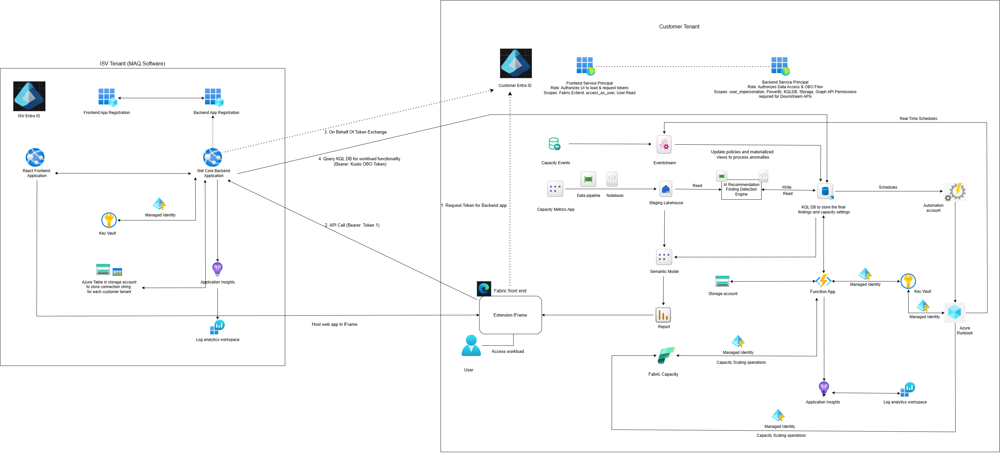

# Fabric Admin Agent

**Prevent Microsoft Fabric throttling before your users feel it — and stop paying for capacity you don't use.**

The Fabric Admin Agent watches every Microsoft Fabric capacity in your tenant around the clock. It spots throttling risk and wasted capacity as they emerge, tells you exactly what to do about them, and — when you choose — does it for you, within limits you set. It installs as a workload item in your own Fabric workspace, and your capacity data never leaves your tenant.

---

## Why teams use it

| Without the agent | With the agent |
|---|---|
| You find out about throttling when users complain | You get a finding — and optionally an automatic scale-up — before reports slow down |
| Oversized capacities bill silently for months | Idle capacity is flagged with the evidence to right-size it |
| Dev/test capacities run 24×7 | They pause every evening and resume before the team logs in |
| Sizing decisions rest on spreadsheets and guesswork | Every recommendation comes with 30 days of trend data behind it |
| Nobody knows which workspace caused the spike | Noisy-neighbor workspaces are identified, with a suggested new home |

---

## What it does

- **Watches in real time.** Live utilization from every onboarded capacity, refreshed about every 30 seconds.
- **Warns early.** Flags **Throttling Risk** and **Idle Capacity** using sensitivity and thresholds you tune per capacity.
- **Recommends with evidence.** AI Insights analyze your usage history to recommend the right SKU, a pause/resume schedule, or a better workspace layout.
- **Acts within your guardrails.** Optional auto-scaling between a minimum and maximum SKU you choose, plus scheduled pause, resume, and scale actions on a daily or weekly calendar.
- **Tells the right people.** Email alerts per capacity and per finding type, with suppression windows for planned maintenance.
- **Remembers everything.** Every finding, recommendation, and action is logged in your tenant for audit and review.

> Learn more: [What it does](docs/overview/what-it-does.md) · [Key features](docs/overview/key-features.md) · [Use cases](docs/overview/use-cases.md) · [FAQ](docs/overview/faq.md)

---

## Your data stays in your tenant

Everything that touches your capacity data lives in **your** environment: the real-time event store, the historical data lake, the detection logic, the reports, and the Azure automation that scales your capacities. MAQ Software hosts only the application that draws the workload's screens inside Fabric and reads your data on your behalf using your signed-in identity — nothing is copied out.

> For architects and security reviewers: [Architecture overview](docs/architecture/01-overview.md) · [Data flow](docs/architecture/02-data-flow.md) · [Detection logic](docs/architecture/05-detection-logic.md)

---

## Getting started

| Step | What you do | Time |
|---|---|---|
| **1. Check prerequisites** | Confirm admin roles, the Capacity Metrics App, and an Azure subscription — [Prerequisites](docs/setup/prerequisites.md) | 15 min |
| **2. Run one-time setup** | Enable tenant settings, create the workload item, deploy resources, grant permissions, connect notifications — [Setup guide](docs/setup/01-tenant-settings.md) | About 2 hours, most of it automated |
| **3. Onboard your capacities** | Add each capacity you want monitored; monitoring starts automatically — [Onboard a capacity](docs/operations/onboard-a-capacity.md) | 10 min each |
| **4. Tune, then automate** | Set sensitivity and thresholds; enable auto-scale and schedules when you're ready — [Configure findings](docs/operations/configure-findings.md) · [Autoscaling & scheduling](docs/operations/autoscaling-and-scheduling.md) | Ongoing |

### What you'll need

- A Microsoft Fabric **F-SKU** capacity and a workspace where you are a Contributor or higher
- The **Microsoft Fabric Capacity Metrics App** installed (powers the historical insights)
- An **Azure subscription** for the small set of automation resources the agent deploys
- Someone with **Fabric Administrator** and **Microsoft Entra** admin rights for one-time approvals
- Optional: an **Azure OpenAI** resource for AI-written insight summaries, and an Exchange **High Volume Email** account for alerts

Full details: [Prerequisites](docs/setup/prerequisites.md) · [Permissions matrix](docs/reference/permissions-matrix.md)

---

## Documentation

| Section | Start here if you want to… |
|---|---|
| [**Overview**](docs/overview/what-it-does.md) | Understand what the agent does and whether it fits your needs |
| [**Architecture**](docs/architecture/01-overview.md) | Review how it is built, where data lives, and how it authenticates |
| [**Setup**](docs/setup/prerequisites.md) | Install it — a step-by-step guide with screenshots |
| [**Operations**](docs/operations/onboard-a-capacity.md) | Onboard capacities, tune findings, enable automation, troubleshoot |
| [**Reference**](docs/reference/glossary.md) | Look up permissions, settings, tables, and terms |
| [**Compliance**](docs/compliance/attestation.md) | Read our Microsoft Fabric workload attestation |

Browse every page from the [documentation index](docs/index.md).

---

## Get the Fabric Admin Agent

The Fabric Admin Agent is available through the [Microsoft Marketplace](https://marketplace.microsoft.com/en-us/product/maqsoftware.fabricadminagent) as a paid offer, billed per capacity through Marketplace metered billing. Pricing details are published on the Marketplace listing.

To see it in action or discuss your environment, contact **CustomerSuccess@MAQSoftware.com**.

---

## Support, security, and licensing

- **Support** — [SUPPORT.md](SUPPORT.md) · CustomerSuccess@MAQSoftware.com
- **Security** — [SECURITY.md](SECURITY.md)
- **License** — [LICENSE](LICENSE)
- **Release notes** — [CHANGELOG.md](CHANGELOG.md)

© MAQ Software. Microsoft, Microsoft Fabric, and Azure are trademarks of the Microsoft group of companies.
