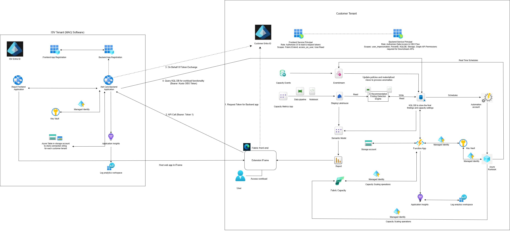

# Architecture Overview

The Fabric Admin Agent is a real-time capacity monitoring and optimization solution built on the Microsoft Fabric Workload Extensibility Toolkit. It ingests live Fabric Capacity Overview Events, evaluates capacity health continuously, and combines that with historical Capacity Metrics App data to surface findings, recommendations, and automated scaling/scheduling actions to Fabric administrators.

This page describes the six architectural layers and the two-tenant deployment model. For the event/request flow between components, see [02-data-flow.md](02-data-flow.md). For the full list of deployed Fabric artifacts, see [03-fabric-artifacts.md](03-fabric-artifacts.md). For Azure-side components, see [04-azure-components.md](04-azure-components.md).

## The Six Layers

| Layer | Technology | Purpose |
|---|---|---|
| Real-time Ingestion | Eventstream → Eventhouse (KQL DB) | Streams live Capacity Overview Events every 30 seconds; one Eventstream is created per onboarded capacity. |
| Historical Data Staging | Pipeline → Lakehouse (Delta Tables) | Extracts and stores Capacity Metrics App data and other historical capacity telemetry used for advanced analytics and recommendations. |
| Real-time Detection & Analytics | KQL (Kusto Query Language) | Executes real-time detection logic for throttling risk and idle capacity scenarios as Capacity Overview Events are ingested, generating findings with minimal latency. |
| Batch Insights Processing | Pipeline → Notebooks → Lakehouse → KQL Database | Processes historical Capacity Metrics App data and Capacity Overview Events to generate capacity scaling, F-SKU schedule, and workspace reallocation recommendations. Intermediate results land in Lakehouse tables; final recommendations are written to the `FabricAdminAgentLogs` KQL database. |
| Scheduling & Automation | Function App + Azure Automation Account | Executes scheduled operational actions — capacity pause, capacity resume, real-time monitoring windows, and autoscale windows. Schedule configurations live in `FabricAdminAgentLogs` and are enforced by backend automation services. |
| Operational Metadata | KQL Database (`FabricAdminAgentLogs`) | Stores findings, batch insight recommendations, schedule definitions, autoscale configurations, F-SKU settings, onboarded capacities, notifications, and audit logs. |

## Two-Tenant Deployment Model

**Your capacity telemetry and operational data stay entirely within your tenant.** MAQ Software hosts only the application layer — the React frontend and .NET Core backend — that renders the Fabric Admin Agent screens and reads your capacity data on your behalf. The only information held on MAQ's side is a per-customer pointer record (KQL cluster URI and database name) stored in Azure Table Storage, used solely to route backend API calls to the correct customer database. No capacity telemetry, findings, or operational metadata leave your tenant.

The solution spans two Microsoft Entra tenants, shown in the end-to-end diagram below.

### ISV Tenant (MAQ Software)

Hosts the multi-tenant SaaS components shared across all customers:

- **ISV Entra ID** — issues the **Frontend App Registration** and **Backend App Registration**. These are multi-tenant Entra app registrations. When a customer completes Setup Steps 4 and 5, Entra projects these registrations into the customer tenant as **service principals** — one for the frontend UI and one for the backend API. The admin-consent steps grant those service principals the delegated and application permissions they need to operate within the customer tenant.
- **React Frontend Application** — the web app hosted inside the Fabric workload's Extension iFrame.
- **.NET Core Backend Application** — serves the frontend, performs OBO token exchanges against each customer's tenant, and queries each customer's KQL database.
- **Azure Table (ISV Config Store)** — stores the per-customer-tenant KQL cluster URI and database name, accessed by the backend via a dedicated Entra service principal (client-secret credential), and cached in-memory by the backend for 5 minutes. No capacity telemetry is stored here.
- **Application Insights** and **Log Analytics Workspace** — telemetry for the ISV-side frontend/backend.
- **Azure Key Vault** — stores secrets including the Azure Table Storage (ISV Config Store) connection string.

### Customer Tenant

Hosts the Fabric workload and Azure automation resources deployed per customer:

- **Customer Entra ID** — hosts the **Frontend Service Principal** (scopes: `Fabric.Extend`, `access_as_user`, `User.Read`) and **Backend Service Principal** (scopes: `user_impersonation`, plus PowerBI/KQLDB/Storage/Graph API permissions). These service principals are the customer-tenant representations of the ISV's app registrations, created automatically when admin consent is granted in Steps 4–5.
- **Fabric front end / Extension iFrame** — hosts the ISV's web app inside the customer's Fabric workspace; the end user accesses the workload through here.
- **Real-time pipeline** — Capacity Events → Eventstream → the AI Recommendation / Finding Detection Engine, which reads/writes the KQL DB storing final findings and capacity settings, and updates policies/materialized views used to process anomalies.
- **Batch pipeline** — Capacity Metrics App → Data pipeline → Notebook → Staging Lakehouse → Semantic Model → Report.
- **Automation** — a **Function App** and an **Automation Account/Runbook**, each with their own system-assigned Managed Identity and Key Vault, execute capacity scaling operations and read/write schedules against the KQL DB.
- **Fabric Capacity** — the monitored capacity itself, scaled/paused/resumed by the Function App and Automation Account.

## Diagram

## Related Docs

- [02-data-flow.md](02-data-flow.md) — the numbered request/auth flow and the real-time vs. batch data paths
- [03-fabric-artifacts.md](03-fabric-artifacts.md) — full table of deployed Fabric notebooks, pipelines, models, and connections
- [04-azure-components.md](04-azure-components.md) — Function App, Key Vault, Application Insights, Log Analytics, Automation Account
- [05-detection-logic.md](05-detection-logic.md) — sensitivity and finding-suppression configuration
