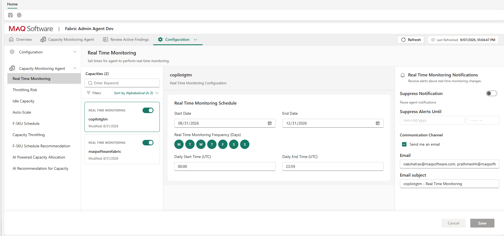
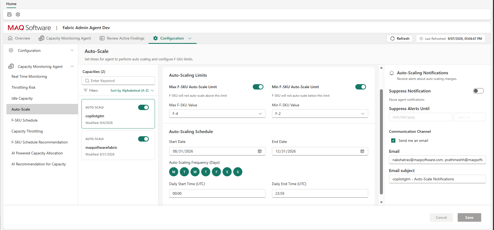
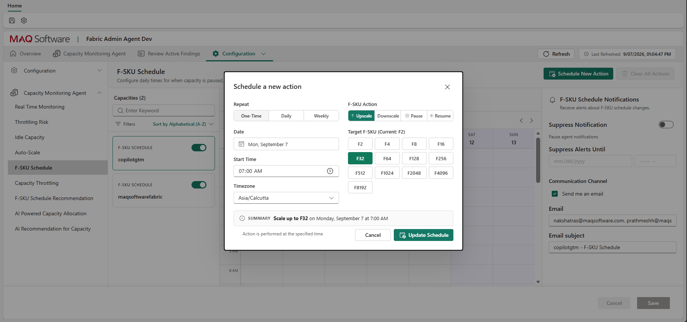
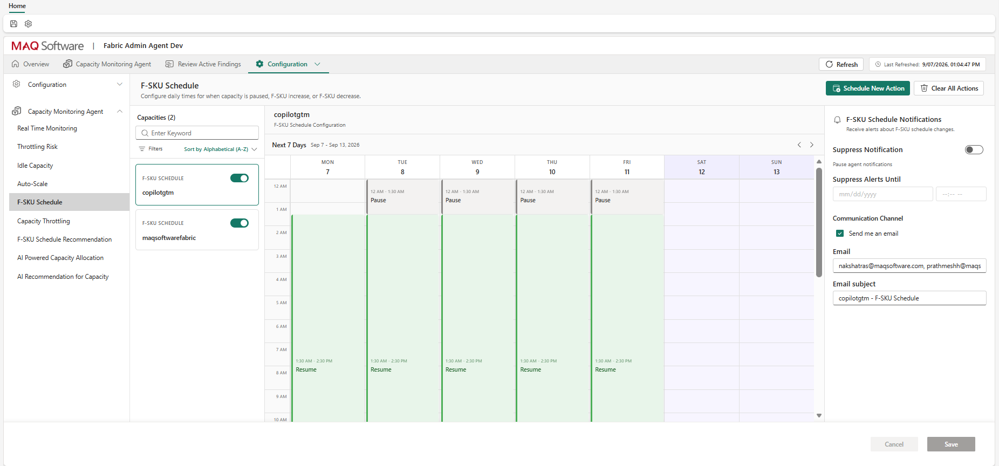
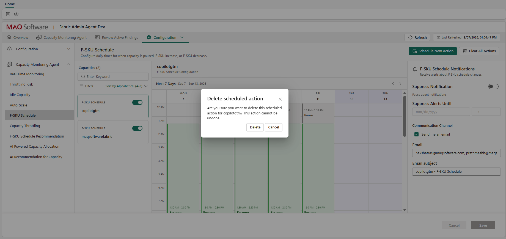
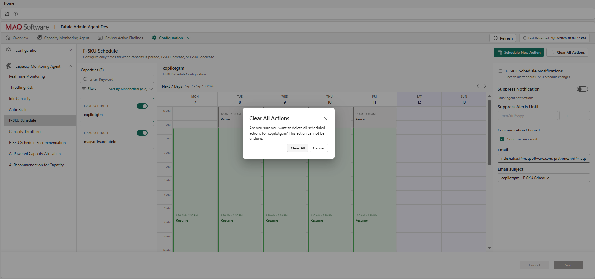

# Autoscaling & Scheduling

> **Prerequisites**
>
> Before configuring Real Time Monitoring, Auto-Scale, or F-SKU Schedules, ensure you have access to the Azure Resource Group that contains the deployed Automation Account used by the workload item. If the required permissions are managed through Azure Privileged Identity Management (PIM), activate the appropriate role before creating, modifying, or deleting monitoring and scheduling configurations.

Configure automated operational boundaries, real-time monitoring windows, and scheduled scaling actions for your capacities.

## Real Time Monitoring
Set times for the agent to perform real-time monitoring.
1. Navigate to **Configuration > Capacity Monitoring Agent > Real Time Monitoring** and enable the capacity.
2. Configure the **Real Time Monitoring Schedule**:
   * **Start Date / End Date:** The calendar window for monitoring.
   * **Real Time Monitoring Frequency (Days):** Operating days of the week.
   * **Daily Start Time (UTC) / Daily End Time (UTC):** The daily time window.
3. Configure notification settings in the Real Time Monitoring Notifications section and click **Save**. Refer to [notifications.md](notifications.md) for notification configuration details.

### Why Use or Adjust This Setting?
Configure when real-time monitoring is enabled. Real-time monitoring supports autoscaling, capacity recommendations, and proactive alerts. It consumes a small amount of CUs to collect and store capacity data. When disabled, autoscaling and real-time alerts are unavailable, and utilization history is not collected for that period.

* **Restricting to Business Hours:** For non-production, development, or regional analytics capacities, configuring operating days (e.g., Monday–Friday) and a daily active window (e.g., 08:00–18:00 UTC) stops telemetry ingestion during inactive off-hours. This conserves Fabric Capacity Units (CUs) and eliminates unneeded alert noise while team members are offline.
* **Continuous 24/7 Monitoring:** For business-critical production capacities hosting global users, DirectLake models, or 24/7 data pipelines, keep real-time monitoring enabled 24/7 (Monday–Sunday) to guarantee continuous protection against throttling and capture uninterrupted utilization history for capacity planning.

---

## Auto-Scale
Set times for the agent to perform auto-scaling and configure F-SKU limits.
1. Navigate to **Configuration > Capacity Monitoring Agent > Auto-Scale** and enable the capacity.
2. Configure **Auto-Scaling Limits**:
   * **Max F-SKU Auto-Scale Limit:** F-SKU will not auto-scale above this limit.
   * **Min F-SKU Auto-Scale Limit:** F-SKU will not auto-scale below this limit.
3. Configure the **Auto-Scaling Schedule** (Start Date, End Date, Frequency, and Daily Time Window).
4. Configure notification settings in the Auto-Scaling Notifications section and click **Save**. Refer to [notifications.md](notifications.md) for notification configuration details.

### Why Use or Adjust This Setting?
* **Enabling Auto-Scale:** Automatically scales the capacity up when throttling pressure is detected and down when sustained idle capacity is observed. This provides hands-free elasticity, maintaining optimal query responsiveness during unexpected spikes without requiring 24/7 manual administrative intervention.
* **Running in "Alert-Only" Mode (Disabled):** Leaving auto-scale disabled allows you to observe finding accuracy during the initial 1–2 weeks of onboarding. The agent continues generating upscale and downscale recommendations in the **Review Active Findings** tab, giving administrators full visibility to validate sensitivity before granting autonomous scaling authority.
* **Max F-SKU Auto-Scale Limit (Financial Guardrail):** Fabric compute costs double with each ascending SKU tier. The maximum limit serves as a critical financial budget ceiling. It guarantees that unexpected runaway queries, unoptimized DAX measures, or recursive data pipelines cannot upscale your capacity to enterprise-level tiers (e.g., F256 or F512) and incur unbudgeted cloud expenditure.
* **Min F-SKU Auto-Scale Limit (SLA & Memory Protection):** Fabric capacities share memory across interactive queries, background semantic model refreshes, and tenant overhead. Downscaling too low (e.g., down to F2 or F4) can cause large DirectLake datasets or semantic model refreshes to fail due to insufficient memory. Setting a minimum floor ensures the capacity always retains enough memory to sustain core reporting SLAs.
* **Auto-Scaling Schedule (Active Window):** Restricts automated scaling actions to designated time frames. For example, enable autoscaling during core business hours when interactive user experience is critical, and freeze scaling overnight or during financial quarter-end close when environment stability is paramount.

---

## F-SKU Schedule
Configure daily times for when capacity is paused, resumed, or scaled.
1. Navigate to **Configuration > Capacity Monitoring Agent > F-SKU Schedule** and enable the capacity.
2. Select **Schedule New Action** and create Pause, Resume, Upscale, or Downscale schedules.
3. Choose the recurrence (**One-Time, Daily, or Weekly**), Date, Start Time, and Target F-SKU.
4. Review the generated summary (e.g., "Scale up to F32 on Monday, September 7 at 7:00 AM").
5. Click **Update Schedule** and then **Save**.

6. Review all configured F-SKU schedules for the capacity in the calendar view. The calendar displays each scheduled action and visualizes the capacity state between actions, showing the timeline up to the start time of the next configured schedule.

7. Configure notification settings in the F-SKU Schedule Notifications section and click **Save**. Refer to [notifications.md](notifications.md) for notification configuration details.
8. To remove an individual scheduled action, select the **bin icon** on the corresponding schedule in the calendar.

9. To remove all scheduled actions for the capacity, select **Clear All Actions**.

### Why Use or Adjust This Setting?
* **Automated Pause & Resume:** Microsoft Fabric capacities incur compute charges for every second they are active. Scheduled pausing (e.g., pausing development, sandbox, or test capacities on weekday evenings and weekends) can reduce monthly compute costs by up to 60–70%. Resuming them automatically at 07:00 AM ensures environments are warm and ready before developers begin work.
* **Predictable Scheduled Scaling:** Workloads with known consumption schedules benefit from proactive scaling. For example, automatically scaling a capacity from F32 to F128 at 06:00 UTC every weekday pre-empts morning report traffic spikes, eliminating sluggishness before users log in. Scaling back down to F32 at 19:00 UTC optimizes evening spend without waiting for reactive threshold triggers.
* **Calendar Visibility & Governance:** The calendar view visualizes the capacity state timeline across upcoming days, allowing administrators to audit scheduled actions, identify overlapping commands, and verify that planned schedules align with organizational maintenance windows.