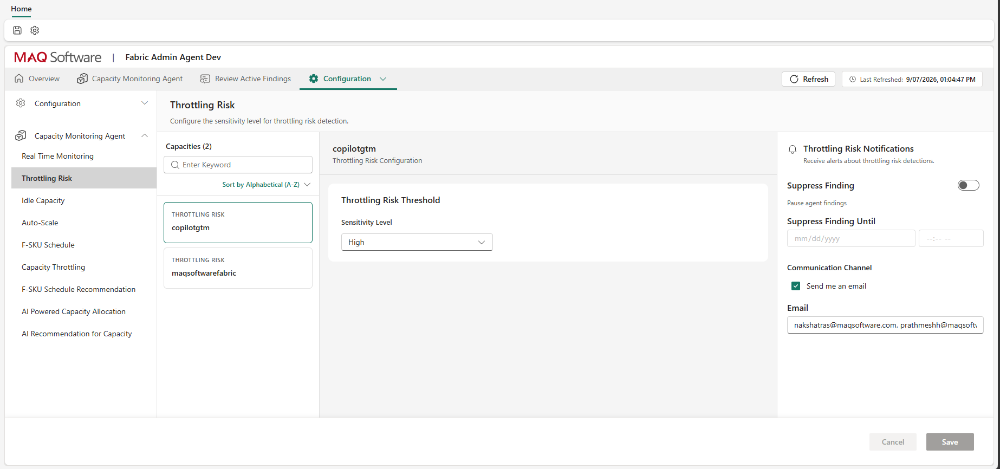
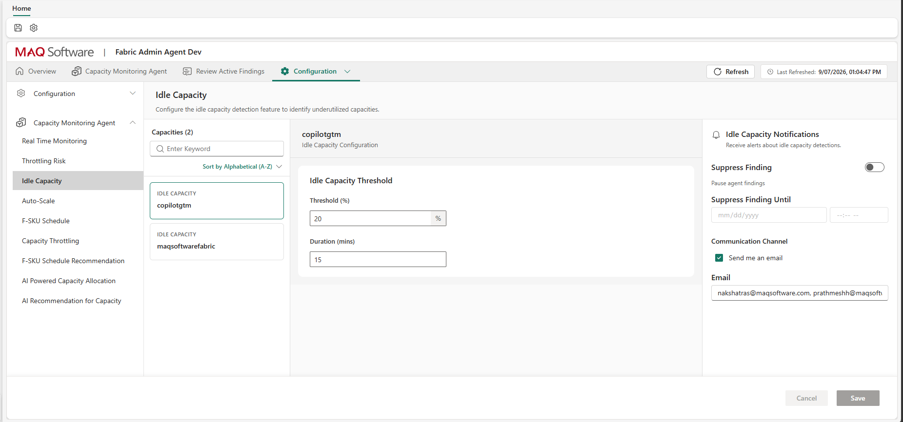
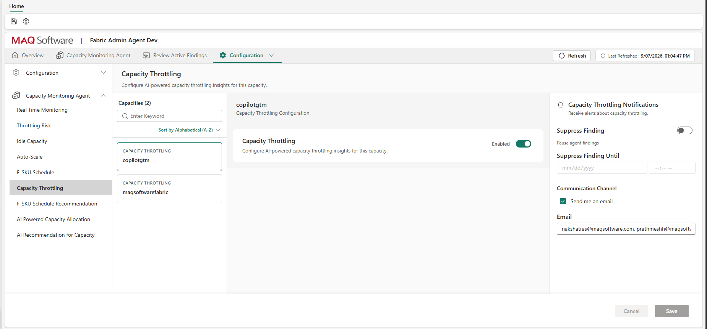

# Configure Findings

For each onboarded capacity, you can configure monitoring thresholds and AI insights through the **Capacity Monitoring Agent** section in the **Configuration** tab. Findings are categorized into **Alerts** and **Insights**.

## Alerts
Alerts generate immediate findings based on configured thresholds.

### Throttling Risk
1. Navigate to **Configuration > Capacity Monitoring Agent > Throttling Risk**.
2. Select the onboarded capacity.
3. Configure the **Sensitivity Level**: The detection sensitivity level for anomaly findings. This determines how aggressively the agent flags potential throttling events based on consumption patterns.
4. Configure notification settings in the right pane and click **Save**. Refer to [notifications.md](notifications.md) for notification configuration details.

#### Why Adjust Sensitivity?
* **High (Default):** Evaluates lower pressure thresholds and stricter delay/rejection guardrails. Recommended for **mission-critical production capacities** hosting executive dashboards, high-concurrency DirectLake models, or SLA-sensitive workloads. High sensitivity flags resource pressure early, enabling proactive scaling or intervention before end users experience query queuing or noticeable degradation.
* **Medium:** Balances responsiveness and alert frequency, filtering out brief transient query spikes while reliably flagging sustained load increases. Recommended for **standard enterprise analytics capacities**.
* **Low:** Triggers only under severe, prolonged compute pressure with high query rejection rates. Recommended for **development, testing, or batch-heavy ETL capacities** where occasional background query queuing is acceptable and does not warrant immediate alerting or costly SKU upgrades. Low sensitivity minimizes alert fatigue.

---

### Idle Capacity
1. Navigate to **Configuration > Capacity Monitoring Agent > Idle Capacity**.
2. Select the onboarded capacity.
3. Configure the idle capacity detection parameters:
   * **Threshold (%)**: The maximum capacity utilization percentage required for the capacity to be considered idle.
   * **Duration (mins)**: The approximate number of minutes the capacity must remain below the specified threshold percentage to trigger a finding.
4. Configure notification settings in the right pane and click **Save**. Refer to [notifications.md](notifications.md) for notification configuration details.

#### Why Adjust Idle Detection Settings?
* **Threshold (%):** Sets the maximum CU utilization percentage to qualify as idle. If your capacity runs continuous background utilities or health checks consuming 10–15% CU at all times, raising the threshold to 20–25% ensures the capacity is still recognized as eligible for downscaling. Conversely, lowering the threshold to 5–10% on shared capacities ensures downscaling recommendations only trigger when compute is virtually unutilized.
* **Duration (mins):** Sets the continuous rolling time window required before an idle finding is generated.
  * *Increasing Duration (e.g., 30–60 minutes):* Recommended for capacities running **cyclical or bursty workloads** (e.g., hourly scheduled pipelines). A longer duration prevents premature downscale alerts during short 15-minute lulls between pipeline runs, avoiding rapid scale oscillation.
  * *Decreasing Duration (e.g., 10–15 minutes):* Recommended for **dedicated ad-hoc reporting capacities** where users work during specific windows and leave the capacity completely idle thereafter. Shorter windows surface downscaling or pause opportunities faster, maximizing compute cost savings.

---

## Insights
Insights provide AI-driven analysis and recommendations for capacity management. Navigate to the respective section, enable the capacity, and configure the notification settings as required:

* **Capacity Throttling:** Configure AI-powered capacity throttling insights for this capacity.
* **F-SKU Schedule Recommendation:** AI recommendations for optimal F-SKU scheduling actions.
* **AI Powered Capacity Allocation:** Recommendations on workspace allocation across capacities.
* **AI Recommendation for Capacity:** Overall sizing and scaling recommendations.

Refer to [notifications.md](notifications.md) for notification configuration details.

### Why Use or Adjust Insights Settings?
* **Capacity Throttling:** Evaluates multi-day historical throttling patterns from the Capacity Metrics App to determine whether throttling is caused by systemic undersizing or isolated inefficient DAX queries, providing administrators with actionable data for long-term capacity rightsizing.
* **F-SKU Schedule Recommendation:** Analyzes historical weekly usage dips to automatically recommend optimal pause/resume or scale schedules, identifying cost-saving opportunities without requiring manual audit of consumption logs.
* **AI Powered Capacity Allocation:** Detects "noisy-neighbor" workspaces that consume disproportionate CUs and cause contention on shared capacities, providing recommendations to redistribute heavy workspaces across alternative capacities in the tenant.
* **AI Recommendation for Capacity:** Evaluates 30-day historical usage percentiles and growth trends to recommend whether a capacity's base SKU tier should be upgraded, downgraded, or kept unchanged.