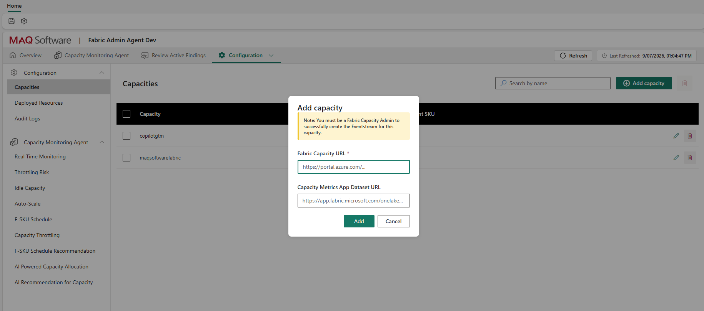

# Onboard a Capacity

When a new Fabric capacity needs to be monitored, perform the following per-capacity one-time setup steps in addition to the one-time infrastructure setup step 12 in ([Permissions](./../setup/04-permissions.md)).

## Step 1: Assign Capacity Admin Role
1. Go to Microsoft Fabric Admin Portal → Capacities.
2. Select the new capacity.
3. Go to the **Capacity admins** tab.
4. Add the user account that will onboard the capacity on the workload item.

## Step 2: Add Capacity from the Workload
1. Open the Fabric Admin Agent workload item.
2. Navigate to the **Configuration** tab.
3. Under the Capacities section, click **Add capacity**.
4. Provide the **Fabric Capacity URL** and the **Capacity Metrics App Dataset URL** for the capacity (Optional - Can be added later by using Edit Capacity).
   * *Fabric Capacity URL:* `https://portal.azure.com/#@domain/resource/subscriptions/subscriptionId/resourceGroups/resourceGroupName/providers/Microsoft.Fabric/capacities/capacityName/overview`
   * *Capacity Metrics App Dataset URL:* `https://app.fabric.microsoft.com/onelake/details/MetricsAppWorkspaceId/dataset/MetricsAppDatasetId/overview?experience=fabric-developer`
5. Click **Add**.
   > **Note:** The user must be a Fabric Capacity Administrator for the respective capacity.

## Step 3: Eventstream Creation
When a capacity is onboarded in Step 2, an Eventstream named `Eventstream-<capacity-name>-Source_<identifier>` is automatically created in the workspace. No manual Eventstream setup is required. 
* Verify the Eventstream is active and streaming events after onboarding.

## Step 4: Verify Data Flow
After onboarding, confirm the following:
* Eventstream is active and streaming events.
* `FabricCapacityEvents` table in KQL DB is receiving rows.
* Detection notebooks are picking up data for the new capacity on the next scheduled run.

---

## Onboarding Parameters & Why Configure Them

| Parameter | Required / Optional | Why Configure or Adjust This Setting? |
|---|---|---|
| **Fabric Capacity URL** | **Required** | Uniquely identifies the Azure Fabric Capacity resource and maps its Capacity GUID. This URL is required to automatically bind the Eventstream to the capacity's Capacity Overview Events feed and enables the Azure Function App and Automation Runbooks to execute automated scaling, pause, and resume actions via the Fabric REST API. |
| **Capacity Metrics App Dataset URL** | **Optional** *(Can be added later)* | Links the capacity to item-level historical metrics from the official Microsoft Fabric Capacity Metrics App. While real-time Eventstream monitoring and throttling alerts function immediately without this URL, providing it is required to unlock **historical AI batch insights** (such as F-SKU schedule recommendations, weekly capacity sizing trends, and workspace reallocation). |
| **Offboarding & Re-onboarding** | Operational Action | If an Eventstream encounters orphaned event bindings, connectivity drops after a capacity pause, or tenant role changes, offboarding the capacity from the workload and re-onboarding it automatically tears down the old Eventstream and provisions a fresh, healthy Eventstream with the correct bindings. |