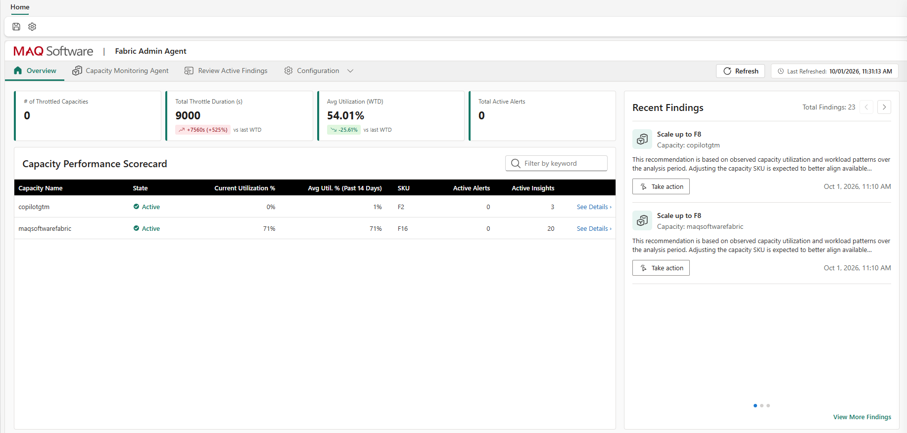
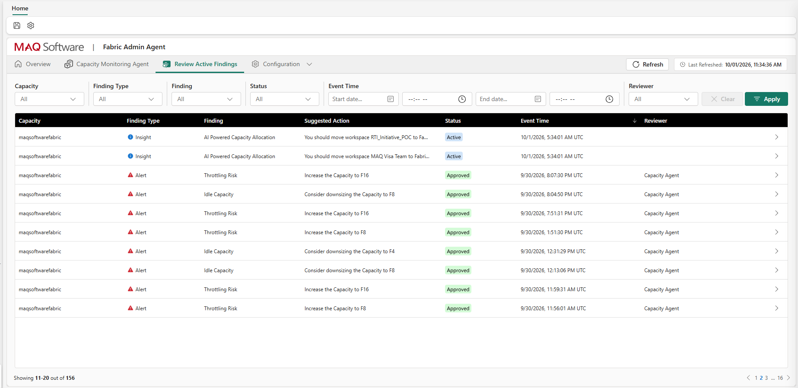

# What the Fabric Admin Agent Does

The Fabric Admin Agent keeps watch over every Microsoft Fabric capacity in your tenant so you don't have to. It tells you when a capacity is about to throttle or is sitting idle, explains why, recommends what to do — and, if you allow it, does it for you inside limits you set.

This page explains the problem it solves and how it works, in plain terms. For a feature checklist, see [Key features](key-features.md). To see whether it fits your situation, see [Use cases](use-cases.md).

---

## The problem it solves

Every Fabric capacity has a fixed amount of compute, set by its SKU. When demand outgrows it, Fabric throttles: dashboards crawl, queries queue, refreshes fail. Most administrators hear about it from users first.

The opposite problem costs just as much and makes no noise at all. Capacities sized for a launch, a migration, or a peak that never returned keep running — and keep billing — at a tier nobody needs.

Fabric's built-in Capacity Metrics App is a good place to investigate after the fact, but somebody has to remember to open it, find the right chart, and decide what to do. Across a tenant with a dozen capacities, that doesn't scale.

---

## How the agent helps

The agent turns capacity management from occasional inspection into continuous, evidence-based operation:

1. **It watches.** The moment you onboard a capacity, the agent starts receiving its live utilization telemetry — refreshed about every 30 seconds — into a data store in your own workspace.
2. **It detects.** Every reading is checked against rules you set for that capacity. A finding appears within seconds of a problem emerging, not hours later.
3. **It analyzes.** Once a day, the agent combines that live history with detailed usage data from the Capacity Metrics App to produce longer-range recommendations.
4. **It tells you.** Findings and recommendations appear in the **Review Active Findings** tab and, if you choose, arrive by email to the people responsible for that capacity.
5. **It acts — only if you say so.** When you enable automation, the agent scales, pauses, or resumes the capacity, staying within the SKU limits and time windows you define.

Everything the agent sees, recommends, and does is recorded in your tenant, so there is always a clear answer to "what happened, and why?"

---

## Two things it watches for, in real time

### Throttling Risk

The agent tracks compute pressure, request delays, and rejections on each capacity. When the pattern says throttling is coming, it raises a **Throttling Risk** finding with a recommendation to scale up — typically before anyone notices a slowdown.

You choose how sensitive detection should be. **High** suits executive dashboards and anything with a service-level commitment. **Low** suits development or overnight ETL capacities where a bit of queuing is acceptable. **Medium** balances the two.

### Idle Capacity

The agent also watches for capacities running well below their limit for a sustained period. When utilization stays under a percentage you set for as long as you specify, it raises an **Idle Capacity** finding with a recommendation to scale down — a direct pointer to money you can recover.

In both cases, a single sustained event produces one finding, not a flood of them.

> Details: [Configure findings](../operations/configure-findings.md) · For the technically curious: [Detection logic](../architecture/05-detection-logic.md)

---

## AI Insights: the longer view

Real-time detection answers "what is happening right now?" AI Insights answer "what should change?" They draw on weeks of usage history and are refreshed daily.

| Insight | The question it answers for you |
|---|---|
| **Capacity Throttling** | Is this capacity throttling because it's genuinely too small, or because of a few inefficient reports? |
| **AI Recommendation for Capacity** | Looking at the last 30 days and where usage is heading, should this capacity's SKU go up, down, or stay put? |
| **F-SKU Schedule Recommendation** | When does this capacity reliably go quiet, and what pause/resume schedule would capture that saving? |
| **AI Powered Capacity Allocation** | Which workspace is the noisy neighbor, and which other capacity has room to take it? |

Insights are recommendations. You review them alongside real-time findings and decide whether to act.

> Details: [Configure findings → Insights](../operations/configure-findings.md#insights)

---

## Automation, with guardrails you control

You can run the agent in **alert-only mode** for as long as you like. When you're ready to hand over some of the work, three options are available per capacity:

- **Auto-Scale** — scales up on Throttling Risk and down on Idle Capacity, one SKU step at a time, never above your **maximum** or below your **minimum**, and only during hours you allow.
- **F-SKU Schedule** — explicit calendar actions: pause at 7 PM, resume at 7 AM, step up before Monday's report rush, step back down after. One-time, daily, or weekly, with a calendar view showing the resulting capacity state.
- **Monitoring windows** — choose when the agent collects telemetry at all, to save compute and eliminate off-hours noise on non-production capacities.

Actions are carried out by Azure resources deployed in your own subscription, using managed identities — no passwords or keys to manage.

> Details and guidance on when to use each: [Autoscaling & scheduling](../operations/autoscaling-and-scheduling.md)

---

## Where it runs, and where your data lives

The agent installs as a **workload item** in a Fabric workspace you choose. Its one-click deployment creates the event store, data lake, notebooks, pipelines, and report it needs — all in **your** workspace, on **your** capacity. The automation components (an Azure Function App, Automation Account, and Key Vault) go into **your** Azure subscription.

MAQ Software hosts only the application that renders the agent's screens inside Fabric and reads your data on your behalf. It does so using your signed-in identity for each request, and it does not copy or store your capacity data. The only thing it keeps is a pointer to where your data lives so it can find it next time.

> For security and architecture reviewers: [Architecture overview](../architecture/01-overview.md) · [Data flow](../architecture/02-data-flow.md)

---

## What you'll see

| Area | What it shows you |
|---|---|
| **Overview** | A scorecard for every onboarded capacity — its SKU, current state, and open findings — at a glance |
| **Review Active Findings** | Your working queue: every alert and insight, each with its recommended action |
| **Capacity Monitoring Agent** | An embedded report with live utilization and historical trends from the Capacity Metrics App |
| **Configuration** | Where you onboard capacities, set thresholds, enable automation, and manage who gets notified |

*Overview: every onboarded capacity at a glance.*

*Review Active Findings: alerts and insights with recommended actions.*

---

## Next steps

- Check the agent against your requirements → [Key features](key-features.md)
- Find a scenario like yours → [Use cases](use-cases.md)
- Have a question? → [FAQ](faq.md)
- Ready to install → [Prerequisites](../setup/prerequisites.md)
