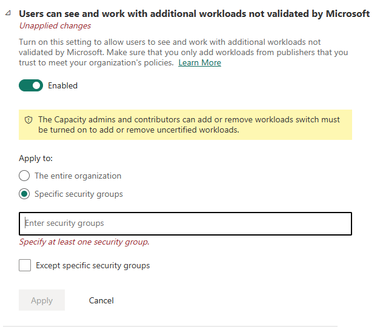
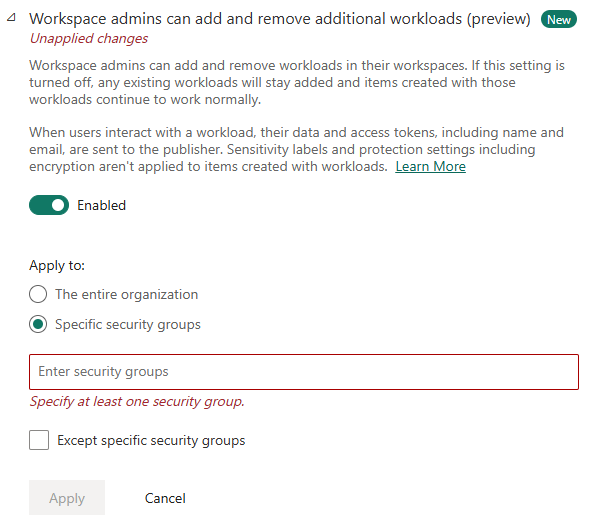
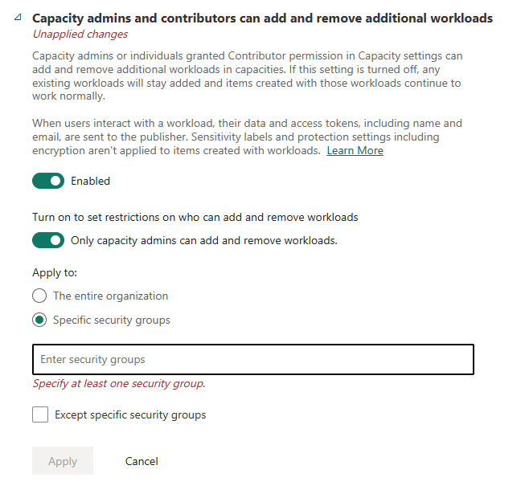
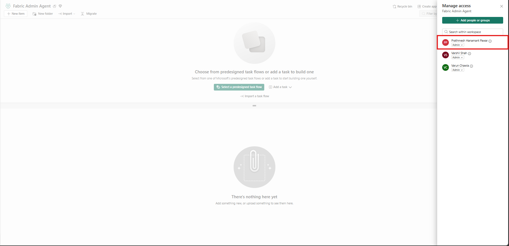

# 01 — Tenant Settings & Workspace Access

*Part of the [Fabric Admin Agent Setup Guide](./prerequisites.md) · Previous: [Prerequisites](./prerequisites.md)*

Perform all steps in this guide once per environment deployment. Each step is a dependency for the next.

---

## Step 1: Enable Required Fabric Tenant Settings

Before deploying or using the Fabric Admin Agent workload, a Fabric Administrator must enable the required tenant settings for additional workloads in the Microsoft Fabric Admin Portal.

**Navigate to:** Microsoft Fabric Admin Portal → Tenant Settings → Additional Workloads

### 1.1 Enable "Users can see and work with additional workloads not validated by Microsoft"

This setting allows users to discover and use unverified workloads such as Fabric Admin Agent.

1. Locate **Users can see and work with additional workloads not validated by Microsoft**.
2. Enable the setting.
3. Apply it to the required users or security groups.

### 1.2 Enable "Workspace admins can add and remove additional workloads"

This setting allows workspace administrators to install and manage workloads within their Fabric workspaces.

1. Locate **Workspace admins can add and remove additional workloads (Preview)**.
2. Enable the setting.
3. Apply it to the required users or security groups.

### 1.3 Enable "Capacity admins and contributors can add and remove additional workloads"

This setting allows capacity administrators and contributors to manage workloads on Fabric capacities.

1. Locate **Capacity admins and contributors can add and remove additional workloads**.
2. Enable the setting.
3. Apply it to the required users or security groups.
4. If desired, enable **Only capacity admins can add and remove workloads** to further restrict access.

> **Important:** All three settings must be enabled before the Fabric Admin Agent workload can be installed, deployed, or used within the tenant.

**Required Role:** The user enabling these settings must be a **Fabric Administrator** or **Global Administrator**.

**Verification:**
1. Click **Apply** for each setting.
2. Wait several minutes for the changes to propagate across the tenant.
3. Verify that the **Fabric Admin Agent** workload is available from the **New Item** experience in the target workspace.

---

## Step 2: Verify Workspace Access

Ensure the user performing the setup has at least **Contributor** role on the Fabric workspace where the Fabric Admin Agent will be deployed.

---

**Next:** [Deploy the Workload →](./02-deploy-workload.md)
