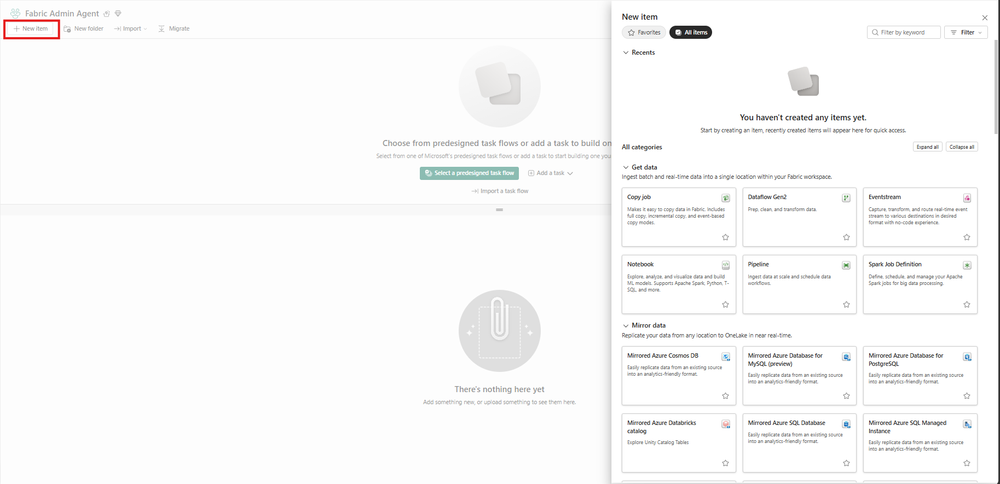
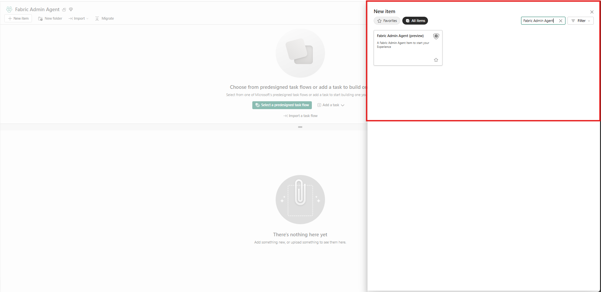
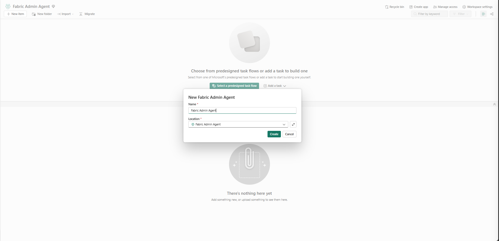
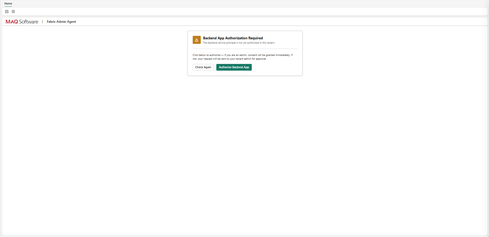
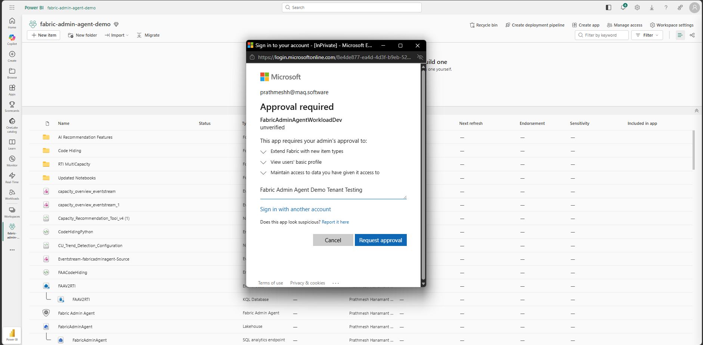
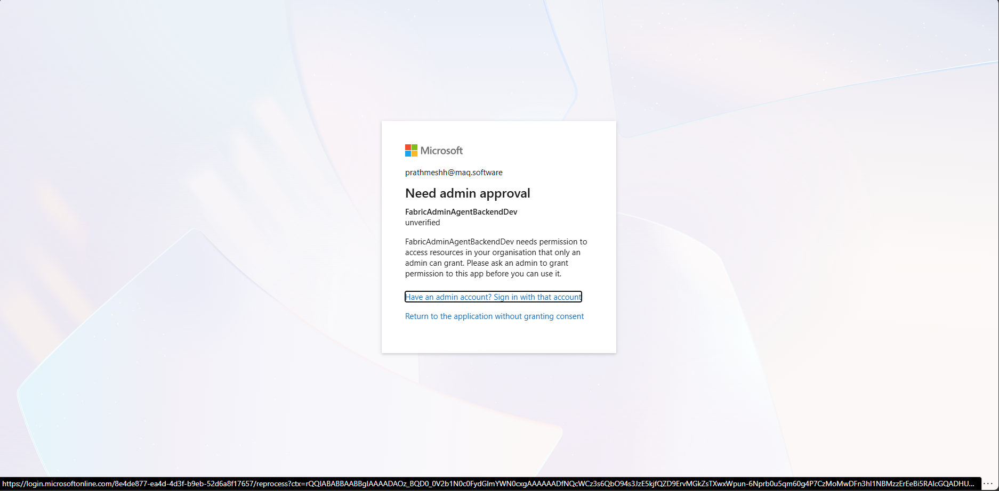
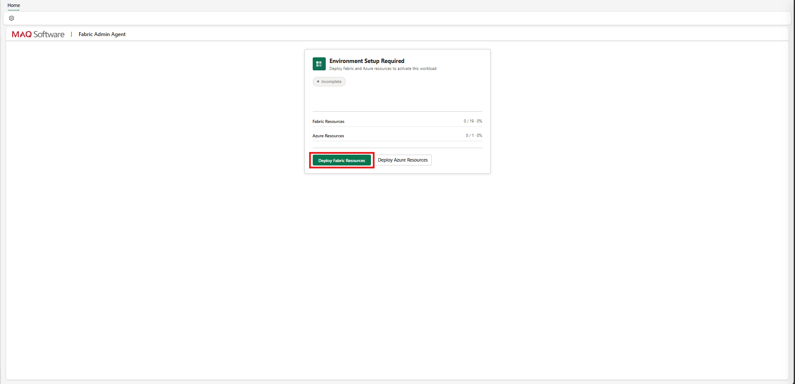
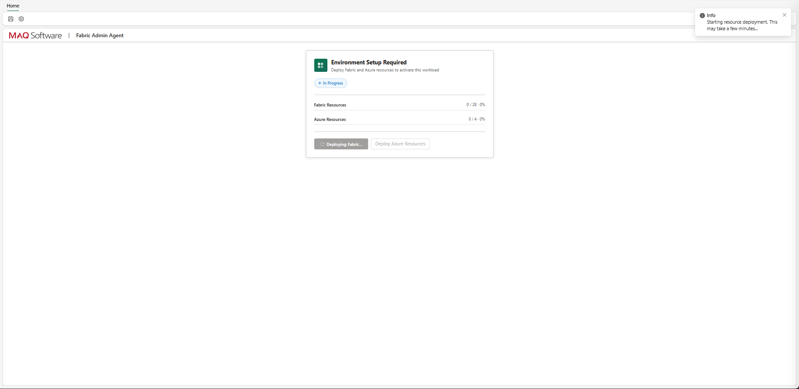
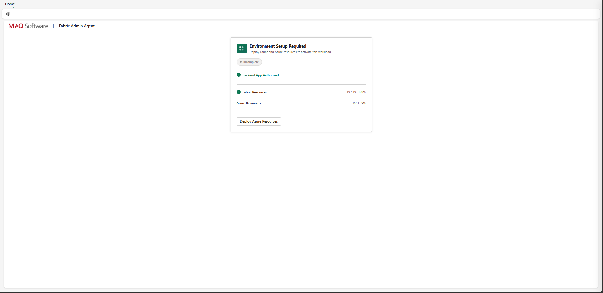

# 02 — Deploy the Workload

*Previous: [Tenant Settings](./01-tenant-settings.md)*

---

## Step 3: Create the Fabric Admin Agent Workload Item

**1.** In the Fabric workspace, click the **New Item** button.

**2.** Search for **Fabric Admin Agent** and click on it.

**3.** Enter a name for the artifact and confirm creation.

The item is created and shows the **Backend App Authorization Required** card until the Backend app is authorized in [Step 5](#step-5-authorize-the-backend-application).

---

## Step 4: Approve Frontend Service Principal Permissions

Upon creation, a popup appears requesting permissions for the **Frontend Service Principal (SPN)**. This is required for the workload UI to access Fabric APIs on behalf of the user.

**1.** Review the requested permissions in the popup.

**2.** Click **Request Approval** to submit the consent request.

> **Note:** Approval must be granted by a user with one of the admin roles listed in [Prerequisites → Required Roles & Permissions](./prerequisites.md#required-roles--permissions) (Global Administrator, Privileged Role Administrator, Application Administrator, or Cloud Application Administrator).

---

## Step 5: Authorize the Backend Application

The Backend app registration requires admin consent and **must be performed by** a **Global Administrator**, **Privileged Role Administrator**, **Application Administrator**, or **Cloud Application Administrator**.

**1.** On the **Backend App Authorization Required** card in the workload item (see [Step 3](#step-3-create-the-fabric-admin-agent-workload-item)), click **Authorize Backend App**. A Microsoft sign-in window opens.

**2.** Complete the consent prompt:

- **If you hold one of the admin roles above**, review the requested permissions and accept them. Consent is granted immediately.
- **If you don't**, Microsoft shows a **Need admin approval** page for the Backend app. Select **Have an admin account? Sign in with that account** to sign in as an admin, or select **Return to the application without granting consent** and ask an admin to complete this step.

**3.** After consent is granted, click **Check Again** on the card. The card is replaced by the **Environment Setup Required** card, which shows the deployment buttons used in Step 6.

> **Important:** Both the Frontend SPN approval (Step 4) and Backend app authorization (Step 5) must be completed before proceeding to Step 6.

---

## Step 6: Deploy Fabric Resources

Once both SPN approvals are complete:

**1.** Click the **Deploy Fabric Resources** button in the workload item.

**2.** Wait for the deployment to complete. The status changes to **In Progress**, and the **Fabric Resources** row tracks how many items have been deployed. This process takes approximately **20–25 minutes**.

**3.** Confirm all Fabric artifacts have been successfully deployed. See [Fabric Artifacts reference](../architecture/03-fabric-artifacts.md) for the full list of items this deploys (Lakehouse, notebooks, pipelines, semantic model, report, KQL database, connections, etc.).

---

**Next:** [Deploy Azure Resources →](./03-deploy-azure.md)
