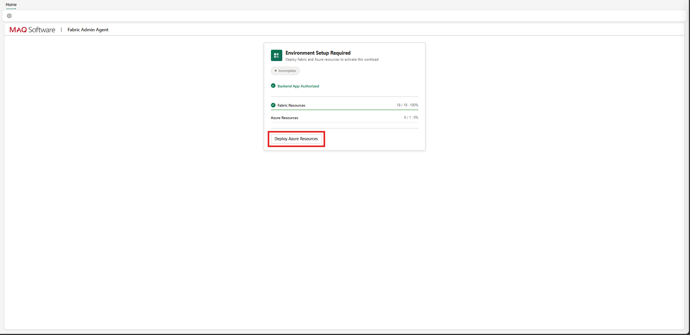
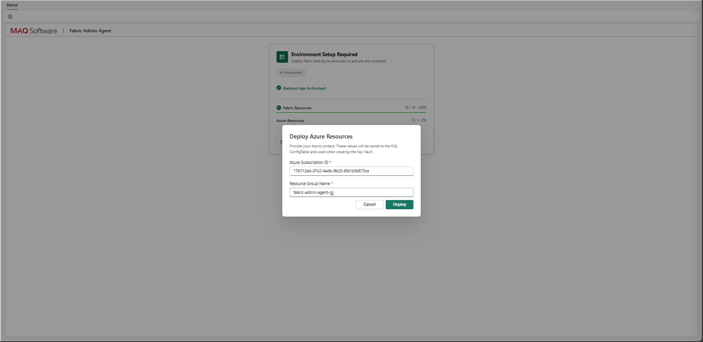
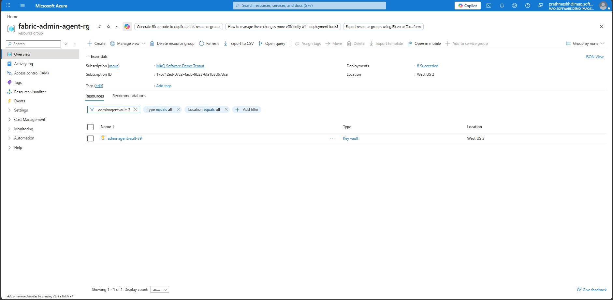
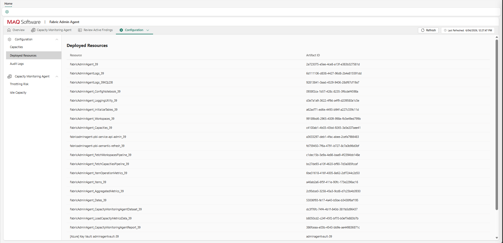
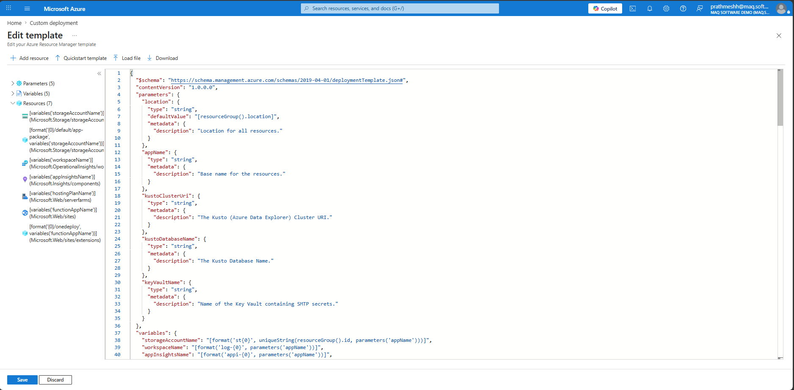
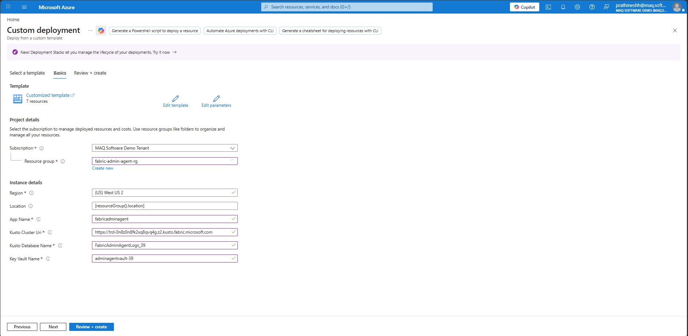
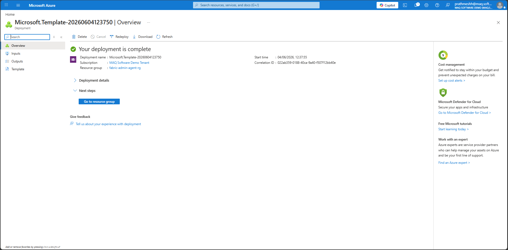
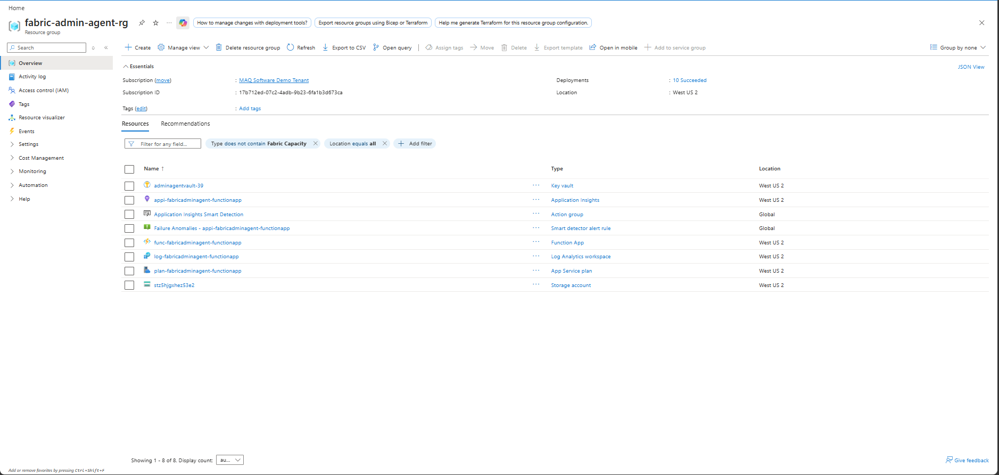

# 03 — Deploy Azure Resources

*Previous: [Deploy the Workload](./02-deploy-workload.md)*

---

## Step 7: Deploy Azure Resources (Key Vault, Automation Account, Runbooks)

**1.** Click the **Deploy Azure Resources** button.

**2.** Provide the following inputs when prompted:

| Parameter | Description |
|---|---|
| Azure Subscription ID | The subscription where Azure resources will be deployed |
| Resource Group Name | The resource group where Azure resources will be deployed |

> **Note:** The user must have **Contributor** role on the target Azure Resource Group.

**3.** Confirm the deployment. This step deploys a Key Vault, an Automation account, and two runbooks.

---

## Step 8: Note the Deployed (Fabric) Resources

Before deploying the Function App, gather the Fabric artifact details produced in [Step 6: Deploy Fabric Resources](./02-deploy-workload.md#step-6-deploy-fabric-resources) — the KQL Database URI and name are required as inputs in Step 9 below.

**1.** In the Fabric Admin Agent workload item, navigate to the **Configuration** tab.

**2.** Expand the **Deployed Artifacts** section in the left pane.

**3.** Note down the names and GUIDs of the following deployed artifacts:
- **Eventhouse** — KQL Eventhouse for real-time capacity events
- **Semantic Model** — for capacity monitoring reports
- **PBI Connection** — Web v2 Power BI service connection
- **PowerBIDataset Connection** — Power BI Semantic Model connection
- **KQL Connection** — Azure Data Explorer (Kusto) connection
- **SQL Connection** — SQL Server connection

---

## Step 9: Deploy the Function App via ARM Template

A custom ARM template deployment provisions the Azure Function App used for capacity operations. This must be done manually in the Azure Portal using the ARM template provided by the Fabric Admin Agent team.

**1.** In the Azure Portal, navigate to **Deploy a custom template** (search for "Deploy a custom template" in the search bar, or go to [portal.azure.com/#create/Microsoft.Template](https://portal.azure.com/#create/Microsoft.Template)).

**2.** Click **Build your own template in the editor**, paste in the ARM template JSON from [`deploy/arm/ARM-FunctionApp-FAA.json`](../../deploy/arm/ARM-FunctionApp-FAA.json), and click **Save**.

**3.** Provide the following required input parameters:

| Parameter | Description |
|---|---|
| Function App Name | Name for the new Azure Function App |
| Key Vault Name | Name of the Key Vault deployed in Step 7 |
| KQL DB URI | Query URI of the KQL Database (from Step 8) |
| KQL DB Name | Name of the KQL Database (from Step 8) |

**4.** Submit the deployment. This takes approximately **2–3 minutes**.

**5.** Verify that all Azure resources have been successfully deployed. The following resources should be visible in the Azure Resource Group:
- Azure Key Vault
- Azure Function App
- App Service Plan
- Azure Storage Account
- Log Analytics Workspace
- Application Insights

---

**Next:** [Permissions →](./04-permissions.md)
