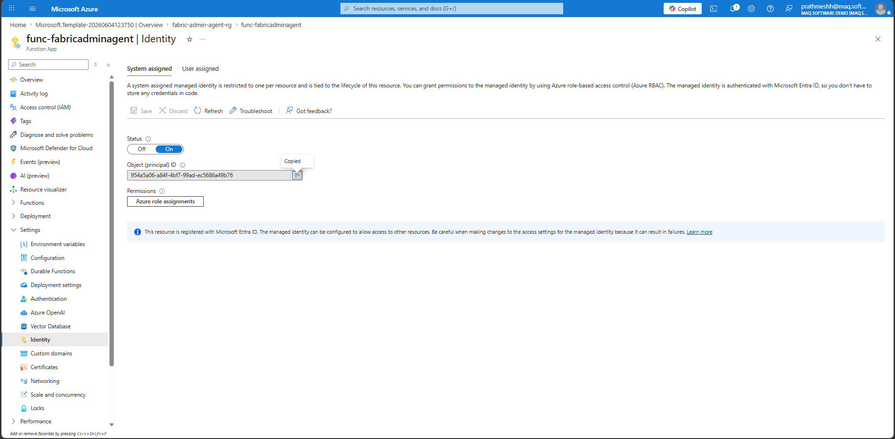
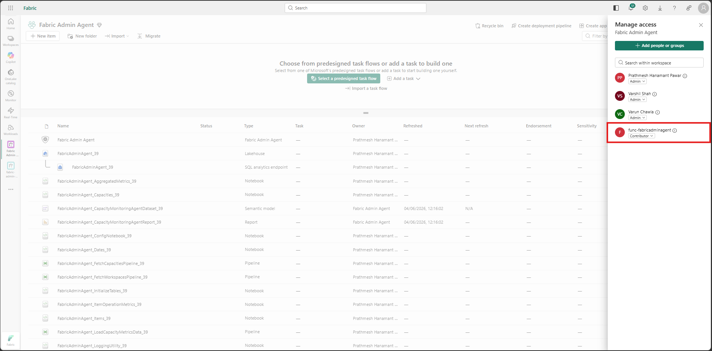
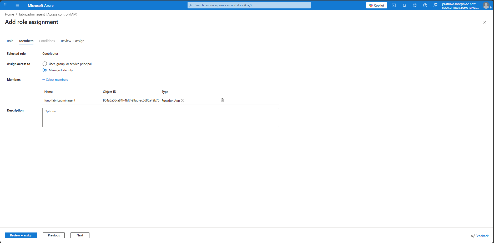
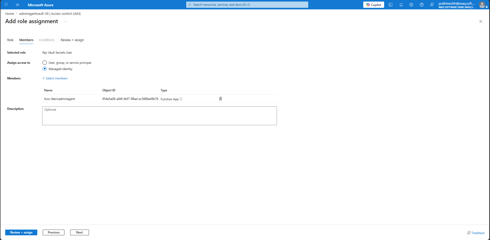

# 04 — Permissions (Managed Identity Role Grants)

*Part of the [Fabric Admin Agent Setup Guide](./prerequisites.md) · Previous: [Deploy Azure Resources](./03-deploy-azure.md)*

The Function App and Automation Account each use a **System Assigned Managed Identity**. This section grants those identities the Fabric, Azure, and Power BI permissions they need to operate.

---

## Step 10: Copy the Function App and Automation Account Managed Identity

**1.** In the Azure Portal, navigate to the deployed **Function App**.

**2.** Go to **Settings → Identity**.

**3.** Under the **System assigned** tab, copy the **Object (principal) ID**.

**4.** Perform the same steps for the deployed **Automation Account**.

---

## Step 11: Grant Workspace Contributor Role to the Function App and Automation Account

**1.** Navigate to the Fabric workspace in the Fabric Portal.

**2.** Go to **Workspace settings → Manage access**.

**3.** Add the Function App's managed identity and Automation Account's managed identity (using the Object IDs from Step 10) with the **Contributor** role.

---

## Step 12: Grant Capacity Roles to the Function App and Automation Account Identities

For each capacity to be onboarded, grant the following Fabric permissions to the Function App's and Automation Account's managed identities:
- **Microsoft.Fabric/capacities/read**
- **Microsoft.Fabric/capacities/write**

**1.** Go to **Microsoft Fabric Admin Portal → Capacities**.

**2.** Select the target capacity.

**3.** Add the Function App's managed identity and the Automation Account's managed identity with the required roles.

---

## Step 13: Grant Key Vault Secrets User Role to the Function App and Automation Account

**1.** In the Azure Portal, navigate to the deployed **Key Vault**.

**2.** Go to **Access control (IAM) → Add role assignment**.

**3.** Assign the **Key Vault Secrets User** role to the Function App's managed identity and the Automation Account's managed identity.

---

## Step 14: Add the Automation Account's Managed Identity to the "Allow service principals to use Power BI APIs" Security Group

> **⚠ Incomplete in source material.** The detailed sub-steps for this grant were not filled in in the original setup guide and still need to be documented (a screenshot placeholder was also left blank). Until this is completed here, follow your organization's standard process for adding a service principal to a Microsoft Entra security group that is scoped to the Fabric tenant setting **Allow service principals to use Power BI APIs**, then confirm the Automation Account's managed identity is a member.

---

**Next:** [Email & Notifications →](./05-email-notifications.md)
