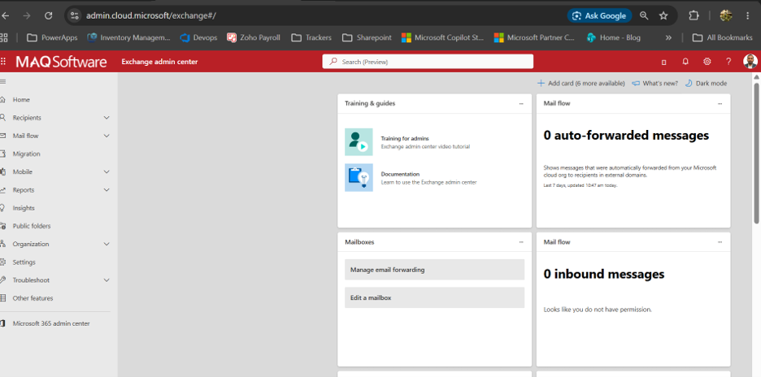
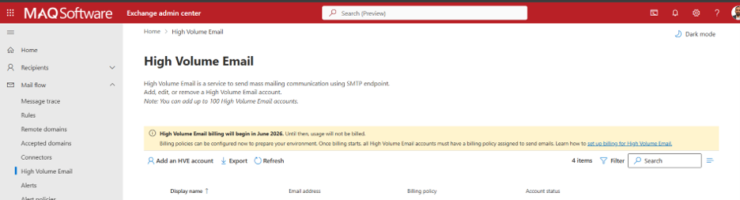
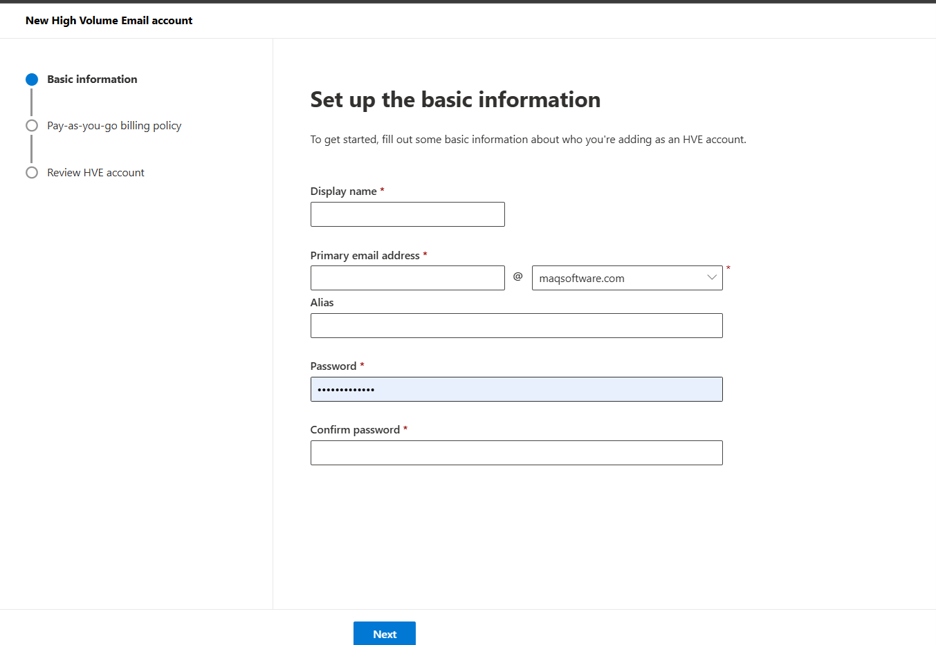
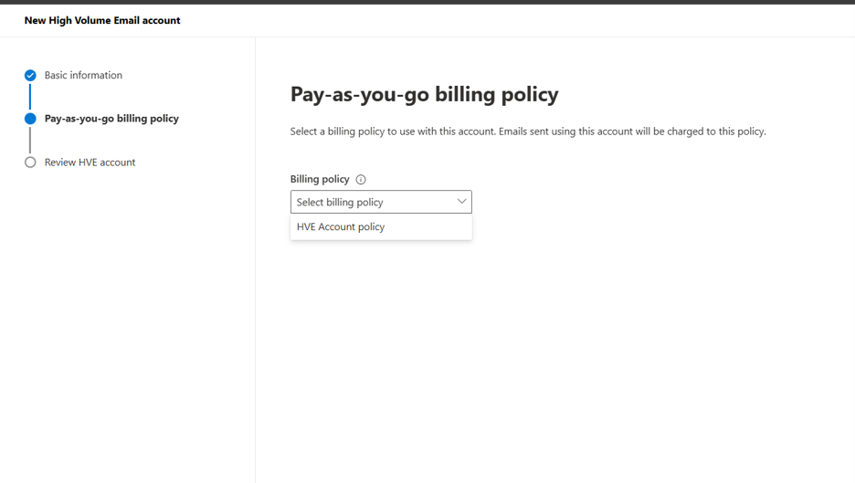
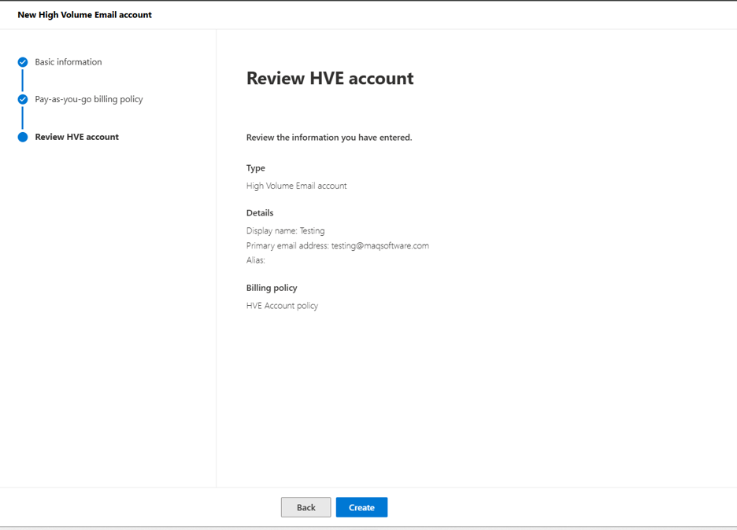
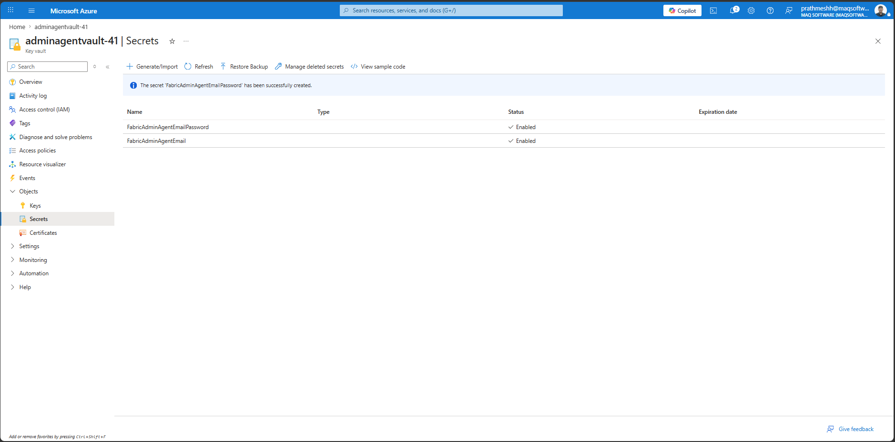
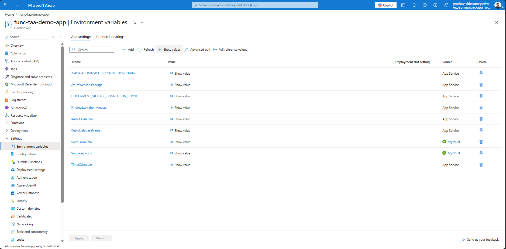

# 05 — Email Notifications (HVE Account & Key Vault Secrets)

*Part of the [Fabric Admin Agent Setup Guide](./prerequisites.md) · Previous: [Permissions](./04-permissions.md)*

The Fabric Admin Agent sends notification emails for findings and autoscale actions. Microsoft recommends using a dedicated **High Volume Email (HVE)** account for application-based email delivery.

> **Prerequisites**
> - Exchange Administrator or Global Administrator access
> - Access to the Exchange Admin Center
> - Approved sender email address
> - Strong password meeting tenant requirements
> - Billing policy configured for HVE usage

---

## Step 15: Create a High Volume Email (HVE) Account

### 15.1 Open Exchange Admin Center
1. Sign in to the Microsoft 365 Admin Portal using an administrator account.
2. Open the **Exchange Admin Center**.

### 15.2 Navigate to High Volume Email
1. In the Exchange Admin Center, navigate to **Mail Flow → High Volume Email**.
2. Open the High Volume Email management page.

### 15.3 Create a New HVE Account
1. Click **Add an HVE account**.
2. Enter the required account information:

| Field | Recommended Value |
|---|---|
| Display Name | Fabric Admin Agent |
| Primary Email Address | Dedicated sender email address |
| Password | Strong password meeting tenant requirements |
| Purpose | Fabric Admin Agent notifications |

Example:

| Field | Example |
|---|---|
| Display Name | Fabric Admin Agent |
| Primary Email Address | fabricadminagent@yourdomain.com |
| Purpose | Fabric Admin Agent notifications |

### 15.4 Select Billing Policy
1. Select the appropriate HVE billing policy.
2. Continue to the review page.

### 15.5 Review and Create the Account
1. Review the account details.
2. Click **Create**.
3. Verify the account appears in the High Volume Email list.

Record the following information for operational tracking:
- Account Display Name
- Primary Email Address
- Application Name
- Business Owner
- Technical Owner

### HVE SMTP Configuration

Use the following SMTP settings in the Fabric Admin Agent notification service:

| Setting | Value |
|---|---|
| SMTP Server | smtp.hve.mx.microsoft |
| Port | 587 |
| Encryption | TLS |
| Authentication | HVE Account Credentials |
| Sender Address | HVE Account Email Address |
| Recipient Scope | Internal Tenant Recipients |

---

## Store HVE and OpenAI Credentials in Azure Key Vault

After creating the HVE account, store the credentials in the Azure Key Vault deployed during Azure resource setup.

Create the following secrets:

| Secret Name | Value |
|---|---|
| FabricAdminAgentEmail | HVE email address |
| FabricAdminAgentEmailPassword | HVE account password |
| AZURE-OPENAI-API-KEY | Azure OpenAI API Key |

> **Important:** The Function App and Automation Account Managed Identity must have the **Key Vault Secrets User** role on the Key Vault (see [Permissions → Step 13](./04-permissions.md#step-13-grant-key-vault-secrets-user-role-to-the-function-app-and-automation-account)) so they can retrieve these credentials at runtime.

---

## Step 16: Verify Function App Configuration

**1.** In the Azure Portal, navigate to the deployed **Function App**.

**2.** Go to **Settings → Environment variables** (or **Configuration**).

**3.** Verify that all Key Vault reference settings display a **resolved** status (green checkmark).

---

**Next:** [Connections →](./06-connections.md)
