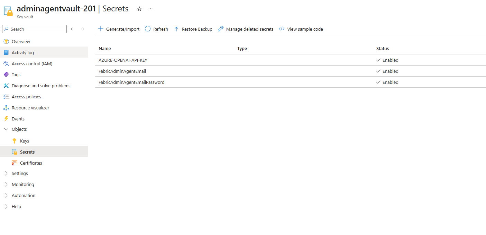

# 06 — Azure Open AI Setup

*Previous: [Connections](./05-connections.md)*

## Step 16: Get and Store the Azure OpenAI API Key

**1.** In the Azure Portal, open the deployed Azure OpenAI resource.

**2.** Go to **Resource Management → Keys and Endpoint** and copy **KEY 1** or **KEY 2**.

**3.** In the deployed Azure Key Vault, create a secret named `AZURE-OPENAI-API-KEY` and set its value to the copied Azure OpenAI API key.

> **Important:** The user configuring the pipeline and notebook schedules must have the **Key Vault Secrets User** role on the deployed Key Vault. See [Permissions → Step 13](./04-permissions.md#step-13-grant-key-vault-secrets-user-role-to-the-function-app-and-automation-account).

---
**Next:** [Email & Notifications →](./07-email-notifications.md)
