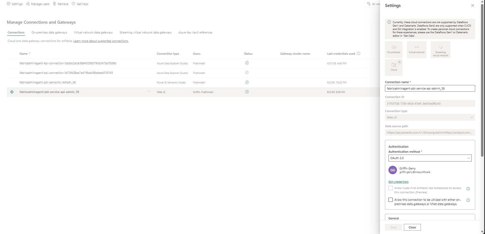
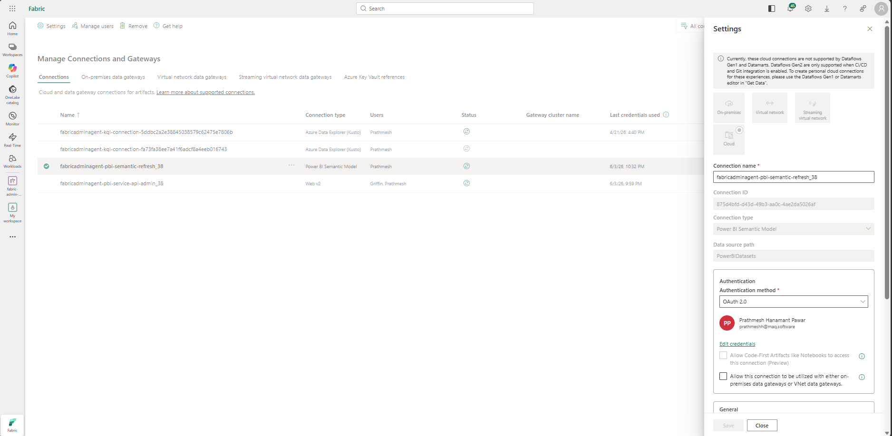
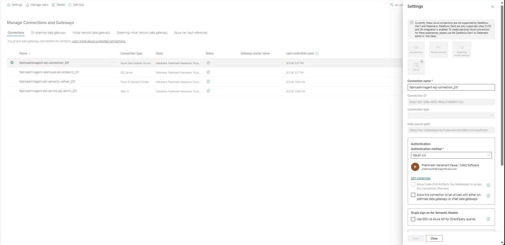
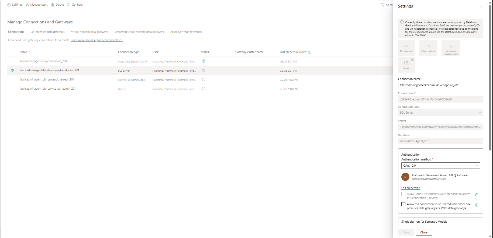
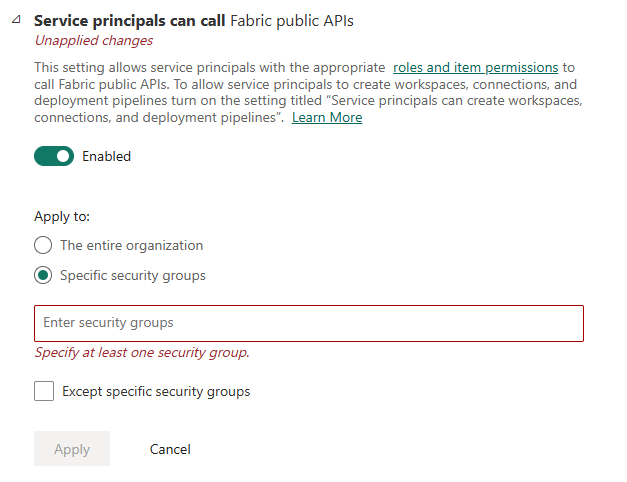
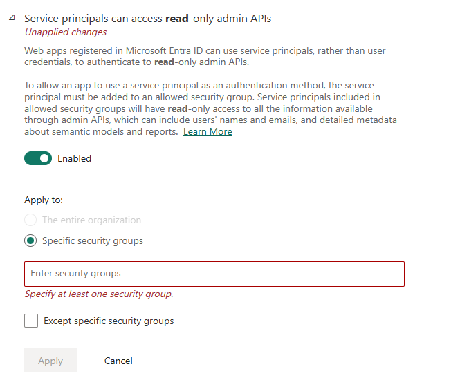
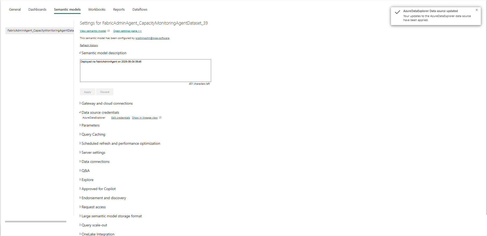

# 06 — Connections (OAuth2 / SPN / Workspace Identity)

*Previous: [Email Notifications](./05-email-notifications.md)*

The Fabric Admin Agent supports multiple authentication methods for its Fabric connections. Configure the authentication method that best aligns with your organization's security and governance requirements.

---

## Step 17: Authorize Connections in Manage Connections and Gateways

**1.** In the Fabric Portal, navigate to **Settings (top right) → Manage connections and gateways**.

### 17.1 Configure the PBI Service Web v2 Connection

Used by the Fabric Admin Agent to retrieve tenant metadata, including Fabric capacities and workspaces.

**2.** Locate the **PBI Service Web v2 connection** (`fabricadminagent-pbi-service-api-admin_<identifier>`).

**3.** Edit the connection credentials and select one of the supported authentication methods:

| Authentication Method | Minimum Requirements |
|---|---|
| OAuth2 | Fabric Administrator (recommended) or Global Administrator |
| Service Principal | Service Principal configured for Power BI/Fabric REST APIs and Power BI Admin APIs |
| Workspace Identity | Workspace Identity enabled and granted required Fabric permissions |

**4.** Save the connection configuration.

### 17.2 Configure the PBI Semantic Model Connection

Used to access and refresh semantic models used by the workload.

**5.** Locate the **PBI Semantic Model connection** (`fabricadminagent-pbi-semantic-refresh_<identifier>`).

**6.** Edit the connection credentials and configure the same authentication method used for the PBI Service Connection.

**7.** Save the connection configuration.

### 17.3 Configure the Azure Data Explorer (Kusto) Connection

Used by the semantic model to access and query the Eventhouse/KQL Database that stores capacity events and utilization data.

**8.** Locate the **Azure Data Explorer (Kusto) connection** (`fabricadminagent-kql-connection_<identifier>`).

**9.** Edit the connection credentials and configure the same authentication method used for the PBI Service Connection.

**10.** Save the connection configuration.

### 17.4 Configure the SQL Server Connection

Used by the semantic model to access the lakehouse SQL endpoint and execute queries against data required for reporting and monitoring.

**11.** Locate the **SQL Server connection** (`fabricadminagent-lakehouse-sql-endpoint_<identifier>`).

**12.** Edit the connection credentials and configure the same authentication method used for the PBI Service Connection.

**13.** Save the connection configuration.

---

## Authentication Method Requirements

### OAuth2 Requirements

If using OAuth2:

**PBI Service Web v2 Connection**
- Sign in using a **Fabric Administrator** account (recommended).
- The account must have permission to access the Power BI Admin APIs used by the workload.

**PBI Semantic Model Refresh Connection / Azure Data Explorer (Kusto) Connection / SQL Server Connection**
- Access to the Fabric workspace.
- Access to the semantic model.
- Contributor (or higher) permissions on the workspace are recommended.

### Service Principal Requirements

If using a Service Principal:

**Microsoft Entra Configuration**
1. Create a Microsoft Entra App Registration.
2. Create a Microsoft Entra Security Group.
3. Add the Service Principal to the Security Group.

**Fabric Tenant Settings** — enable the following, scoped to the Security Group containing the Service Principal:
- Service principals can call Fabric public APIs

  
- Service principals can access read-only admin APIs

  

**Fabric Permissions** — grant the Service Principal:
- Access to the required Fabric workspaces.
- Access to the semantic models used by the workload.
- Contributor (or higher) permissions on monitored Fabric capacities.

> **Note:** The Fabric Admin Agent only performs read operations against Power BI Admin APIs to retrieve capacities and workspaces. The **Service principals can access admin APIs used for updates** tenant setting is not required.

### Workspace Identity Requirements

If using Workspace Identity:
- Workspace Identity must be enabled for the Fabric workspace.
- Workspace Identity must have access to the required Fabric workspaces.
- Workspace Identity must have access to the semantic models used by the workload.
- Workspace Identity must be granted Contributor (or higher) permissions on monitored Fabric capacities.

---

## Step 18: Configure Semantic Model OAuth Settings

**1.** In the Fabric workspace, open the **FabricAdminAgent_CapacityMonitoringAgentDataset** semantic model.

**2.** Go to **Settings → Data source credentials**.

**3.** Edit the KQL DB source credentials and set them to **OAuth2**.

---

**Next:** [Azure Open AI Setup →](./07-azure-openai-api-key.md)
