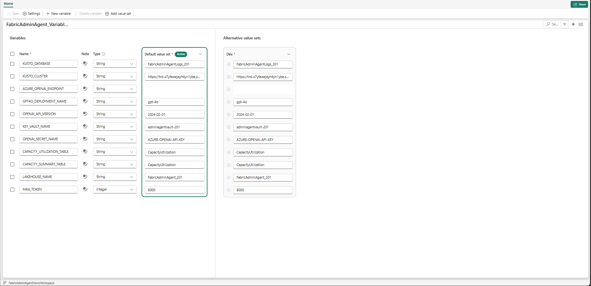
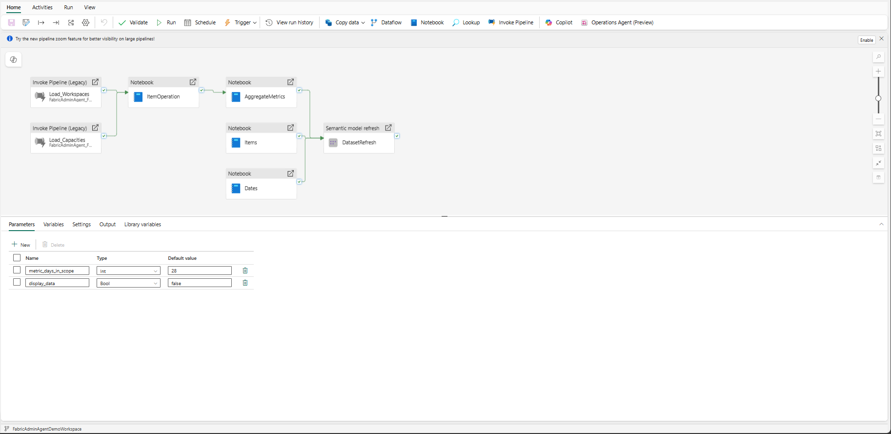
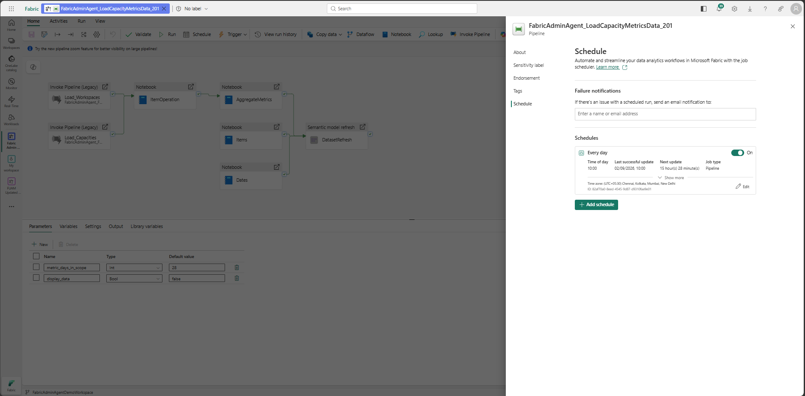
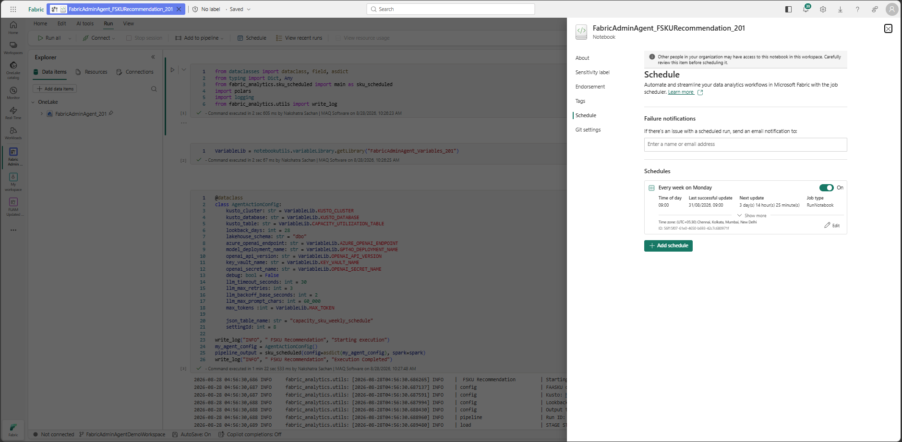
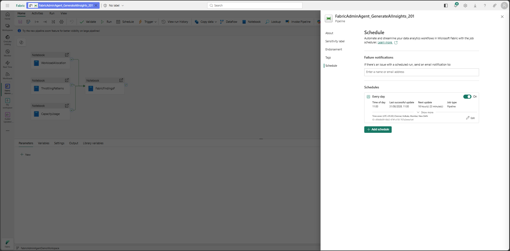

# 08 — Pipeline & Notebook Scheduling

*Previous: [Email & Notifications](./07-email-notifications.md)*

---

## Step 19: Provide the AZURE_OPENAI_ENDPOINT in the Variable Library

**1.** In the Fabric workspace, open the **FabricAdminAgent_Variables** variable library.

**2.** In the Azure Portal, open the deployed Azure OpenAI resource, go to **Resource Management → Keys and Endpoint**, and copy the **Endpoint** value.

**3.** Provide the copied endpoint value for `AZURE_OPENAI_ENDPOINT` in the Default value set.

> **Required access:** The user configuring this pipeline and the notebook must have the **Key Vault Secrets User** role on the deployed Key Vault.

---

## Step 20: Configure and Schedule the Load Capacity Metrics Data Pipeline

**1.** In the Fabric workspace, open the **FabricAdminAgent_LoadCapacityMetricsData** pipeline.

**2.** Set a **Daily** schedule (or as required by your refresh cadence).

---

## Step 21: Configure and Schedule the F-SKU Recommendation Notebook and Generate AI Insights Pipeline

**1.** In the Fabric workspace, open the **FabricAdminAgent_FSKURecommendation** notebook.

**2.** Set a **Weekly** schedule (or as required by your refresh cadence).

**3.** In the Fabric workspace, open the **FabricAdminAgent_GenerateAIInsights** pipeline.

**4.** Set a **Daily** schedule (or as required by your refresh cadence).

---

**Next:** [Verify Deployment →](./09-verify-deployment.md)
