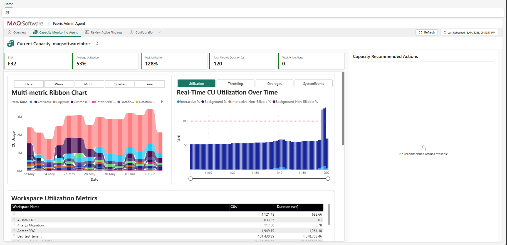
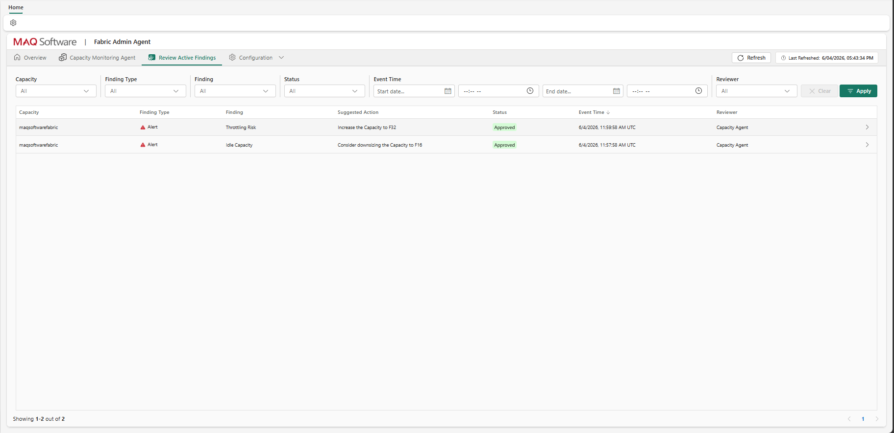

# 09 — Verify Deployment

*Previous: [Pipeline Scheduling](./08-pipeline-schedule.md)*

---

## Step 22: Verify Setup

After completing all steps in this guide, confirm the system is operating correctly:

- The **Review Active Findings** tab in the Fabric Admin Agent workload should start populating with alerts once capacity events are detected and the detection logic runs.
- The **Monitoring Agent** tab will be populated after the Load Capacity Metrics Data pipeline refresh completes successfully.

---

## What's Next

One-time infrastructure setup is now complete. To start monitoring a Fabric capacity, continue with:

- **Onboarding a new capacity** (assigning capacity admin role, adding the capacity, verifying data flow, configuring findings and thresholds) — *docs/operations/onboard-a-capacity.md* (not yet created)
- **Configuring findings, autoscaling, and notifications** — *docs/operations/configure-findings.md* (not yet created)

---

*Previous in this guide:* [Prerequisites](./prerequisites.md) → [01 Tenant Settings](./01-tenant-settings.md) → [02 Deploy Workload](./02-deploy-workload.md) → [03 Deploy Azure](./03-deploy-azure.md) → [04 Permissions](./04-permissions.md) → [05 Email Notifications](./05-email-notifications.md) → [06 Connections](./06-connections.md) → [07 Azure Open AI Setup](./08-azure-openai-api-key.md) → [08 Pipeline Schedule](./08-pipeline-schedule.md) → **09 Verify Deployment**
